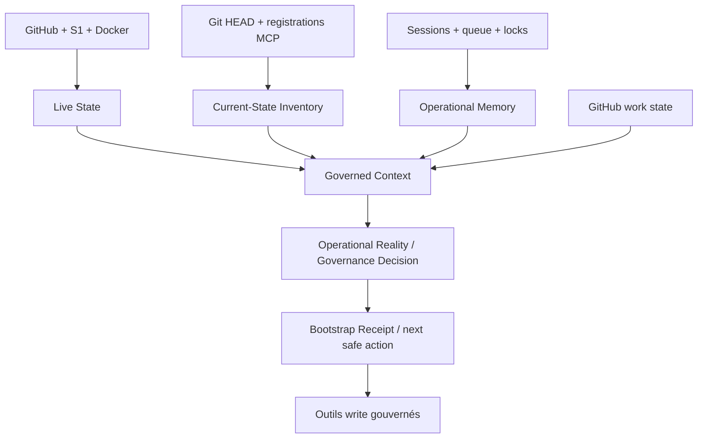

# ARCHITECTURE.md

## Rôle

Cette page décrit l’architecture technique actuelle du MCP WealthTech. Elle explique les autorités et les relations stables. Les listes susceptibles de changer — modules, imports, routes, outils, ressources, audits et tâches — sont dérivées à chaque lecture par le Current-State Inventory et ne sont pas recopiées manuellement ici.

## Périmètre déployé

| Élément | Valeur ou autorité |
|---|---|
| Repository versionné | `Patricked-code/MCP` sur GitHub |
| Branche de production | `main` |
| Racine S1 | `/opt/apps/wealthtech-mcp-ssh-bridge` |
| Conteneur | `wealthtech-mcp-ssh-bridge` |
| Runtime | Node.js, TypeScript compilé, Express et serveur MCP Streamable HTTP |
| Endpoint MCP | `/mcp` |
| Santé | `/health` |
| Interface humaine | `/dashboard`, `/git`, `/github` |
| État exécuté | S1, Docker, révision OCI et attestation Live State |

## Autorités canoniques

Le système ne possède pas de seconde base current-state indépendante. Chaque domaine reste lu depuis son autorité, puis composé dans une vue bornée.

| Domaine | Autorité |
|---|---|
| Code, branche, PR, CI, revue | GitHub |
| Checkout serveur et runtime | S1, Docker, labels OCI |
| Alignement exact-SHA | Live State |
| Sessions, checkpoints, locks, receipts | Operational Memory |
| Tâches et ordre de travail runtime | Governed Task Queue |
| Contrats d’outils actuels | registrations MCP réelles |
| Contrats historiques protégés | fixture de non-régression V1 |
| Modules, imports, routes, documentation et audits | fichiers suivis par Git au HEAD lu |
| Règles machine | fichiers suivis sous `.mcp/` |
| Historique humain | documents canoniques et journaux append-only |

Les champs dynamiques de branche, PR ou prochain travail ne sont pas persistés dans `.mcp/branch-governance.json`. Ils sont lus depuis GitHub, Operational Memory et la queue.

## Composants et relations



La couche `Operational Reality / Governance Decision` est une projection dérivée : elle n'est ni un store, ni une nouvelle autorité. Elle assemble les preuves déjà détenues par Live State, Current-State Inventory, Operational Memory, Governed Task Queue, GitHub et les registrations MCP.

### Live State

`src/liveState/` collecte et réconcilie :

- le HEAD GitHub ;
- le checkout S1 ;
- la révision du runtime ;
- la santé Docker ;
- l’état documentaire ;
- les digests de capabilities, gouvernance, audits et inventaire ;
- les contradictions et la prochaine action.

Le moteur incrémente `stateVersion` uniquement lorsque la preuve sémantique change. Un timestamp de collecte seul ne crée pas une nouvelle version.

### Current-State Inventory

`src/currentState/` et `scripts/current-state-evidence.mjs` composent une preuve read-only et bornée :

- catalogue des outils et ressources à partir des registrations réelles ;
- surface et nature de chaque capability ;
- modules TypeScript et relations d’import ;
- routes Express déclarées ;
- inventaire Markdown, audits et historique ;
- digests des politiques `.mcp/` ;
- version et digest de la task registry ;
- contradictions de gouvernance détectées.

Le collecteur ne lit que les fichiers suivis par Git, refuse les sorties de racine et les fichiers trop volumineux, n’ouvre aucun réseau et ne lit aucun secret.

### Operational Memory

`src/operationalMemory/` porte :

- les Governed Sessions ;
- les checkpoints et heartbeats ;
- les locks avec TTL ;
- les Bootstrap Receipts ;
- le journal d’événements append-only et sanitizé ;
- la Governed Task Queue persistante et révisée atomiquement.

La queue ordonne les tâches par priorité puis FIFO, vérifie leurs dépendances et conflits de scope, et applique une machine d’états allowlistée. Une intention identique est réconciliée de manière idempotente au lieu de créer un doublon.

### Governed Context et bootstrap

`src/governedContext/` compose Live State, Current-State Inventory, Operational Memory, contexte GitHub et WRITE gate. À la connexion, l’agent suit l’ordre obligatoire :

1. `ping` ;
2. lecture du Live State ;
3. lecture du Current-State Inventory ;
4. lecture ou reprise de la session ;
5. acquittement du contexte et création d’un Bootstrap Receipt ;
6. réconciliation de la nouvelle intention avec la queue ;
7. claim de la première tâche exécutable antérieure ou courante ;
8. exécution depuis le dernier checkpoint.

Le receipt relie la session, l’identité agent/client, la version Live State, les SHA GitHub/runtime et les digests catalogue, gouvernance et task registry. Il ne contient ni prompt brut, ni jeton, ni secret de reprise.

Pour l'observation GitHub d'un travail en cours, la branche est résolue dans cet ordre : branche déjà liée à la Governed Session, puis branche portée par la tâche courante, puis branche explicitement fournie à l'entrée. Une session d'intake sans branche ne perd donc pas la continuité de la tâche déjà gouvernée.

### Unified Operational Work State

`src/governance/operationalDecision.ts` et les enrichissements de `src/governedContext/` dérivent trois projections additives.

`CapabilityReality` répond, pour une capability donnée, à quatre questions distinctes : outil enregistré, appelabilité attestée, autorisation attestée et préconditions de gouvernance satisfaites. `safeNow=true` exige les quatre preuves; une inconnue reste une inconnue et produit une preuve requise au lieu d'une autorisation implicite.

`TaskReality` compare l'état déclaré de la tâche aux preuves observées. Les phases observées sont `UNKNOWN`, `DISCOVERED`, `IN_PROGRESS`, `REVIEW`, `MERGE_READY`, `DEPLOYING`, `VERIFYING` et `VERIFIED`. Les écarts sont explicités comme `ALIGNED`, état déclaré en retard ou en avance, preuve indisponible/incomplète ou réalité contradictoire. Une tâche n'est `VERIFIED` que lorsque les preuves nécessaires de PR/CI exact-head, déploiement exact-SHA, runtime et documentation sont réunies.

`GovernanceDecision` compose l'opération proposée, la tâche, sa réalité, la session/owner, le bootstrap, les dépendances, scopes, locks, l'état GitHub, l'état runtime et la capability. Elle retourne les preuves requises, blockers, reason codes, `nextSafeAction` et `mayMutate`. Elle ne modifie aucun store et ne remplace aucune décision d'autorité source.

### Observer Before Actor

Avant qu'une opération dépendante d'une autorité soit considérée sûre, cette autorité doit avoir été observée avec une preuve suffisamment fraîche. Pour GitHub, la projection porte notamment la branche et le head de travail, PR, checks requis exact-head, reviews, threads, ruleset, ownership, activité, fraîcheur/cache et reason codes. Ces reason codes sont propagés à `GovernanceDecision` lorsqu'une opération exige GitHub; ils ne bloquent pas une opération qui ne dépend pas de GitHub.

Cette règle reste aujourd'hui une couche d'observation et de décision compatible avec le mode `shadow`; elle ne constitue pas une activation implicite de l'enforcement.

### WRITE gate

`src/governance/scopedWriteGate.ts` observe :

- session non liée ;
- contexte non acquitté ;
- `stateVersion` périmée ;
- receipt absent, expiré ou incohérent ;
- tâche non claimée ;
- lock en conflit ;
- baseline d’audit invalide.

Le mode courant reste `shadow` : les verdicts sont audités sans bloquer les contrats historiques. Tout passage à un enforcement bloquant exige une décision et une PR séparées.

## Surfaces MCP

Les surfaces current-state et orchestration exposent notamment :

- la ressource `mcp://wealthtech/current-state/inventory` ;
- `mcp_get_current_state_inventory` ;
- `mcp_get_work_queue` et `mcp_get_governed_task` ;
- `mcp_reconcile_agent_intent` ;
- `mcp_claim_next_governed_task` ;
- `mcp_transition_governed_task` ;
- les outils Live State, Governed Context, sessions, checkpoints et locks existants.

Le catalogue exact, y compris les outils feature-gated, est généré dans `.mcp/function-cartography.json` et vérifié contre les registrations pendant la CI.

## Stores persistants

Les stores runtime vivent sous `/app/data` dans le volume Docker : sessions, locks, journal et queue. Les écritures utilisent des validations strictes, des révisions optimistes et des remplacements atomiques. GitHub et les documents gouvernés conservent les sources versionnées ; les stores runtime ne les remplacent pas. Unified Operational Work State n'ajoute aucun store persistant.

## Livraison exacte-SHA

Le chemin de livraison reste :

```text
branche gouvernée
→ Draft PR
→ CI et tests du head exact
→ revue
→ merge sur main
→ GitHub OIDC
→ Autodeploy gouverné
→ checkout S1 du SHA exact
→ image OCI portant ce SHA
→ runtime healthy
→ Live State FULLY_ALIGNED
```

Build et restart restent séparés. Aucun push direct sur `main`, aucun build manuel hors procédure et aucune correction directe du checkout S1 ne sont autorisés.

## Sécurité et non-régression

- aucun secret, prompt brut ou credential dans les inventaires, receipts ou audits ;
- données bornées, allowlists et échappement HTML sur le dashboard ;
- 92 contrats historiques protégés contre suppression, renommage et dérive de schéma ;
- ajout additif des nouvelles surfaces ;
- TDD `RED → GREEN`, tests ciblés, régression complète, typecheck, build, gouvernance documentaire, scan de secrets et `git diff --check` ;
- si une capacité équivalente existe, elle est étendue plutôt que dupliquée ;
- si une autorité existe, elle est consultée plutôt que remplacée par une copie concurrente ;
- suppression destructive, migration et enforcement bloquant uniquement après autorisation distincte.

## Règle de maintenance

Toute modification d’architecture doit mettre à jour les preuves dérivées ou leurs générateurs, puis être reflétée dans `SUIVI.md`, `DECISIONS_LOG.md`, `CHANGELOG.md` et, si la relation stable change, dans ce document. GitHub est la source versionnée ; S1 et Docker sont les sources exécutées. Leur égalité doit être attestée avant la clôture d’une tâche.
