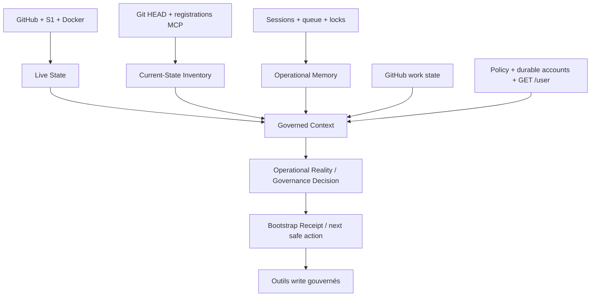

# ARCHITECTURE.md

## Rôle

Cette page décrit l’architecture technique actuelle du MCP WealthTech. Elle explique les autorités et les relations stables. Les listes susceptibles de changer — modules, imports, routes, outils, ressources, audits et tâches — sont dérivées à chaque lecture par le Current-State Inventory et ne sont pas recopiées manuellement ici.

## Périmètre déployé

| Élément | Valeur ou autorité |
|---|---|
| Repository versionné | `Patricked-code/MCP` sur GitHub |
| Branche de production | `main` |
| Racine S1 | `/opt/apps/wealthtech-mcp-ssh-bridge` |
| Conteneur | `wealthtech-mcp-ssh-bridge` |
| Runtime | Node.js, TypeScript compilé, Express et serveur MCP Streamable HTTP |
| Endpoint MCP | `/mcp` |
| Santé | `/health` |
| Interface humaine | `/dashboard`, `/git`, `/github` |
| État exécuté | S1, Docker, révision OCI et attestation Live State |

## Autorités canoniques

Le système ne possède pas de seconde base current-state indépendante. Chaque domaine reste lu depuis son autorité, puis composé dans une vue bornée.

| Domaine | Autorité |
|---|---|
| Code, branche, PR, CI, revue | GitHub |
| Checkout serveur et runtime | S1, Docker, labels OCI |
| Alignement exact-SHA | Live State |
| Sessions, checkpoints, locks, receipts | Operational Memory |
| Tâches et ordre de travail runtime | Governed Task Queue |
| Contrats d’outils actuels | registrations MCP réelles |
| Contrats historiques protégés | fixture de non-régression V1 |
| Modules, imports, routes, documentation et audits | fichiers suivis par Git au HEAD lu |
| Règles machine | fichiers suivis sous `.mcp/` |
| Binding OAuth → connexion GitHub contextuelle | `.mcp/identity-policy.json` |
| Connexions GitHub configurées | registre durable `data/github-accounts.json` |
| Credentials GitHub | secret storage existant, hors Git et hors projections |
| Principal GitHub authentifié | preuve live GitHub `GET /user` |
| Historique humain | documents canoniques et journaux append-only |

Les champs dynamiques de branche, PR ou prochain travail ne sont pas persistés dans `.mcp/branch-governance.json`. Ils sont lus depuis GitHub, Operational Memory et la queue.

## Composants et relations


```mermaid
flowchart TD
    A["GitHub + S1 + Docker"] --> B["Live State"]
    C["Git HEAD + registrations MCP"] --> D["Current-State Inventory"]
    E["Sessions + queue + locks"] --> F["Operational Memory"]
    B --> G["Governed Context"]
    D --> G
    F --> G
    J["GitHub work state"] --> G
    L["Policy + durable accounts + GET /user"] --> G
    G --> K["Operational Reality / Governance Decision"]
    K --> H["Bootstrap Receipt / next safe action"]
    H --> I["Outils write gouvernés"]
```

La couche `Operational Reality / Governance Decision` est une projection dérivée : elle n'est ni un store, ni une nouvelle autorité. Elle assemble les preuves déjà détenues par Live State, Current-State Inventory, Operational Memory, Governed Task Queue, GitHub et les registrations MCP.

### Live State

`src/liveState/` collecte et réconcilie :

- le HEAD GitHub ;
- le checkout S1 ;
- la révision du runtime ;
- la santé Docker ;
- l’état documentaire ;
- les digests de capabilities, gouvernance, audits et inventaire ;
- les contradictions et la prochaine action.

Le moteur incrémente `stateVersion` uniquement lorsque la preuve sémantique change. Un timestamp de collecte seul ne crée pas une nouvelle version.

### Current-State Inventory

`src/currentState/` et `scripts/current-state-evidence.mjs` composent une preuve read-only et bornée :

- catalogue des outils et ressources à partir des registrations réelles ;
- surface et nature de chaque capability ;
- modules TypeScript et relations d’import ;
- routes Express déclarées ;
- inventaire Markdown, audits et historique ;
- digests des politiques `.mcp/` ;
- version et digest de la task registry ;
- contradictions de gouvernance détectées ;
- projection read-only `nextWork` de la session demandeuse (reprise, claim compatible ou blueprint READY sans collision), dérivée des règles de la queue et de la matérialisation, sans claim ni tâche créée.

Le collecteur ne lit que les fichiers suivis par Git, refuse les sorties de racine et les fichiers trop volumineux, n’ouvre aucun réseau et ne lit aucun secret.

### Operational Memory

`src/operationalMemory/` porte :

- les Governed Sessions ;
- les checkpoints et heartbeats ;
- les locks avec TTL ;
- les Bootstrap Receipts ;
- le journal d’événements append-only et sanitizé ;
- la Governed Task Queue persistante et révisée atomiquement.

La queue ordonne les tâches par priorité puis FIFO, vérifie leurs dépendances et conflits de scope, et applique une machine d’états allowlistée. Un candidat bloqué localement (scope actif ou lock d'une autre session) est sauté au profit du suivant compatible ; sans candidat compatible, le code de conflit historique est conservé. Une intention identique est réconciliée de manière idempotente au lieu de créer un doublon.

### Governed Context et bootstrap

`src/governedContext/` compose Live State, Current-State Inventory, Operational Memory, contexte GitHub et WRITE gate. À la connexion, l’agent suit l’ordre obligatoire :

1. `ping` ;
2. lecture du Live State ;
3. lecture du Current-State Inventory ;
4. lecture ou reprise de la session ;
5. acquittement du contexte et création d’un Bootstrap Receipt ;
6. réconciliation de la nouvelle intention avec la queue ;
7. reprise de la tâche active possédée, sinon claim de la première tâche exécutable compatible ;
8. exécution depuis le dernier checkpoint.

Le receipt relie la session, l’identité agent/client, la version Live State, les SHA GitHub/runtime et les digests catalogue, gouvernance et task registry. Il ne contient ni prompt brut, ni jeton, ni secret de reprise.

Pour l'observation GitHub d'un travail en cours, la branche est résolue dans cet ordre : branche déjà liée à la Governed Session, puis branche portée par la tâche courante, puis branche explicitement fournie à l'entrée. Une session d'intake sans branche ne perd donc pas la continuité de la tâche déjà gouvernée.

La résolution B1 enrichit ce même collecteur GitHub et son cache existant ; elle
n'ajoute aucun observateur ni store. Le service transmet uniquement le principal
OAuth et le repository issus du `ConnectionContext` durable visible. Pendant une
réconciliation explicite, le collecteur compose la policy versionnée, les
connexions durables existantes et la preuve live `GET /user`. `getCurrent` reste
cache/store-only. Sa clé sépare branche, principal OAuth, repository, digest de
policy et binding applicable ; une preuve expirée devient `UNVERIFIED/STALE`.

La GitHub Identity résultante est une projection `RESOLVED`, `NONE`, `AMBIGUOUS`
ou `UNVERIFIED`. Elle ne modifie ni la session historique, ni GitRegistry V2, ni
le Bootstrap Receipt, ni les permissions. Le principal `GET /user` reste distinct
des organisations accessibles. Une organisation n'est vérifiée que par une
appartenance authentifiée active et concordante ; son profil public ne suffit pas.
Les contextes accessibles sont bornés au même credential par une corrélation
éphémère non secrète, jamais persistée ni projetée. Les capacités effectives sont
calculées seulement au SLOT-11 à partir de leurs autorités propres.

La résolution B2 prolonge le même collecteur au SLOT-07. Elle privilégie le
repository exact du `ConnectionContext` lorsqu'il est déjà prouvé ; sinon elle
lit uniquement `githubOwner`/`githubRepo` dans les `repoMappings` GitRegistry V1
comme candidats bornés. Elle n'appelle jamais le fallback historique
`mcp_bridge`, n'active pas GitRegistry V2 et ne résout encore ni projet, serveur,
runtime ou domaine. Un seul candidat déterministe est observé par
`GET /repos/{owner}/{repo}` avec l'exact `authenticationContextId` sélectionné
par B1.

Le batch d'observation reste éphémère dans `src/tools/durableAccounts.ts` : il
réutilise la collecte B1, déduplique les token files et ne conserve le credential
que dans une closure locale. `GithubOperationalContext.repositoryResolution` est
une projection additive et optionnelle pour les consommateurs historiques. Le
cache GitHub existant reste l'unique cache ; une entrée expirée supprime le dépôt
sélectionné et devient `UNVERIFIED/STALE`. Les réponses GitHub sont réduites à
l'identité canonique du repository ; permissions, scopes et erreurs brutes sont
écartés avant projection.

Une collecte portant une identité B1/B2 réobserve les autorités live au lieu de
servir une preuve potentiellement révoquée depuis le cache ; `getCurrent()` reste
strictement cache-only pour ses consommateurs historiques. Les clés de
single-flight hachent les valeurs exactes du principal et du repository sans les
normaliser avant validation, afin qu'un contexte invalide ne puisse pas partager
la collecte d'un contexte valide. La vue d'évidence GitRegistry V1 borne enfin la
lecture à 1 MiB et 1 000 mappings avant toute résolution.

La résolution C3 prolonge la même chaîne au contrat GW-07 : après la résolution
projet C2, `serverResolution` appelle le résolveur GWC existant avec les liaisons
serveur du GitRegistry V2 (chemin déclaré ; seul `realPathVerified` atteste un
chemin réel), l'identité serveur canonique (serveurs gérés par le runtime et
déclarés dans `.mcp/server-map.json`, sans renommer les ids stockés) et la preuve
registre lue en direct. Elle reste en lecture seule : aucun appel SSH, aucune
écriture GitRegistry, aucune autorisation inférée, aucune donnée de connexion
projetée ; une preuve absente, invalide ou expirée reste `UNVERIFIED` avec une
raison bornée. Le cache GitHub existant reste l'unique cache.

La résolution C4 prolonge la chaîne au contrat GW-08 : après `serverResolution`,
`runtimeResolution` appelle le résolveur GWC existant avec les composants du
projet déclarés par le GitRegistry V2 (composants du projet enregistré, ou le
seul mapping sélectionné s'il déclare son rôle) et les observations runtime des
autorités d'observation existantes. Aujourd'hui, seule Live State observe un
runtime : celui du MCP sur le serveur qu'elle lit. Le type
(`DOCKER_COMPOSE`/`DOCKER`) vient du label compose observé sur le conteneur.
Une observation n'est rattachée qu'au composant de son dépôt (OD-04 :
l'observation fait foi, une déclaration ne la remplace jamais ; le GitRegistry
V2 ne déclare aucun runtime). Ports et reverse proxy n'ont pas d'autorité
d'observation runtime, car l'attestation exclut volontairement le réseau : ils
ne sont pas inventés. Une observation absente, périmée, indisponible, ambiguë
ou contradictoire reste `UNVERIFIED`, jamais `NO_RUNTIME`. Lecture seule : aucun
SSH, redémarrage, rebuild ni store ; Live State est lue sans nouvelle collecte.

La résolution C5 prolonge la chaîne au contrat GW-09 : après C2/C3,
`domainResolution` appelle le résolveur GWC existant avec les déclarations de
domaine du GitRegistry V2 (`publicDomain`, `publicApi` et `historicalVhosts` du
projet ; `domain`/`domainVerified` des mappings) et l'observation courante de ce
que sert le serveur résolu. Aucune autorité d'observation de domaine n'existe
encore dans le runtime : le point d'injection ne répond rien par défaut et la
surface reste `UNVERIFIED` (`DOMAIN_OBSERVATION_UNAVAILABLE`), jamais `NONE`.
Les vhosts historiques ne deviennent jamais actifs. La liste
`protectedApplications` de la carte serveur reste une liste de sécurité et
jamais le modèle de domaine. Lecture seule : aucune sonde DNS/TLS/HTTP, aucun
store, aucune modification de vhost.

L'acceptation C345-02 compose ces résolutions en une **réalité projet**
(`src/github/projectReality.ts`, `GovernedOperationalContext.projectReality`).
La composition est calculée une seule fois par le service de contexte gouverné,
quel que soit le chemin de cache qui a produit les résolutions. Les couches
ordonnées sont `REPOSITORY` (GW-05), `PROJECT` (GW-06), `SERVER` (GW-07),
`RUNTIME` (GW-08), `INGRESS` (domaine → reverse proxy → port → runtime, sans
autorité) et `DOMAIN` (GW-09). Chaque couche a pour état `VERIFIED`,
`UNVERIFIED`, `STALE`, `AMBIGUOUS`, `CONFLICT` ou `NONE` et garde les codes et
la provenance de son résolveur.

- **Vérification.** Une couche n'est `VERIFIED` que si sa résolution est
  courante, si les couches sur lesquelles elle se compose sont `VERIFIED` et si
  elle leur est liée (même dépôt, même projet, même serveur).
- **En aval d'une couche non prouvée.** Une telle couche n'est jamais vérifiée
  ni prouvée absente : elle prend `PROJECT_REALITY_UPSTREAM_UNVERIFIED`.
- **Contradictions.** Les contradictions des résolveurs et les liaisons
  incohérentes restent visibles et rendent la réalité `CONFLICT`.
- **Absences acceptées.** Seules sont acceptées comme `NONE` l'absence de
  runtime observée, l'absence confirmée de surface publique et l'absence
  d'ingress qui en découle.
- **Ingress.** Faute d'observation, l'ingress reste `UNVERIFIED`
  (`INGRESS_OBSERVATION_UNAVAILABLE`).
- **TargetContext.** Le `TargetContext` Live State n'est pas enrichi.
- **Lecture seule.** La composition n'infère aucune autorisation.

L'héritage de gouvernance D1 (GW-10, `src/governedWorkflow/governance/projectInheritance.ts`,
`GovernedOperationalContext.governanceInheritance`) projette sur le périmètre
projet prouvé par la réalité projet les contraintes que portent déjà les
autorités existantes, sans les copier :

- **Mapping GitRegistry.** La gouvernance déclarée du mapping sélectionné
  (`selectedMapping.governance` : branche officielle, préfixes, push direct
  interdit, statut, capacités, sauvegarde), issue de
  `GitRegistryProjectEvidence.governanceEvidence`.
- **Ruleset GitHub.** Observé pour le seul dépôt qu'il couvre ; il n'est
  jamais prêté à un autre dépôt (`GOVERNANCE_RULESET_NOT_OBSERVED`).
- **Politique de branches MCP.** `.mcp/branch-governance.json`, lue de façon
  bornée et livrée dans l'image ; ses règles de `main` ne parlent que pour une
  branche officielle `main`.
- **Governed Lock Service.** Seuls les locks actifs d'une autre session sur le
  périmètre du projet contraignent.
- **WRITE gate.** Mode et activation des outils d'écriture.

Chaque règle (`OFFICIAL_BRANCH`, `DIRECT_PUSH_TO_OFFICIAL_BRANCH`,
`BRANCH_PREFIXES`, `PULL_REQUEST`, `DRAFT_PULL_REQUEST`,
`REQUIRED_STATUS_CHECKS`, `REQUIRED_APPROVALS`, `CONVERSATION_RESOLUTION`,
`DEPLOY`, `BACKUP_BEFORE_DEPLOY`, `WRITE_FILES`, `CREATE_BRANCH`, `COMMIT`,
`PUSH_BRANCH`, `WRITE_TOOLS`, `PROJECT_LOCKS`, `CLEAN_WORKTREE`) a pour effet
`REQUIRE`, `FORBID`, `PERMIT` ou `UNKNOWN` et nomme les autorités qui l'ont
déterminée.

- **Composition stricte.** La contrainte la plus stricte l'emporte : une seule
  autorité qui interdit suffit, le silence ne permet jamais, et une preuve
  périmée ou non observée reste `UNKNOWN`.
- **Déploiement.** Il n'est hérité que sur un serveur prouvé.
- **Périmètre non prouvé.** Rien n'est hérité (`UNVERIFIED`), jamais un
  défaut global.
- **Lecture seule.** Aucune autorisation n'est dérivée ; D2 compose ensuite
  les capacités effectives.

### Unified Operational Work State

`src/governance/operationalDecision.ts` et les enrichissements de `src/governedContext/` dérivent trois projections additives.

`CapabilityReality` répond, pour une capability donnée, à quatre questions distinctes : outil enregistré, appelabilité attestée, autorisation attestée et préconditions de gouvernance satisfaites. `safeNow=true` exige les quatre preuves; une inconnue reste une inconnue et produit une preuve requise au lieu d'une autorisation implicite.

`TaskReality` compare l'état déclaré de la tâche aux preuves observées. Les phases observées sont `UNKNOWN`, `DISCOVERED`, `IN_PROGRESS`, `REVIEW`, `MERGE_READY`, `DEPLOYING`, `VERIFYING` et `VERIFIED`. Les écarts sont explicités comme `ALIGNED`, état déclaré en retard ou en avance, preuve indisponible/incomplète ou réalité contradictoire. Une tâche n'est `VERIFIED` que lorsque les preuves nécessaires de PR/CI exact-head, déploiement exact-SHA, runtime et documentation sont réunies.

`GovernanceDecision` compose l'opération proposée, la tâche, sa réalité, la session/owner, le bootstrap, les dépendances, scopes, locks, l'état GitHub, l'état runtime et la capability. Elle retourne les preuves requises, blockers, reason codes, `nextSafeAction` et `mayMutate`. Elle ne modifie aucun store et ne remplace aucune décision d'autorité source.

### Observer Before Actor

Avant qu'une opération dépendante d'une autorité soit considérée sûre, cette autorité doit avoir été observée avec une preuve suffisamment fraîche. Pour GitHub, la projection porte notamment la branche et le head de travail, PR, checks requis exact-head, reviews, threads, ruleset, ownership, activité, fraîcheur/cache et reason codes. Ces reason codes sont propagés à `GovernanceDecision` lorsqu'une opération exige GitHub; ils ne bloquent pas une opération qui ne dépend pas de GitHub.

Cette règle reste aujourd'hui une couche d'observation et de décision compatible avec le mode `shadow`; elle ne constitue pas une activation implicite de l'enforcement.

### WRITE gate

`src/governance/scopedWriteGate.ts` observe :

- session non liée ;
- contexte non acquitté ;
- `stateVersion` périmée ;
- receipt absent, expiré ou incohérent ;
- tâche non claimée ;
- lock en conflit ;
- baseline d’audit invalide.

Le mode courant reste `shadow` : les verdicts sont audités sans bloquer les contrats historiques. Tout passage à un enforcement bloquant exige une décision et une PR séparées.

## Surfaces MCP

Les surfaces current-state et orchestration exposent notamment :

- la ressource `mcp://wealthtech/current-state/inventory` ;
- `mcp_get_current_state_inventory` ;
- `mcp_get_work_queue` et `mcp_get_governed_task` ;
- `mcp_reconcile_agent_intent` ;
- `mcp_materialize_program_blueprint` (au plus une tâche par blueprint READY du Program Backlog déployé, sans claim) ;
- `mcp_claim_next_governed_task` ;
- `mcp_transition_governed_task` ;
- les outils Live State, Governed Context, sessions, checkpoints et locks existants.

Le catalogue exact, y compris les outils feature-gated, est généré dans `.mcp/function-cartography.json` et vérifié contre les registrations pendant la CI.

## Stores persistants

Les stores runtime vivent sous `/app/data` dans le volume Docker : sessions, locks, journal et queue. Les écritures utilisent des validations strictes, des révisions optimistes et des remplacements atomiques. GitHub et les documents gouvernés conservent les sources versionnées ; les stores runtime ne les remplacent pas. Unified Operational Work State n'ajoute aucun store persistant.

## Livraison exacte-SHA

Le chemin de livraison reste :

```text
branche gouvernée
→ Draft PR
→ CI et tests du head exact
→ revue
→ merge sur main
→ GitHub OIDC
→ Autodeploy gouverné
→ checkout S1 du SHA exact
→ image OCI portant ce SHA
→ runtime healthy
→ Live State FULLY_ALIGNED
```

Build et restart restent séparés. Aucun push direct sur `main`, aucun build manuel hors procédure et aucune correction directe du checkout S1 ne sont autorisés.

## Sécurité et non-régression

- aucun secret, prompt brut ou credential dans les inventaires, receipts ou audits ;
- données bornées, allowlists et échappement HTML sur le dashboard ;
- 92 contrats historiques protégés contre suppression, renommage et dérive de schéma ;
- ajout additif des nouvelles surfaces ;
- TDD `RED → GREEN`, tests ciblés, régression complète, typecheck, build, gouvernance documentaire, scan de secrets et `git diff --check` ;
- si une capacité équivalente existe, elle est étendue plutôt que dupliquée ;
- si une autorité existe, elle est consultée plutôt que remplacée par une copie concurrente ;
- suppression destructive, migration et enforcement bloquant uniquement après autorisation distincte.

## Règle de maintenance

Toute modification d’architecture doit mettre à jour les preuves dérivées ou leurs générateurs, puis être reflétée dans `SUIVI.md`, `DECISIONS_LOG.md`, `CHANGELOG.md` et, si la relation stable change, dans ce document. GitHub est la source versionnée ; S1 et Docker sont les sources exécutées. Leur égalité doit être attestée avant la clôture d’une tâche.
