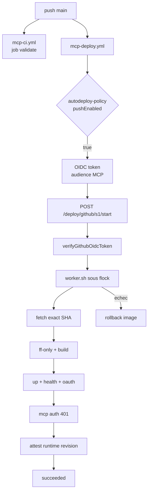
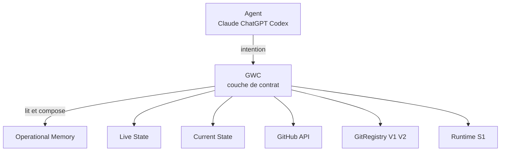
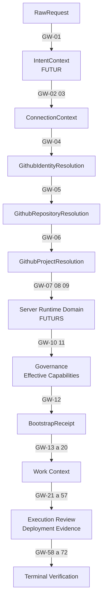
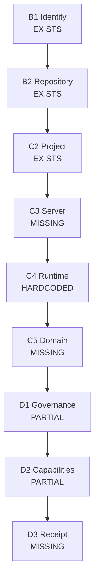
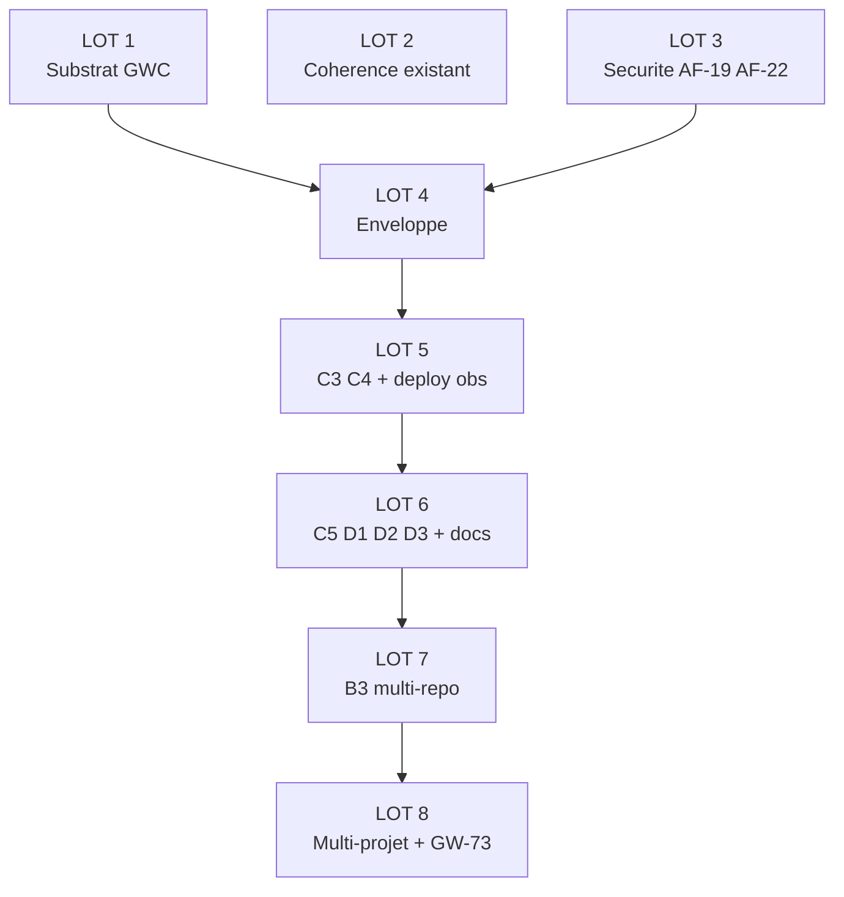
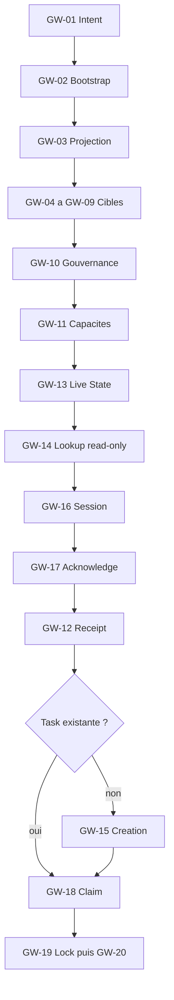

# GWC V1 — Architecture des 73 contrats

Révision `R2` · statut `AWAITING_HUMAN_RATIFICATION` · dépôt `Patricked-code/MCP`.

Document de référence du dossier `docs/gwc/`. Voir `docs/gwc/README.md` pour le protocole d'amendement et `.mcp/gwc-contracts.json` pour la version lisible par un agent.

Origine : préparation architecturale strictement read-only menée sur `main@d1f303955c4d368950da2307dda41d826fc85d0a`, puis révision R2 confrontée à l'état GitHub live. Aucune implémentation n'a été réalisée. L'autorité de départ reste `docs/superpowers/specs/2026-09-15-governed-workflow-contract-v1-design.md`.

Les incohérences découvertes sont identifiées sous `ARCHITECTURAL FINDING` (AF-01 à AF-30) et n'ont jamais été corrigées dans le code.

---

## Cadre de mission

Cette architecture prépare les 73 contrats du Governed Workflow Contract sans en implémenter aucun : le dépôt n'a reçu aucune écriture.

| Élément | Valeur observée |
| --- | --- |
| Dépôt | `Patricked-code/MCP` |
| HEAD observé | `d1f303955c4d368950da2307dda41d826fc85d0a` (`docs(gwc): define Governed Workflow Contract V1 (#94)`) |
| Branche de session | `claude/ecstatic-edison-v1dyt1` |
| Autorité de départ | `docs/superpowers/specs/2026-09-15-governed-workflow-contract-v1-design.md` (598 lignes, lu intégralement) |
| Périmètre inventorié | 69 fichiers `src/**.ts` (16 976 lignes), 69 fichiers `tests/**`, 9 fichiers `.mcp/*.json`, 2 workflows GitHub, 58 Markdown racine, `docs/` complet |

> **Amendé en R2.** Les volumétries de ce tableau sont erronées (71 / 61 / 10 fichiers réels) et l'observation n'était pas étiquetée. L'en-tête d'observation `GITHUB_LIVE` faisant foi figure en Révision R2, en fin de document.

La mission était strictement read-only. Aucun fichier modifié ou créé, aucune branche, aucun commit, aucune PR, aucune mutation de tâche, de lock, de session, de serveur ni de déploiement. Les compteurs de vérification figurent en fin de document.

Les incohérences découvertes sont identifiées et documentées sous `ARCHITECTURAL FINDING` (AF-01 à AF-27), jamais corrigées.

---

## 1. Résumé exécutif

GWC n'existe pas en code, mais la majorité de ce qu'il nomme existe déjà : `grep -rn "GW-0\|GovernedStep\|governedWorkflow\|stepId" src tests scripts .mcp` renvoie zéro occurrence, alors que 60 contrats sur 73 réutilisent une autorité ou une attestation existante.

### Statut architectural des 73 contrats

| Statut | Nombre | Part |
| --- | --- | --- |
| `ALREADY_IMPLEMENTED` | 24 | 33 % |
| `IMPLEMENTED_NEEDS_GWC_WRAPPER` | 6 | 8 % |
| `PARTIAL` | 19 | 26 % |
| `MCP_HARDCODED_NEEDS_GENERALIZATION` | 5 | 7 % |
| `DESIGNED_NOT_IMPLEMENTED` | 17 | 23 % |
| `DEPENDENCY_BLOCKED` | 2 | 3 % |
| `UNVERIFIED` | 0 | 0 % |

### Classification d'intégration

| Classification | Nombre |
| --- | --- |
| `REUSE` | 23 |
| `WRAP` | 24 |
| `GENERALIZE` | 6 |
| `EXTEND` | 8 |
| `NEW` | 12 |

### Trois vérités structurantes

1. **Le MCP n'écrit jamais sur GitHub.** Aucun `POST /repos/.../git/refs`, `POST /pulls` ni `PUT /pulls/{n}/merge` n'existe dans `src/`. Le seul `POST` GitHub est une requête GraphQL de lecture des review threads (`src/governedContext/github.ts:1110`). Les contrats GW-24, GW-34, GW-37, GW-38, GW-43, GW-59, GW-61 et GW-63 sont donc des contrats d'observation et de précondition, jamais des mutations MCP.
2. **Le moteur `callable / authorized / safeNow` existe déjà** dans `src/governance/operationalDecision.ts`, avec une sémantique différente de celle du design. `CapabilityReality.safeNow` (ligne 62) agrège `registered && callable && authorized && governanceSafe` ; `GovernanceDecision.mayMutate` (ligne 386) agrège les préconditions. Le `mayExecute` de GWC doit les composer, pas les redéfinir (AF-07).
3. **31 occurrences du littéral `'Patricked-code/MCP'` dans 18 fichiers `src/`**, dont 9 sous forme de `z.literal()`. La Governed Task Queue renvoie `OUT_OF_SCOPE` pour tout autre dépôt (`src/operationalMemory/taskQueue.ts:189`). GW-73 Universal Acceptance est aujourd'hui structurellement impossible sans B3.


> **Amendé en R2.2.** « Le MCP n'écrit jamais sur GitHub » est exact pour le SHA observé, mais ne doit pas être figé comme décision d'architecture : les PR #89 et #90 portent déjà une surface d'écriture GitHub candidate. Les 14 contrats `M*` prennent une colonne `CURRENT` et une colonne `TARGET`.

### Ce qui manque réellement

| Contrat | Slot | Classification | Lot |
| --- | --- | --- | --- |
| GW-01 Intent Capture | — | `NEW` pur, sans dépendance | LOT 1 |
| GW-07 Server Resolution | C3 | `NEW` | LOT 5 |
| GW-08 Runtime Resolution | C4 | `GENERALIZE` | LOT 5 |
| GW-09 Domain Resolution | C5 | `NEW` | LOT 5 |
| GW-10 Governance Inheritance | D1 | `EXTEND` | LOT 6 |
| GW-11 Effective Capabilities | D2 | `GENERALIZE` | LOT 6 |
| GW-12 Receipt Enrichment | D3 | `EXTEND` | LOT 6 |
| GW-45 Main CI observation | — | `EXTEND` — aucune preuve à ce jour (AF-19) | LOT 3 |
| GW-73 Universal Acceptance | — | `NEW`, bloqué par B3 | LOT 8 |

### Verdict

Le design GWC V1 est architecturalement sain et compatible avec l'existant. Il ne crée pas d'autorité parallèle à trois conditions : l'attestation d'étape reste une projection dérivable (56 étapes sur 73 n'en ont pas besoin) ; `mayExecute` appelle `deriveGovernanceDecision()` au lieu de le réimplémenter ; les statuts d'étape GWC ne sont jamais écrits dans `GovernedTaskStatus` ni l'inverse.

---

## 2. Carte du système existant

Neuf autorités réelles portent déjà les faits que GWC orchestre : Operational Memory, Governed Session, Governed Task Queue, Lock Service, Live State, Current State, GitRegistry V1/V2, GitHub API et le runtime S1.

### Modules observés

| Module | Lignes | Rôle | Fonctions clés |
| --- | --- | --- | --- |
| `operationalMemory/types.ts` | 272 | schémas Zod stricts | `BootstrapReceiptSchema`, `GovernedSessionRecordSchema`, `GovernedLockRecordSchema`, `GovernedTaskRecordSchema`, `ClientToolSurfaceAttestationSchema` |
| `operationalMemory/sessionService.ts` | 712 | Governed Session | `openSession`, `resumeSession`, `autoResumeCompatibleSession:406`, `acknowledgeContext:471`, `createCheckpoint:521`, `closeSession:571`, `expireIdleSessions:635` |
| `operationalMemory/lockService.ts` | 445 | Lock Service | `acquireLock`, `releaseLock`, `renewLocksForHeartbeat`, `expireLocks`, `reconcileSessionLockIds`, `normalizeScope:62` |
| `operationalMemory/taskQueue.ts` | 429 | Governed Task Queue | `reconcileIntent:188`, `claimNextTask:287`, `transitionTask:316`, `requeueTerminalSessionTasks:366`, `ALLOWED_TRANSITIONS:22` |
| `operationalMemory/eventJournal.ts` | 284 | journal JSONL borné | 31 types clos, allowlist de clés, `redactSensitiveValue:145`, rotation, `O_NOFOLLOW` |
| `operationalMemory/atomicStore.ts` | 101 | écriture atomique 0600 | `createAtomicJsonStore`, file d'attente sérialisée |
| `liveState/collect.ts` | 494 | 4 collecteurs + evidence | `collectGithubObservation`, `collectS1Observation`, `collectRuntimeObservation`, `collectDocumentationObservation`, `parseCurrentStateEvidence` |
| `liveState/reconcile.ts` | 163 | alignement + `stateVersion` | `buildAlignment`, `reconcileLiveState:127`, `applyFreshness` |
| `liveState/engine.ts` | 144 | rafraîchissement 60 s | `reconcileNow`, `getCurrent`, déduplication `inFlight` |
| `currentState/toolCatalog.ts` | 258 | catalogue d'outils | `decorateRegistrationCatalogServer:191`, `catalogueDigest` SHA-256 |
| `governedContext/service.ts` | 483 | composition centrale | `compose():186` — point d'intégration principal |
| `governedContext/github.ts` | 1328 | collecteur GitHub + B1/B2/C2 | `collectIdentityAndRepository:852`, `collectWork:977`, `parseChecks:507`, `aggregateRulesets:788`, cache 15 s |
| `governance/operationalDecision.ts` | 390 | décision gouvernée | `deriveCapabilityReality:40`, `deriveGovernancePreconditionReasons:110`, `deriveTaskReality:236`, `deriveGovernanceDecision:319` |
| `governance/scopedWriteGate.ts` | 280 | WRITE gate `shadow` | `deriveShadowWriteDecision:68`, observation seule |
| `github/identityResolution.ts` | 222 | B1 | `resolveGithubIdentity:157` |
| `github/repositoryResolution.ts` | 310 | B2 | `resolveGithubRepository:200` |
| `github/projectResolution.ts` | 202 | C2 | `resolveGithubProject:71` |
| `github/registryV2.ts` | 701 | schéma V2, dry-run, C1 | `validateGitRegistryV2:326`, `assessGitRegistryV2ActivationReadiness:375` |
| `deploy/githubOidc.ts` | 276 | politique OIDC épinglée | `GITHUB_OIDC_POLICY:14` |
| `deploy/s1Deploy.ts` | 326 | worker de déploiement | `buildS1DeployWorkerScript`, flock, rollback, attestation |
| `ssh/safety.ts` | 61 | denylist read-only | `assertReadOnlyCommand` — 26 motifs + wrappers |

### Surfaces d'enregistrement MCP

Trois surfaces distinctes, définies dans `src/server.ts:333-352` :

- `read` — `registerReadOnlyTools` + `registerGovernedTaskReadTools`
- `operational-write` — `registerGovernedTaskMutationTools`
- `scoped-write` — `registerScopedWriteTools`, uniquement si `ENABLE_WRITE_TOOLS`, décoré par le WRITE gate `shadow`

### Chaîne de déploiement réelle



`mcp-ci.yml` et `mcp-deploy.yml` se déclenchent indépendamment sur `push: main`, sans lien de dépendance — c'est l'origine du finding AF-19.

> **Amendé en R2.3.** AF-19 est désormais démontré empiriquement : sur `d1f3039` le déploiement s'est terminé 21 s avant la fin de la CI, et 16 s avant sur le commit précédent. Le SHA de squash déployé n'est pas le SHA validé par le check requis.

### Tests existants

69 suites, dont 56 exécutées par `npm run test:readonly-safety` en CI. Les plus structurantes pour GWC : `governedSessionService` (1310 lignes), `governedLocks` (575 lignes, 11 tests), `governedTaskQueue` (7 tests), `unifiedOperationalWorkState` (7 tests), `governedContextGithub` (681 lignes), `pr55ReviewRegressions`, `docGovernance`, `s1Deploy`, `deployWorkflowShell`, `githubOidc`, `toolContractRegression` avec sa fixture `existing-tool-contracts-v1.json`.

---

## 3. Architecture fonctionnelle GWC

GWC est une couche de contrat et d'orchestration au-dessus de neuf autorités existantes : il ne possède aucun fait, seulement l'identité stable des étapes, l'évaluation bornée `mayExecute`, l'attestation d'étape et le graphe de transitions.

### Position fonctionnelle



GWC lit et compose ; il n'écrit jamais l'état d'autrui.

### Les neuf familles

Le design définit les familles A à I sans leur assigner de plages d'IDs. La répartition ci-dessous est une dérivation, cohérente avec les descriptions du design ; elle doit être gravée dans le registre, sinon deux implémentations divergeront sur la frontière GW-44 / GW-45 (AF-20).

| Famille | Plage | Rôle | Mutation possible |
| --- | --- | --- | --- |
| A — Intake | GW-01 | structurer la requête sans effet | non |
| B — Identity & target resolution | GW-02 … GW-09 | connexion, identité, repo, projet, serveur, runtime, domaine | non, sauf GW-02 (binding) |
| C — Governance & capability | GW-10 … GW-12 | héritage, capacités effectives, receipt | oui (GW-12) |
| D — Work orchestration | GW-13 … GW-20 | Live State, queue, session, receipt, claim, locks | oui |
| E — Development | GW-21 … GW-33 | autorités, slot, baseline, branche, TDD, régression, docs | oui (agent-side) |
| F — Review & merge | GW-34 … GW-45 | draft PR, revue exacte, rulesets, ready, merge, CI main | oui (agent-side) |
| G — Deployment | GW-46 … GW-57 | autodeploy, sync S1, build, runtime, health, exact-SHA | oui (pipeline OIDC) |
| H — Verification & closure | GW-58 … GW-72 | drift doc, réconciliation, VERIFYING, DONE, checkpoint, locks, session | oui |
| I — Universal acceptance | GW-73 | preuve E2E hors chemin MCP historique | non |

### Quatre natures de contrat

Les 73 contrats ne sont pas homogènes. Seuls les MUTATOR portent `MUTATE`, et aucun n'introduit un nouveau chemin d'écriture : ils délèguent tous à `sessionService`, `taskQueue` ou `lockService`.

| Nature | Définition | Effectif | Exemples |
| --- | --- | --- | --- |
| OBSERVER | lit une autorité, dérive un verdict, n'écrit rien | 31 | GW-04, GW-13, GW-23, GW-28, GW-36, GW-44, GW-50, GW-52 |
| DERIVER | compose plusieurs observations en un fait dérivé | 9 | GW-01, GW-10, GW-11, GW-22, GW-58, GW-68 |
| GATE | évalue `mayExecute` pour un acte accompli hors MCP, puis atteste | 21 | GW-24, GW-25, GW-27, GW-29, GW-34, GW-43, GW-59 … GW-63 |
| MUTATOR | appelle une autorité existante qui écrit | 12 | GW-12, GW-15 … GW-20, GW-39, GW-42, GW-57, GW-67, GW-69 … GW-72 |

### Vocabulaire fail-closed

Les neuf statuts du design sont entièrement couverts par des valeurs déjà produites — confirmation forte que GWC compose au lieu de remplacer.

| État GWC | Équivalent existant | Fichier |
| --- | --- | --- |
| `SUCCESS` | `RESOLVED`, `CURRENT`, `ALIGNED`, `mayMutate=true` | `identityResolution.ts`, `reconcile.ts`, `operationalDecision.ts:386` |
| `NONE` | `NONE`, `null` task | `identityResolution.ts:130`, `taskQueue.ts` |
| `AMBIGUOUS` | `AMBIGUOUS`, auto-resume `AMBIGUOUS` | `identityResolution.ts:139`, `sessionService.ts:429` |
| `UNVERIFIED` | `UNVERIFIED`, `RUNTIME_UNVERIFIED`, callability `UNKNOWN` | `repositoryResolution.ts`, `reconcile.ts`, `operationalDecision.ts:47` |
| `BLOCKED` | `BLOCKED` task, `BLOCKED` activation readiness | `taskQueue.ts:32`, `registryV2.ts:269` |
| `CONFLICT` | `CONFLICT` task, `LOCK_CONFLICT` | `taskQueue.ts:32`, `lockService.ts` |
| `STALE` | `STALE` freshness, `BOOTSTRAP_RECEIPT_STALE` | `reconcile.ts`, `governedTasks.ts` |
| `OUT_OF_SCOPE` | `repository_out_of_scope` | `taskQueue.ts:189` |
| `REJECTED` | erreurs bornées `^[A-Z][A-Z0-9_]{2,79}$` | `governedSessions.ts` |

---

## 4. Architecture technique GWC

Le substrat GWC doit déléguer sa décision à `deriveGovernanceDecision()` plutôt que la réimplémenter, sous peine de faire coexister deux moteurs de verdict.

### Substrat proposé (n'existe pas)

```
src/governedWorkflow/
├── stepRegistry.ts     73 IDs figés + familles + version de contrat
├── types.ts            GovernedStepContract<I,O>, StepStatus, ActionKind,
│                     AuthorityRef, EvidenceRef, GovernedStepAttestation
├── evaluate.ts         mayExecute() — compose deriveGovernanceDecision()
├── transitions.ts      graphe + validation
├── attestation.ts      digest borné, sanitisation, expiresAt
└── steps/
    └── gw01IntentCapture.ts
```

### Composition obligatoire de `mayExecute`

```
mayExecute(step, input, evidence) =
     callable(step, evidence)                // CapabilityReality.callability
  && authorized(step, evidence)              // CapabilityReality.authorized
  && safeNow(step, evidence)                 // GovernanceDecision.mayMutate
  && preconditionsSatisfied(step, input)     // préconditions propres au contrat
```

### Collision de nommage à trancher (AF-07)

| Nom GWC | Homonyme existant | Sémantique existante | Risque |
| --- | --- | --- | --- |
| `safeNow` | `CapabilityReality.safeNow` (`operationalDecision.ts:62`) | `registered ∧ CALLABLE ∧ authorized=TRUE ∧ governanceSafe` | double comptage de `callable` et `authorized` |
| `mayExecute` | `GovernanceDecision.mayMutate` (`:386`) | `reasonCodes.length === 0` | deux verdicts concurrents |
| `preconditionsSatisfied` | `deriveGovernancePreconditionReasons()` (`:110`) | retourne la première raison seulement | codes de raison incomplets |

Recommandation : renommer côté GWC en `stepCallable`, `stepAuthorized`, `stepSafeNow`, `stepPreconditionsSatisfied`, et définir `stepSafeNow := GovernanceDecision.mayMutate` par délégation stricte.

### Types existants réutilisables directement

| Besoin GWC | Type existant | Fichier |
| --- | --- | --- |
| `StepStatus` partiel | `GithubIdentityStatus`, `GithubRepositoryStatus`, `GithubProjectStatus` | `identityResolution.ts:3` |
| `EvidenceRef` freshness | `GithubEvidenceObservation {freshness, observedAt, provenance}` | `governedContext/types.ts:38` |
| `AuthorityRef` provenance | `provenance: string[]` | `identityResolution.ts:211` |
| Attestation bornée + TTL | `ClientToolSurfaceAttestationSchema` (TTL max 5 min, `superRefine`) | `operationalMemory/types.ts:88` |
| Digest canonique | `canonicalJson()` + `digest()` | `currentState/toolCatalog.ts:72` |
| Digest canonique variante | `canonicalRegistryHash()` | `github/registryV2.ts:305` |
| Digest d'intention borné | `boundedIntentDigest()` | `operationalMemory/taskQueue.ts:117` |
| Révision optimiste | `expectedSessionRevision`, `expectedTaskRevision`, `expectedLockRevision`, `expectedStoreRevision` | 4 services |

Trois canonicalisations JSON coexistent et produisent des digests différents pour la même valeur ; GWC doit en choisir une seule pour `inputDigest` et `outputDigest` (AF-21).

### Les dix Integration Slots réels

| Slot | Point d'ancrage | Fichier:ligne | Étapes concernées |
| --- | --- | --- | --- |
| SLOT-A | `compose()` du Governed Context | `governedContext/service.ts:186` | GW-03 … GW-13, GW-23, GW-28, GW-34 … GW-45, GW-52 |
| SLOT-B | `autoResumeGovernedSessionForTransport()` | `server.ts:316` | GW-02, GW-16 |
| SLOT-C | `assertBootstrap()` | `tools/governedTasks.ts:107` | GW-12, GW-14 … GW-20, GW-39, GW-42, GW-54, GW-57, GW-67, GW-69 |
| SLOT-D | `deriveGovernanceDecision()` | `governance/operationalDecision.ts:319` | toutes les étapes GATE et MUTATOR |
| SLOT-E | `collectLiveStateObservations()` | `liveState/collect.ts:459` | GW-13, GW-44, GW-47, GW-50 … GW-53, GW-58 |
| SLOT-F | `deriveShadowWriteDecision()` | `governance/scopedWriteGate.ts:68` | GW-11, observation des MUTATOR |
| SLOT-G | `createGithubDeployRouter()` | `deploy/routes.ts:64` | GW-46, GW-48, GW-49, GW-52 |
| SLOT-H | `decorateRegistrationCatalogServer()` | `currentState/toolCatalog.ts:191` | GW-11 (callability) |
| SLOT-I | `OperationalEventJournal.append()` | `operationalMemory/eventJournal.ts:280` | toutes (observabilité) |
| SLOT-J | `scripts/check-doc-governance.mjs` + `markdown-inventory.json` | `scripts/` | GW-33, GW-58, GW-60, GW-65 |

### Contrainte bloquante d'observabilité

`eventJournal.ts:65-111` définit `ALLOWED_METADATA_KEYS` par type d'événement, avec 31 types clos et validation stricte (`OPERATIONAL_EVENT_METADATA_FORBIDDEN`). Aucun événement GWC ne peut être journalisé sans étendre cette table. Recommandation : ajouter un type `governed_step.evaluated` avec les clés `stepId`, `status`, `reasonCode`, `stateVersion`, `attestationId`, dans le LOT 1, avec test de non-régression du journal existant.

---

## 5. Matrice maître des 73 contrats

**Légende statut** — `AI` ALREADY_IMPLEMENTED · `INW` IMPLEMENTED_NEEDS_GWC_WRAPPER · `P` PARTIAL · `MH` MCP_HARDCODED_NEEDS_GENERALIZATION · `DNI` DESIGNED_NOT_IMPLEMENTED · `DB` DEPENDENCY_BLOCKED

**Légende mutation** — `R` read-only · `D` derive · `Rec` record · `M` mutate via autorité existante · `M*` mutation accomplie hors MCP, GWC atteste seulement

### Table A — identité, statut, autorité

| ID | Nom | Fam | Statut | Class | Mut | Autorité principale |
| --- | --- | --- | --- | --- | --- | --- |
| GW-01 | INTENT_CAPTURE | A | DNI | NEW | D | requête entrante |
| GW-02 | CONNECTION_BOOTSTRAP | B | AI | WRAP | M | TransportBindings + GovernedSession |
| GW-03 | CONNECTION_CONTEXT | B | MH | WRAP+GEN | R/D | ConnectionContext (OAuth) |
| GW-04 | GITHUB_IDENTITY_RESOLUTION | B | AI | WRAP | R/D | identity-policy.json + GitHub GET /user |
| GW-05 | REPOSITORY_RESOLUTION | B | AI | WRAP+GEN | R/D | GitHub GET /repos + GitRegistry V1 |
| GW-06 | PROJECT_RESOLUTION | B | AI | WRAP | R/D | GitRegistry V2 candidat |
| GW-07 | SERVER_RESOLUTION | B | DNI | NEW | R/D | server-map.json + V2 mapping + Live State |
| GW-08 | RUNTIME_RESOLUTION | B | P | GENERALIZE | R/D | runtime Docker S1 |
| GW-09 | DOMAIN_RESOLUTION | B | DNI | NEW | R/D | V2 publicDomain + vhosts |
| GW-10 | GOVERNANCE_INHERITANCE | C | P | EXTEND | D | .mcp/*.json + GitHub rulesets |
| GW-11 | EFFECTIVE_CAPABILITIES | C | P | GENERALIZE | D | CapabilityReality + GovernanceDecision |
| GW-12 | BOOTSTRAP_RECEIPT | C | INW | EXTEND | M | GovernedSession (acknowledgeContext) |
| GW-13 | LIVE_STATE_RECONCILIATION | D | AI | REUSE | R/D | Live State engine |
| GW-14 | EXISTING_TASK_LOOKUP | D | AI | WRAP | R/D | Governed Task Queue |
| GW-15 | TASK_CREATION_IF_REQUIRED | D | AI | REUSE | M | Governed Task Queue |
| GW-16 | GOVERNED_SESSION_OPEN_OR_RESUME | D | AI | REUSE | M | Governed Session |
| GW-17 | CONTEXT_ACKNOWLEDGEMENT | D | AI | REUSE | M | Governed Session + Live State |
| GW-18 | TASK_CLAIM | D | AI | REUSE | M | Governed Task Queue |
| GW-19 | MINIMAL_LOCK_ACQUISITION | D | AI | REUSE | M | Lock Service |
| GW-20 | TASK_IN_PROGRESS | D | AI | REUSE | M | Governed Task Queue |
| GW-21 | AUTHORITY_DOCUMENT_READ | E | P | WRAP | R/D | Current State evidence |
| GW-22 | INTEGRATION_SLOT_RESOLUTION | E | P | EXTEND | D | function-cartography.json + architecture |
| GW-23 | EXACT_GITHUB_BASELINE | E | AI | WRAP | R | GitHub main head |
| GW-24 | GOVERNED_BRANCH_CREATION | E | DNI | NEW | M* | GitHub + branch-governance.json |
| GW-25 | TDD_RED_AUTHORING | E | DNI | NEW | M* | agent (déclaré) |
| GW-26 | TDD_RED_OBSERVATION | E | P | WRAP | R | GitHub check-runs (head exact) |
| GW-27 | TDD_GREEN_MINIMAL_IMPLEMENTATION | E | DNI | NEW | M* | agent (déclaré) |
| GW-28 | GREEN_CI | E | AI | WRAP | R | GitHub check-runs + rulesets |
| GW-29 | SELF_REVIEW | E | DNI | NEW | D | agent + diff GitHub |
| GW-30 | REGRESSION_RED_IF_FINDING | E | DNI | NEW | M* | agent + CI |
| GW-31 | REGRESSION_GREEN | E | DNI | NEW | M* | agent + CI |
| GW-32 | FULL_REGRESSION | E | P | WRAP | R | CI job validate |
| GW-33 | NON_TERMINAL_DOCUMENTATION | E | P | WRAP | M* | doc governance scripts |
| GW-34 | DRAFT_PR | F | P | WRAP | M* | GitHub PR (agent) |
| GW-35 | EXACT_DIFF_REVIEW | F | P | WRAP | R | GitHub reviews + threads |
| GW-36 | RULESET_VERIFICATION | F | AI | REUSE | R/D | GitHub rulesets |
| GW-37 | REVIEW_FINDINGS_RESOLUTION | F | P | WRAP | M* | GitHub threads |
| GW-38 | PR_READY | F | P | WRAP | M* | GitHub PR draft flag |
| GW-39 | TASK_REVIEW | F | AI | REUSE | M | Governed Task Queue |
| GW-40 | REVIEW_CHECKPOINT | F | AI | REUSE | M | Governed Session |
| GW-41 | PREMERGE_REVALIDATION | F | P | WRAP | R/D | Governed Context |
| GW-42 | TASK_MERGE_READY | F | AI | REUSE | M | Governed Task Queue |
| GW-43 | EXACT_HEAD_MERGE | F | DNI | NEW | M* | GitHub merge (expected_head_sha) |
| GW-44 | MAIN_MERGE_COMMIT_OBSERVATION | F | AI | WRAP | R | GitHub main head + Live State |
| GW-45 | MAIN_CI | F | P | EXTEND | R | GitHub check-runs sur main — non collecté (AF-19) |
| GW-46 | GOVERNED_AUTODEPLOY_OBSERVATION | G | P | EXTEND | R | mcp-deploy.yml + job S1 |
| GW-47 | GITHUB_TO_S1_SYNC_ATTESTATION | G | AI | REUSE | R/D | Live State s1.head / originMain |
| GW-48 | DEPLOY_TYPECHECK_BUILD | G | P | WRAP | R | CI validate + worker build |
| GW-49 | RUNTIME_REBUILD_OR_RESTART_ATTESTATION | G | AI | WRAP | R | S1 deploy worker phases |
| GW-50 | HEALTH_CHECK | G | AI | REUSE | R | /health, oauth, /mcp 401 |
| GW-51 | RUNTIME_IMAGE_ATTESTATION | G | AI | REUSE | R | labels Docker S1 |
| GW-52 | EXACT_SHA_DEPLOYMENT_PROOF | G | AI | REUSE | D | deploymentExactShaSuccess |
| GW-53 | LIVE_STATE_UPDATE | G | AI | REUSE | M | Live State engine |
| GW-54 | STALE_RECEIPT_DETECTION | G | AI | REUSE | D | bootstrap status derivation |
| GW-55 | RECEIPT_REFRESH | G | AI | REUSE | M | Governed Session |
| GW-56 | TASK_RUNTIME_REVISION_BINDING | G | AI | REUSE | M | Governed Task Queue |
| GW-57 | TASK_DEPLOYING | G | AI | REUSE | M | Governed Task Queue |
| GW-58 | DOCUMENTATION_DRIFT_DECISION | H | P | EXTEND | D | Live State documentation.drift |
| GW-59 | DOCUMENTATION_BRANCH_IF_REQUIRED | H | DNI | NEW | M* | GitHub (agent) |
| GW-60 | DOCUMENTATION_RECONCILIATION | H | DNI | NEW | M* | agent + doc governance |
| GW-61 | DOCUMENTATION_PR | H | DNI | NEW | M* | GitHub PR (agent) |
| GW-62 | DOCUMENTATION_CI_REVIEW | H | P | WRAP | R | CI + reviews |
| GW-63 | DOCUMENTATION_EXACT_HEAD_MERGE | H | DNI | NEW | M* | GitHub merge (agent) |
| GW-64 | DOCUMENTATION_AUTODEPLOY | H | P | WRAP | R | pipeline autodeploy |
| GW-65 | DOCUMENTATION_LIVE_STATE | H | AI | REUSE | R/D | Live State |
| GW-66 | TERMINAL_RECEIPT_REFRESH | H | AI | REUSE | M | Governed Session |
| GW-67 | TASK_VERIFYING | H | AI | REUSE | M | Governed Task Queue |
| GW-68 | TERMINAL_VERIFICATION | H | P | WRAP | D | TaskReality observedPhase=VERIFIED |
| GW-69 | TASK_DONE | H | AI | REUSE | M | Governed Task Queue |
| GW-70 | TERMINAL_CHECKPOINT | H | AI | REUSE | M | Governed Session |
| GW-71 | LOCK_RELEASE | H | AI | REUSE | M | Lock Service |
| GW-72 | SESSION_CLOSE_AND_QUEUE_RECONCILE | H | AI | REUSE | M | Governed Session + Task Queue |
| GW-73 | UNIVERSAL_ACCEPTANCE | I | DB | NEW | D | orchestration GW-01 … GW-72 |

### Table B — flux, locks, transitions, slots

| ID | Input principal | Output principal | Lock | Interaction Task | Prev | Next | Slot |
| --- | --- | --- | --- | --- | --- | --- | --- |
| GW-01 | rawIntent, source, receivedAt | IntentContext | — | aucune | — | 02 | SLOT-A amont |
| GW-02 | transportSessionId, authInfo | ATTACHED/RESUMED/NONE/AMBIGUOUS | — | aucune | 01 | 03 | SLOT-B |
| GW-03 | RequestIdentity | ConnectionContext | — | aucune | 02 | 04 | SLOT-B |
| GW-04 | oauthPrincipalId, repositoryContext, policy | GithubIdentityResolution | — | aucune | 03 | 05 | SLOT-A |
| GW-05 | identité + registry + observation live | GithubRepositoryResolution | — | aucune | 04 | 06 | SLOT-A |
| GW-06 | repositoryId + V2 candidat | GithubProjectResolution | — | aucune | 05 | 07 | SLOT-A |
| GW-07 | projet + mapping + server-map | ServerResolution (futur) | — | aucune | 06 | 08 | SLOT-A |
| GW-08 | serveur + observation Docker | RuntimeResolution (futur) | — | aucune | 07 | 09 | SLOT-A/E |
| GW-09 | projet + serveur + V2 domaine | DomainResolution (futur) | — | aucune | 08 | 10 | SLOT-A |
| GW-10 | repo/projet/serveur résolus | InheritedGovernance (futur) | — | aucune | 09 | 11 | SLOT-A |
| GW-11 | gouvernance + capability + gate | EffectiveCapabilities (futur) | — | aucune | 10 | 12 | SLOT-D/F/H |
| GW-12 | expectedStateVersion + session | BootstrapReceipt | — | aucune | 11 | 13 | SLOT-C |
| GW-13 | observations 4 sources | LiveStateSnapshot | — | aucune | 12 | 14 | SLOT-E |
| GW-14 | intentKey / taskId | classification + firstExecutableTask | lit locks | lookup | 13 | 15 | SLOT-C |
| GW-15 | ReconcileIntentInput | GovernedTaskRecord READY | conflit vérifié | create | 14 | 16 | SLOT-C |
| GW-16 | repository + taskScope | GovernedSessionPublicRecord | — | owner | 15 | 17 | SLOT-B/C |
| GW-17 | expectedStateVersion | session + receipt | — | prérequis | 16 | 18 | SLOT-C |
| GW-18 | expectedStoreRevision | task CLAIMED | scope + lock externe | claim | 17 | 19 | SLOT-C |
| GW-19 | scope, ttlSeconds, reason | GovernedLockRecord ACTIVE | acquiert | protège | 18 | 20 | SLOT-C |
| GW-20 | task + revision | task IN_PROGRESS | détient | transition | 19 | 21 | SLOT-C |
| GW-21 | inventaire markdown/gouvernance | AuthorityReadAttestation | détient | contexte | 20 | 22 | SLOT-J |
| GW-22 | cartographie + modules/routes | IntegrationSlot | détient | contexte | 21 | 23 | SLOT-A |
| GW-23 | GitHub main | exactBaselineSha | détient | observedHeadSha | 22 | 24 | SLOT-A |
| GW-24 | baseline + branch-governance | branchRef observé | détient | workBranch | 23 | 25 | SLOT-A |
| GW-25 | slot + tests | commit RED déclaré | détient | — | 24 | 26 | agent |
| GW-26 | commit RED + CI | redObserved | détient | — | 25 | 27 | SLOT-A |
| GW-27 | RED observé | commit GREEN déclaré | détient | — | 26 | 28 | agent |
| GW-28 | head exact + rulesets | ciExactHeadSuccess | détient | — | 27 | 29 | SLOT-A |
| GW-29 | diff exact | findings[] | détient | — | 28 | 30/32 | agent |
| GW-30 | finding | commit RED régression | détient | — | 29 | 31 | agent |
| GW-31 | RED régression | commit GREEN | détient | — | 30 | 32 | agent |
| GW-32 | suite complète CI | fullRegressionGreen | détient | — | 31/29 | 33 | SLOT-A |
| GW-33 | docs non terminales | commits doc | détient | — | 32 | 34 | SLOT-J |
| GW-34 | branche + base main | PR draft observée | détient | pullRequestNumber | 33 | 35 | SLOT-A |
| GW-35 | diff exact du head | revue exacte | détient | — | 34 | 36 | SLOT-A |
| GW-36 | rulesets actifs main | contraintes agrégées | détient | — | 35 | 37 | SLOT-A |
| GW-37 | threads non résolus | threads = 0 | détient | — | 36 | 38 | SLOT-A |
| GW-38 | draft=false | PR ready | détient | — | 37 | 39 | SLOT-A |
| GW-39 | task + revision | task REVIEW | détient | transition | 38 | 40 | SLOT-C |
| GW-40 | contexte acquitté | GovernedCheckpoint | détient | — | 39 | 41 | SLOT-C |
| GW-41 | contexte recomposé | préconditions revalidées | détient | — | 40 | 42 | SLOT-A |
| GW-42 | task + revision | task MERGE_READY | détient | transition | 41 | 43 | SLOT-C |
| GW-43 | expected_head_sha | mergeSha | détient | — | 42 | 44 | agent + SLOT-A |
| GW-44 | GitHub main | mergeSha confirmé | détient | observedHeadSha | 43 | 45 | SLOT-A/E |
| GW-45 | check-runs sur main | mainCiGreen | détient | — | 44 | 46 | absent (AF-19) |
| GW-46 | run mcp-deploy.yml | statut de job | flock S1 | — | 45 | 47 | SLOT-G |
| GW-47 | Live State S1 | githubVsS1 = ALIGNED | flock | — | 46 | 48 | SLOT-E |
| GW-48 | worker build | build OK | flock | — | 47 | 49 | SLOT-G |
| GW-49 | worker start | conteneur recréé | flock | — | 48 | 50 | SLOT-G |
| GW-50 | endpoints locaux | health/oauth/mcpAuth OK | flock | — | 49 | 51 | SLOT-G |
| GW-51 | labels Docker | runtimeRevision | — | — | 50 | 52 | SLOT-E |
| GW-52 | 5 SHA + health | deploymentExactShaSuccess | — | runtimeRevision | 51 | 53 | SLOT-A |
| GW-53 | observations | stateVersion n+1 | — | — | 52 | 54 | SLOT-E |
| GW-54 | receipt + stateVersion | MISSING/CURRENT/STALE/EXPIRED | — | bloque | 53 | 55 | SLOT-A/C |
| GW-55 | expectedStateVersion | receipt renouvelé | — | débloque | 54 | 56 | SLOT-C |
| GW-56 | runtimeRevision attesté | task.runtimeRevision | détient | transition | 55 | 57 | SLOT-C |
| GW-57 | task + revision | task DEPLOYING | détient | transition | 56 | 58 | SLOT-C |
| GW-58 | documentation.drift | décision drift | détient | — | 57 | 59/66 | SLOT-E/J |
| GW-59 | drift=true | branche doc | détient | — | 58 | 60 | agent |
| GW-60 | drift + autorités | commits doc | détient | — | 59 | 61 | SLOT-J |
| GW-61 | branche doc | PR doc | détient | — | 60 | 62 | agent |
| GW-62 | PR doc | CI + revue verte | détient | — | 61 | 63 | SLOT-A |
| GW-63 | head exact doc | mergeSha doc | détient | — | 62 | 64 | agent |
| GW-64 | mergeSha doc | deploy attesté | flock | — | 63 | 65 | SLOT-G |
| GW-65 | Live State | drift = false | — | — | 64 | 66 | SLOT-E |
| GW-66 | expectedStateVersion final | receipt frais | — | débloque | 65/58 | 67 | SLOT-C |
| GW-67 | task + revision | task VERIFYING | détient | transition | 66 | 68 | SLOT-C |
| GW-68 | TaskReality | observedPhase = VERIFIED | détient | preuve | 67 | 69 | SLOT-A |
| GW-69 | task + revision | task DONE | détient | transition | 68 | 70 | SLOT-C |
| GW-70 | contexte acquitté | checkpoint terminal | détient | — | 69 | 71 | SLOT-C |
| GW-71 | lockId + revision | lock RELEASED | libère | — | 70 | 72 | SLOT-C |
| GW-72 | session + revision | session CLOSED + requeue | libère tout | requeue | 71 | 73 | SLOT-C |
| GW-73 | scénarios E2E | rapport d'acceptance | selon scénario | selon scénario | 72 | — | SLOT-A … J |

---

## 6. Socle commun des 73 fiches

Ces clauses s'appliquent aux 73 contrats et ne sont pas répétées dans chaque fiche ; seules les clauses locales figurent à l'unité.

### Invariants globaux

`NO_DIRECT_S1_VERSIONED_WRITE` · `NO_UNVERIFIED_PERMISSION` · `NO_TASK_DUPLICATION` · `NO_LOCK_BYPASS` · `NO_STALE_RECEIPT_MUTATION` · `NO_UNREVIEWED_HEAD_MERGE` · `NO_FALSE_DONE` · `NO_SECRET_PROJECTION` · `NO_PARALLEL_AUTHORITY` · `NO_IMPLICIT_V2_ACTIVATION` · `NO_PERMISSION_FROM_IDENTITY_ALONE` · `NO_RUNTIME_FACT_FROM_GITHUB_ALONE`

### Side effects interdits

Créer un second store d'autorité · écrire un secret · écrire du code versionné directement sur S1 · pousser sur `main` · force-push · merger automatiquement · activer GitRegistry V2 · passer le WRITE gate en `enforce` · muter une autorité non possédée.

### Contraintes secret

Aucun token GitHub, clé privée, `resumeSecret`, token OIDC, cookie de session, `transportSessionId` brut ni corps de prompt dans l'attestation, le journal ou la projection. La redaction de `eventJournal.ts:145` est obligatoire.

### Vocabulaire fail-closed

`SUCCESS` · `NONE` · `AMBIGUOUS` · `UNVERIFIED` · `BLOCKED` · `CONFLICT` · `STALE` · `OUT_OF_SCOPE` · `REJECTED` — chaque contrat n'expose que le sous-ensemble qui le concerne.

### Observabilité

Journal d'événements existant uniquement ; le type futur `governed_step.evaluated` doit être ajouté à `ALLOWED_METADATA_KEYS`. Aucun log de secret.

### Compatibilité historique

Noms, schémas et digests des outils MCP historiques inchangés. Garde : `tests/toolContractRegression.test.ts` et sa fixture `tests/fixtures/existing-tool-contracts-v1.json`.

---

## 6a. Fiches GW-01 → GW-09 — Intake, identité et cible

Un seul contrat de cette plage est réellement neuf sans dépendance (GW-01) ; trois autres sont absents faute de résolveur serveur, runtime généralisé et domaine.

### GW-01 INTENT_CAPTURE · Famille A

| Champ | Valeur |
| --- | --- |
| Purpose | représenter fidèlement la demande entrante sans la transformer en fait, en tâche ni en autorisation |
| Responsabilité | dériver objectif, type d'opération provisoire, indices explicites, contraintes, références, incertitudes, contradictions, `READ` / `POTENTIAL_WRITE` |
| Non-responsabilités | ne résout aucun repository/projet/serveur ; n'interroge ni GitHub, ni Live State, ni Operational Memory ; ne classe pas l'intention au sens Task Queue |
| Statut | `DESIGNED_NOT_IMPLEMENTED` — aucun code |
| Classification | `NEW` |
| Autorités | owning : aucune (GWC possède la projection) · consumed : requête + métadonnées de source · derived : `IntentContext` |
| Input / Output | `IntentCaptureInput {rawIntent, source, receivedAt}` → `IntentContext` (design §11) |
| Owners | input : transport MCP · output : GWC |
| Préconditions | requête présente ; source présente ; timestamp ISO valide ; taille bornée |
| Postconditions | indices explicites conservés ; aucun inconnu deviné ; contradictions explicites ; aucun effet de bord |
| Invariants locaux | `NO_MUTATION` `NO_TASK_CREATION` `NO_TASK_CLAIM` `NO_LOCK` `NO_BRANCH` `NO_COMMIT` `NO_PR` `NO_DEPLOY` `NO_PERMISSION_INFERENCE` `NO_REPOSITORY_RESOLUTION` `NO_PROJECT_RESOLUTION` `NO_SERVER_RESOLUTION` `NO_SECRET_PERSISTENCE` |
| Actions | READ oui · DERIVE oui · RECORD seulement si un store gouverné existant revendique la projection · MUTATE non |
| may_execute | `true ∧ true ∧ true ∧ preconditionsSatisfied` |
| Succès | `INTENT_CAPTURED` |
| Fail-closed | `INTENT_INCOMPLETE`, `INTENT_AMBIGUOUS`, `INTENT_REJECTED` |
| Reason codes | `INTENT_RAW_MISSING`, `INTENT_SOURCE_MISSING`, `INTENT_TIMESTAMP_INVALID`, `INTENT_TOO_LARGE`, `INTENT_CONTRADICTORY`, `INTENT_OBJECTIVE_UNRESOLVED` |
| Evidence / fraîcheur / stale | la requête elle-même · instantanée · sans objet |
| Attestation | `stepId=GW-01`, digests, statut, sans `expiresAt` (fait immuable) · owner GWC · validité illimitée |
| Prev / Next | — / GW-02 |
| Skippable / Reobserve / Reconcile / Blocked / Conflict | jamais / impossible / nouvelle capture / `INTENT_REJECTED` → arrêt sûr / contradictions listées non arbitrées |
| Replay / idempotence / concurrence / lock | `PURE` · totale · parallélisme illimité · aucun |
| Interactions | aucune autorité |
| Slot / fichiers existants | amont de SLOT-A · aucun |
| Futur | type `IntentContext` ; `captureIntent()` ; tests préservation des indices, non-invention, contradictions, absence d'effet de bord, bornes |
| Multi-repo | natif : `repositoryHint` et `projectHint` sont des chaînes libres non validées |
| Sécurité | surface d'injection de prompt ; `rawIntent` est une donnée, jamais une instruction pour GWC |
| Exemples d'échec | requête de 2 Mo → `INTENT_REJECTED` ; « déploie et ne déploie pas » → `INTENT_AMBIGUOUS` |
| Acceptance | sur 20 requêtes réelles : zéro indice perdu, zéro valeur inventée, zéro écriture |
| Questions ouvertes | `RECORD` doit-il exister en V1 ? Recommandation : non |

### GW-02 CONNECTION_BOOTSTRAP · Famille B

| Champ | Valeur |
| --- | --- |
| Purpose | lier le transport MCP éphémère à une Governed Session durable, sans churn de révision |
| Responsabilité | sur `initialize`, tenter `autoResumeCompatibleSession` → `ATTACHED \| RESUMED \| NONE \| AMBIGUOUS` |
| Non-responsabilités | ne crée pas de session ; n'acquitte pas le contexte ; ne réclame aucune tâche |
| Statut / classification | `ALREADY_IMPLEMENTED` (`server.ts:316`, `sessionService.ts:406`) · `WRAP` |
| Autorités | owning : TransportBindings + Governed Session · consumed : `AuthInfo` OAuth · derived : statut de liaison |
| Préconditions | `operationalMemoryConfig.enabled` ; assurance `oauth_subject` et `principalId` non nul, sinon `NONE` |
| Postconditions | binding posé sans incrément de `sessionRevision` si `ATTACHED` ; `RESUMED` seulement pour une session `EXPIRED` dans la grâce |
| Invariants locaux | `NO_SESSION_REVISION_CHURN` · `NO_ARBITRARY_CANDIDATE_SELECTION` · `NO_AUTO_RESUME_ON_SHARED_CREDENTIAL` |
| Actions | READ · DERIVE · RECORD (journal) · MUTATE (binding ; store seulement si `RESUMED`) |
| may_execute | `enabled ∧ oauth_subject ∧ candidates.length===1 ∧ ¬bindingConflict` |
| Succès / fail-closed | `ATTACHED`, `RESUMED` / `NONE`, `AMBIGUOUS`, `TRANSPORT_BINDING_CONFLICT`, `SESSION_CLOSED`, `SESSION_EXPIRED` |
| Reason codes | `governed_session_auto_attached`, `..._auto_resumed`, `..._auto_resume_none`, `..._auto_resume_ambiguous`, `..._auto_resume_failed` |
| Evidence | store de sessions + `AuthInfo` · lecture au bootstrap · `EXPIRED` hors grâce → `NONE` |
| Attestation | projection du binding, `expiresAt` = TTL idle · owner Operational Memory |
| Prev / Next | GW-01 / GW-03 |
| Replay / concurrence / lock | `CONDITIONALLY_IDEMPOTENT` · sérialisé par `taskLifecycleCoordinator` · aucun lock gouverné |
| Slot / fichiers / tests | SLOT-B · `server.ts`, `sessionService.ts`, `transportBindings.ts` · `serverGovernedConnectionBootstrap`, `governedConnectionBootstrap`, `connectionContextBindingCleanup` |
| Multi-repo | `autoResumeCompatibleSession({repository})` typé littéral → généralisation requise |
| Sécurité | anti-session-confusion : `canAccess()` exige binding transport ou `ownerPrincipalId` OAuth |
| Acceptance | trois initialisations successives ⇒ même `sessionRevision` (régression corrigée, documentée dans `SUIVI.md`) |
| Non vérifié | reconnexion simultanée de deux transports du même principal — aucun test dédié observé |

### GW-03 CONNECTION_CONTEXT · Famille B

| Champ | Valeur |
| --- | --- |
| Purpose | matérialiser le contexte de connexion prouvé sans en déduire de permission |
| Responsabilité | produire un `ConnectionContext` borné, ou `null` |
| Non-responsabilités | ne classe pas le client (`clientClassification` reste `UNRESOLVED`) ; ne résout pas le repository ; ne donne aucun droit |
| Statut / classification | `MCP_HARDCODED_NEEDS_GENERALIZATION` (`connectionContext.ts:11`) · `WRAP` + `GENERALIZE` |
| Préconditions | `assurance === 'oauth_subject'` ; `principalId` préfixé `oauth:` |
| Postconditions | `evidenceSource='oauth_auth_info'` ; `identityAssurance='oauth_subject'` ; aucun secret projeté |
| Invariants locaux | `NO_PERMISSION_FROM_CONNECTION` · `NO_CLIENT_INFERENCE_FROM_OPAQUE_CLIENT_ID` |
| Actions | READ · DERIVE · RECORD (dans la session) · pas de MUTATE hors session |
| Succès / fail-closed | `SUCCESS` / `NONE` (retourne `null` si assurance insuffisante) |
| Reason codes | `CONNECTION_CONTEXT_ASSURANCE_INSUFFICIENT`, `CONNECTION_CONTEXT_PRINCIPAL_INVALID` |
| Prev / Next | GW-02 / GW-04 |
| Replay / lock | `PURE` (hors UUID et horloge) · aucun |
| Slot / fichiers / tests | SLOT-B · `connectionContext.ts`, `governedContext/service.ts` (`githubIdentityScope`) · `connectionContext`, `mcpAuthContext` |
| Multi-repo | bloquant : `z.literal` refuse tout autre dépôt |
| Sécurité | anti-authority-confusion ; le `clientId` opaque ne devient jamais une identité |
| Acceptance | un contexte non-OAuth ne produit jamais de `ConnectionContext` ni d'accès GitHub |

### GW-04 GITHUB_IDENTITY_RESOLUTION · Famille B

| Champ | Valeur |
| --- | --- |
| Purpose | résoudre l'identité GitHub réellement autorisée pour le principal OAuth, sans créer aucune permission |
| Responsabilité | appliquer `.mcp/identity-policy.json` (bindings v2) puis vérifier la preuve live `GET /user` |
| Non-responsabilités | n'accorde ni scope ni `mayWrite` / `mayMerge` / `mayDeploy` ; ne résout pas le repository |
| Statut / classification | `ALREADY_IMPLEMENTED` (`identityResolution.ts:157`) · `WRAP` |
| Autorités | owning : policy + `data/github-accounts.json` + GitHub API · consumed : `GithubIdentityScope` · derived : `GithubIdentityResolution` |
| Préconditions | policy valide et parsée (digest SHA-256) ; `oauthPrincipalId` présent ; connexions observables |
| Postconditions | `RESOLVED` exige binding unique, connexion unique, `authenticationContextId`, principal `VERIFIED`, `freshness=CURRENT`, login identique, `accountVerified` |
| Invariants locaux | `NO_FIRST_MATCH` · `NO_PERMISSION_FROM_IDENTITY_ALONE` · effet `IDENTITY_ONLY` |
| Succès / fail-closed | `RESOLVED` / `NONE`, `AMBIGUOUS`, `UNVERIFIED` |
| Reason codes | 15 codes exhaustifs (`identityResolution.ts:5-20`) : policy invalide, principal OAuth indisponible, contexte requis, binding absent ou ambigu, connexion absente ou ambiguë, contexte d'authentification indisponible, evidence périmée, mismatch de principal, compte non vérifié, API indisponible, auth absente ou invalide, cache miss |
| Evidence / fraîcheur | policy + digest ; `GET /user` · cache collecteur ≤ 15 s · stale → `GITHUB_IDENTITY_EVIDENCE_STALE` |
| Prev / Next | GW-03 / GW-05 |
| Replay / lock | `PURE` · aucun · `inFlight` déduplique par `scopeKey` |
| Slot / fichiers / tests | SLOT-A (`collectIdentityAndRepository:852`) · `identityResolution.ts`, `identityPolicy.ts`, `durableAccounts.ts` · `githubIdentityResolution` (243 l.), `githubConnectionObservation` |
| Multi-repo | déjà multi-repo : le binding porte un `context.repository` optionnel ; seule la policy doit être étendue |
| Sécurité | anti-privilege-escalation ; `accessibleAccountContexts` ne vaut pas autorisation |
| Acceptance | principal inconnu → `NONE` ; jamais de repli sur « le dernier compte connu » |
| Non vérifié | contenu réel de `data/github-accounts.json` en production |

### GW-05 REPOSITORY_RESOLUTION · Famille B

| Champ | Valeur |
| --- | --- |
| Purpose | résoudre l'identité du repository cible sans résoudre son projet, serveur, runtime ni domaine |
| Responsabilité | sélectionner un candidat (contexte de connexion exact, sinon GitRegistry V1 filtré par le compte B1) puis confirmer par `GET /repos/{owner}/{repo}` |
| Non-responsabilités | n'expose ni `permissions` GitHub, ni `allowedAccess`, ni `deployEnabled` ; n'active pas V2 |
| Statut / classification | moteur `ALREADY_IMPLEMENTED` (`repositoryResolution.ts:200`), consommateurs `MCP_HARDCODED` · `WRAP` + `GENERALIZE` |
| Préconditions | B1 `RESOLVED` ∧ `CURRENT` ∧ `authenticationContextId` non nul |
| Postconditions | cohérence triple : `requestedFullName === candidate.fullName === owner/name` et `ownerType === identity.selectedAccountContext.type` |
| Invariants locaux | `NO_LAST_GLOBAL_REPO_FALLBACK` · `NO_FIRST_MATCH` · registre > 1000 mappings → `UNVERIFIED` |
| Succès / fail-closed | `RESOLVED` / `NONE`, `AMBIGUOUS`, `UNVERIFIED` (+ `GITHUB_REPOSITORY_VISIBILITY_UNCERTAIN` sur 404) |
| Reason codes | 16 codes (`repositoryResolution.ts:6-21`) |
| Prev / Next | GW-04 / GW-06 |
| Slot / fichiers / tests | SLOT-A · `repositoryResolution.ts`, `github/registry.ts` · `githubRepositoryResolution` (338 l.), `githubRegistryEvidence` |
| Multi-repo | le moteur est déjà multi-repo ; ce sont ses consommateurs qui ne le sont pas |
| Sécurité | anti-repository-confusion ; `NOT_FOUND_OR_INVISIBLE` ne devient jamais « inexistant » |
| Acceptance | deux repos candidats du même owner → `AMBIGUOUS` avec `candidates[]`, sans sélection |
| Questions ouvertes | B2 lit V1 alors que C1 prépare V2 sur le même fichier : quand basculer ? (AF-14) |

### GW-06 PROJECT_RESOLUTION · Famille B

| Champ | Valeur |
| --- | --- |
| Purpose | résoudre `repositoryId → mappingId → projectId` via le candidat GitRegistry V2, sans l'activer |
| Responsabilité | corréler mapping et projet, vérifier `projectUid` et `componentRole`, exposer `activationReadiness` C1 |
| Non-responsabilités | n'active aucun mapping ; ne résout ni serveur, ni runtime, ni domaine ; n'accorde aucune capacité |
| Statut / classification | `ALREADY_IMPLEMENTED` (`projectResolution.ts:71`) · `WRAP` |
| Préconditions | B2 `RESOLVED` ∧ `CURRENT` ; registre disponible avec `digest` et `candidateDigest` ; `repository.registryDigest === registry.digest` |
| Postconditions | mapping unique ; composant projet cohérent ; `activationReadiness` reportée sans être interprétée comme autorisation |
| Invariants locaux | `NO_IMPLICIT_V2_ACTIVATION` · `NO_PROJECT_FROM_MAPPING_ALONE` · bornes 1000 mappings / 200 projets |
| Succès / fail-closed | `RESOLVED` / `NONE`, `AMBIGUOUS`, `UNVERIFIED` |
| Reason codes | 10 codes (`projectResolution.ts:11-21`) |
| Prev / Next | GW-05 / GW-07 |
| Skippable | un repository sans projet mappé reste exploitable en mode mono-repo historique → `NONE` non bloquant pour GW-13 … GW-20 |
| Slot / fichiers / tests | SLOT-A · `projectResolution.ts`, `registry.ts`, `registryV2.ts` · `githubProjectResolution` (219 l.), `gitRegistryProjectCompatibility` (261 l.), `gitRegistryV2` |
| Multi-project | natif (schéma V2 `projects[]`, `repositoryComponents[]`, rôles uniques) |
| Sécurité | anti-project-confusion ; anti-cross-project-permission-inheritance |
| Acceptance | un projet `RESOLVED` dont tous les mappings sont `BLOCKED` n'ouvre aucun droit de déploiement |

### GW-07 SERVER_RESOLUTION · Famille B

| Champ | Valeur |
| --- | --- |
| Purpose | résoudre le serveur réel et le chemin réel d'un projet en composant GitRegistry V2, `.mcp/server-map.json` et Live State |
| Responsabilité | produire `{serverId, serverPath, realPathVerified, remoteVerified, environment}` prouvé, ou un état fail-closed |
| Non-responsabilités | ne provisionne aucun serveur ; n'exécute aucune commande mutante ; ne déduit pas un chemin d'un nom |
| Statut / classification | `DESIGNED_NOT_IMPLEMENTED` (C3) · `NEW` |
| Éléments existants | `config/servers.ts` (s1/s2 codés en dur), `.mcp/server-map.json`, champs V2 `serverId`/`serverPath`/`realPath`/`realPathVerified`, observation S1 unique de Live State |
| Préconditions | GW-06 `RESOLVED` ; mapping porteur d'un `serverId` connu de `server-map.json` |
| Postconditions | `realPath` vérifié par observation SSH read-only, sinon `UNVERIFIED` ; `remoteVerified` issu du registre, jamais deviné |
| Invariants locaux | `NO_SERVER_FROM_NAME_ALONE` · `NO_PATH_CREATION` · `NO_SSH_WRITE` |
| Succès / fail-closed | `RESOLVED` / `NONE`, `AMBIGUOUS`, `UNVERIFIED`, `BLOCKED` |
| Reason codes proposés | `GW_SERVER_MAPPING_NOT_FOUND`, `..._MAPPING_AMBIGUOUS`, `..._SERVER_UNKNOWN`, `..._PATH_UNVERIFIED`, `..._REMOTE_UNVERIFIED`, `..._SSH_UNAVAILABLE`, `..._EVIDENCE_STALE` |
| Evidence / attestation | registre V2 + `test -d <path>` + `git remote get-url` · fraîcheur 60 s · attestation nouvelle nécessaire, `expiresAt` 60 s |
| Prev / Next | GW-06 / GW-08 |
| Skippable | chemin MCP historique où `serverId='s1'` et `serverPath='/opt/apps/wealthtech-mcp-ssh-bridge'` sont déjà attestés par Live State |
| Blocked | bloque GW-08, GW-09 et toute la famille G pour un projet non-MCP |
| Fichiers existants | `config/servers.ts`, `.mcp/server-map.json`, `registryV2.ts`, `ssh/client.ts`, `ssh/safety.ts` · test `readOnlySafety` |
| Futur | type `ServerResolution` ; `resolveServer()` ; tests mapping absent, serveur inconnu, path non vérifié, SSH indisponible, deux mappings |
| Questions ouvertes | vérification de chemin via Live State (60 s) ou lecture à la demande ? Recommandation : Live State étendu, pour éviter un second collecteur |
| Non vérifié | accessibilité SSH réelle de S2 pour les projets non-MCP |

### GW-08 RUNTIME_RESOLUTION · Famille B

| Champ | Valeur |
| --- | --- |
| Purpose | résoudre le runtime réel (conteneur, révision, santé) du projet cible |
| Responsabilité | produire `{container, containerStatus, health, imageId, revision}` pour le runtime du projet résolu, pas seulement du conteneur MCP |
| Non-responsabilités | ne redémarre ni ne reconstruit ; ne crée pas de runtime manquant |
| Statut / classification | `PARTIAL` — observation liée à `wealthtech_mcp_ssh_bridge` (`runtimeAttestation.ts:5`, `collect.ts:19`) · `GENERALIZE` |
| Préconditions | GW-07 `RESOLVED` ; sélecteur de conteneur issu du registre, jamais deviné |
| Postconditions | `revision` lue depuis `org.opencontainers.image.revision` (conteneur puis image) ; `health ∈ {healthy, none, unhealthy, null}` |
| Invariants locaux | `NO_RUNTIME_FACT_FROM_GITHUB_ALONE` · `NO_ARBITRARY_LABEL_PROJECTION` (7 labels autorisés) · jamais d'env, mounts, réseaux ni commandes |
| Succès / fail-closed | `CURRENT` / `UNAVAILABLE`, `STALE`, `UNVERIFIED` |
| Reason codes | `runtime_exit_<code>`, `runtime_unavailable`, `RUNTIME_REVISION_UNVERIFIED`, `RUNTIME_HEALTH_NOT_READY`, `GW_RUNTIME_SELECTOR_MISSING` (futur) |
| Prev / Next | GW-07 / GW-09 |
| Skippable | projet sans runtime déclaré (`historicalVhosts` non Git) → `NOT_APPLICABLE` |
| Slot / fichiers / tests | SLOT-E · `runtimeAttestation.ts`, `liveState/collect.ts` · `runtimeAttestation` (108 l.), `liveStateCollectors` |
| Multi-project | bloquant aujourd'hui : nom de conteneur constant |
| Sécurité | anti-false-runtime-attestation ; le sélecteur doit venir du registre validé, sinon injection de nom de conteneur |
| Acceptance | un runtime d'un autre projet peut être attesté sans modifier l'attestation MCP historique |

### GW-09 DOMAIN_RESOLUTION · Famille B

| Champ | Valeur |
| --- | --- |
| Purpose | rattacher un domaine existant au Project Binding et vérifier sa réalité avant tout usage opérationnel |
| Responsabilité | produire `{domain, domainVerified, publicApi, historicalVhosts[]}` prouvé |
| Non-responsabilités | ne crée jamais un domaine, un vhost ni un enregistrement DNS ; ne modifie aucun reverse proxy |
| Statut / classification | `DESIGNED_NOT_IMPLEMENTED` (C5) · `NEW` |
| Éléments existants | `RegistryMappingSchema.domain`/`domainVerified`, `RegistryProjectSchema.publicDomain`/`publicApi`/`historicalVhosts`, `protectedDomains` statiques, outil `curl_domain` |
| Préconditions | GW-06 `RESOLVED` ; domaine déclaré dans le registre |
| Postconditions | `domainVerified=true` seulement si une observation réelle le confirme ; `historicalVhosts` restent `current:false, deploymentSource:false` |
| Invariants locaux | `NO_DOMAIN_CREATION` · `NO_DNS_MUTATION` · `NO_HISTORICAL_VHOST_AS_DEPLOY_SOURCE` |
| Succès / fail-closed | `RESOLVED` / `NONE`, `AMBIGUOUS`, `UNVERIFIED` |
| Reason codes proposés | `GW_DOMAIN_NOT_DECLARED`, `..._DOMAIN_AMBIGUOUS`, `..._DOMAIN_UNVERIFIED`, `..._DOMAIN_MISMATCH`, `..._VHOST_HISTORICAL_ONLY`, `..._OBSERVATION_UNAVAILABLE` |
| Prev / Next | GW-08 / GW-10 |
| Skippable | projet sans domaine public (`publicDomain: null` est licite en V2) |
| Slot / fichiers / tests | SLOT-A · `registryV2.ts`, `config/servers.ts`, `tools/readOnly.ts` · `gitRegistryProjectCompatibility` |
| Futur | type `DomainResolution` ; `resolveDomain()` ; tests domaine absent, vhost historique non déployable, mismatch |
| Sécurité | `protectedDomains` reste une garde, jamais une source de résolution ; risque SSRF si le domaine observé n'est pas validé |
| Acceptance | un domaine non vérifié ne rend jamais `mayDeploy` vrai |
| Questions ouvertes | quelle preuve minimale de réalité d'un domaine : DNS, HTTP 200, certificat ? |
| Non vérifié | état DNS réel, non observable depuis le dépôt |

---

## 6b. Fiches GW-10 → GW-20 — Gouvernance, capacités et orchestration

Onze contrats dont huit sont déjà pleinement implémentés : c'est la plage la plus mature du registre, et la plus directement réutilisable.

### GW-10 GOVERNANCE_INHERITANCE · Famille C

| Champ | Valeur |
| --- | --- |
| Purpose | hériter automatiquement des règles de gouvernance en vigueur, sans les recréer |
| Responsabilité | composer branches/PR (`branch-governance.json`), permissions (`permissions.json`), identité (`identity-policy.json`), rulesets GitHub, stratégie GitHub→S1, locks/scopes, WRITE gate |
| Non-responsabilités | ne réécrit aucune règle ; ne crée pas de politique par défaut pour un repo inconnu ; n'accorde pas de permission |
| Statut / classification | `PARTIAL` — sources lues séparément, aucune fonction de composition · `EXTEND` |
| Préconditions | GW-05 `RESOLVED` ; rulesets `CURRENT` ou explicitement `UNAVAILABLE` |
| Postconditions | chaque règle porte sa `provenance` ; aucune règle inventée ; conflit doc/ruleset signalé, jamais arbitré silencieusement |
| Invariants locaux | `NO_DEFAULT_GOVERNANCE_FOR_UNKNOWN_REPO` · `GITHUB_RULESET_IS_AUTHORITY_FOR_MERGE` · `NO_GOVERNANCE_FROM_MARKDOWN_ALONE` |
| Succès / fail-closed | `SUCCESS` / `NONE`, `UNVERIFIED`, `CONFLICT` |
| Reason codes proposés | `GW_GOVERNANCE_NOT_DECLARED`, `..._RULESET_UNAVAILABLE`, `..._RULESET_MALFORMED`, `..._POLICY_INVALID`, `..._DOC_RULESET_CONFLICT` |
| Evidence | digests `.mcp/*` + rulesets actifs applicables à `refs/heads/main` (`refPatternMatches:700`) · 15 s |
| Prev / Next | GW-09 / GW-11 |
| Slot / fichiers / tests | SLOT-A · `governedContext/github.ts`, `.mcp/*.json`, `identityPolicy.ts` · `governedContextGithub` (681 l.), `pr55ReviewRegressions`, `pr55ReviewApprovalRegression` |
| Multi-repo | `.mcp/*.json` sont mono-dépôt : un résolveur de gouvernance par `repositoryId` est nécessaire |
| Sécurité | `enforcement='evaluate'` ne doit jamais devenir bloquant (garde présente) |
| Exemple d'échec | la documentation exige une PR draft, aucun ruleset ne l'impose → `CONFLICT`, à documenter |
| Questions ouvertes | en cas de conflit doc/ruleset : le ruleset gagne pour le merge, la doc pour l'intention ; le conflit est un blocker documentaire (GW-58) |

### GW-11 EFFECTIVE_CAPABILITIES · Famille C

| Champ | Valeur |
| --- | --- |
| Purpose | calculer les capacités réellement utilisables comme intersection des preuves, jamais comme somme des outils disponibles |
| Responsabilité | composer OAuth, identité, repository, projet, serveur, runtime, gouvernance, WRITE gate et attestation cliente |
| Non-responsabilités | ne déduit jamais une autorisation de l'enregistrement d'un outil ; ne change ni `ENABLE_WRITE_TOOLS` ni `allow_write` |
| Statut / classification | `PARTIAL` — `deriveCapabilityReality:40` et `deriveGovernanceDecision:319` existent par opération, pas comme jeu composé · `GENERALIZE` |
| Préconditions | catalogue d'outils non vide ; gouvernance GW-10 non `UNVERIFIED` pour toute capacité mutante |
| Postconditions | toute capacité `safeNow=true` repose sur `registered ∧ CALLABLE ∧ authorized=TRUE ∧ governanceSafe` ; absence de preuve ⇒ `UNKNOWN`, jamais `TRUE` |
| Invariants locaux | `NO_PERMISSION_FROM_TOOL_AVAILABILITY` · `NO_PERMISSION_FROM_IDENTITY_ALONE` · `CALLABILITY_UNATTESTED_IS_NOT_CALLABLE` |
| Succès / fail-closed | `SUCCESS` / `UNVERIFIED`, `BLOCKED` |
| Reason codes existants | `TOOL_NOT_REGISTERED`, `CALLABILITY_UNATTESTED`, `CLIENT_OR_TRANSPORT_ACTION_NOT_EXPOSED`, `AUTHORIZATION_UNATTESTED`, `ACTION_NOT_AUTHORIZED`, `GOVERNANCE_PRECONDITIONS_NOT_SATISFIED` |
| Evidence / attestation | `catalogueDigest` + `ClientToolSurfaceAttestation` (TTL ≤ 5 min) · réutiliser cette attestation plutôt qu'en créer une seconde |
| Prev / Next | GW-10 / GW-12 |
| Slot / fichiers / tests | SLOT-D, SLOT-F, SLOT-H · `operationalDecision.ts`, `scopedWriteGate.ts`, `toolCatalog.ts`, `operationalMemory/types.ts` · `unifiedOperationalWorkState`, `clientToolSurfaceAttestation` (246 l.), `governanceDecisionShadowParity`, `operationalDecisionEdgeCases` |
| Multi-repo | les capacités doivent être scopées par `repositoryId` / `projectId` ; elles sont aujourd'hui globales au serveur MCP |
| Sécurité | cœur anti-privilege-escalation ; `deriveGovernancePreconditionReasons` ne renvoie qu'une raison (AF-10) |
| Acceptance | aucun `safeNow=true` sans les quatre preuves ; parité stricte avec le WRITE gate shadow |
| Questions ouvertes | jeu complet de capacités ou per-operation ? Recommandation : per-operation conservé + agrégat dérivé |

### GW-12 BOOTSTRAP_RECEIPT · Famille C

| Champ | Valeur |
| --- | --- |
| Purpose | matérialiser un accusé borné de l'état acquitté, précondition de toute opération gouvernée |
| Responsabilité | produire un `BootstrapReceipt` lié à `governedSessionId`, `stateVersion`, `githubHead`, `runtimeRevision` et trois digests |
| Non-responsabilités | n'accorde aucune permission ; ne réclame aucune tâche ; ne crée pas de second receipt |
| Statut / classification | `IMPLEMENTED_NEEDS_GWC_WRAPPER` (`sessionService.ts:471`) ; D3 non livré · `EXTEND` |
| Préconditions | `liveState.stateVersion === expectedStateVersion` ; session mutable ; révision exacte |
| Postconditions | `status='ACKNOWLEDGED'` ; `expiresAt = createdAt + idleTtlSeconds` ; `limitations` dédupliquées, triées, ≤ 20 |
| Invariants locaux | `NO_RECEIPT_WITHOUT_EXACT_STATE_VERSION` · `NO_SECOND_RECEIPT_STORE` · `NO_SECRET_IN_RECEIPT` |
| Actions | READ · DERIVE · RECORD · MUTATE (session uniquement) |
| Succès / fail-closed | `SUCCESS` / `STALE` (`LIVE_STATE_VERSION_MISMATCH`), `REJECTED`, `BLOCKED` |
| Reason codes | + `BOOTSTRAP_RECEIPT_MISSING`, `..._STALE`, `..._EXPIRED`, `..._MISMATCH` (`governedTasks.ts:118`) |
| Evidence / fraîcheur | `stateVersion` + digests · `expiresAt` 86 400 s mais `stateVersion` change dès qu'une observation bouge (≤ 60 s) |
| Attestation | le receipt est l'attestation ; GWC ne doit pas en créer une seconde · owner Operational Memory |
| Prev / Next | GW-11 / GW-13 |
| Replay | `CONDITIONALLY_IDEMPOTENT` : effet idempotent, identité neuve (nouveau `bootstrapReceiptId`) |
| Slot / fichiers / tests | SLOT-C · `sessionService.ts`, `types.ts`, `governedSessions.ts`, `governedTasks.ts`, `governedContext/service.ts` · `governedSessionService`, `governedTaskTools`, `governedContextService` |
| Futur (D3) | champs `repositoryId`, `projectId`, `mappingId`, `serverId`, `runtimeSelector`, `domain`, `connectionContextId` ajoutés au schéma existant, sans second receipt |
| Multi-repo | `repository: z.literal` (`types.ts:40`) → bloquant |
| Sécurité | anti-stale-evidence, anti-replay ; asymétrie `expiresAt` 24 h vs `maxAgeSeconds` 60 s (AF-11) |
| Acceptance | aucune transition de tâche sans receipt courant et non expiré |

### GW-13 LIVE_STATE_RECONCILIATION · Famille D

| Champ | Valeur |
| --- | --- |
| Purpose | produire l'état partagé GitHub/S1/runtime/documentation avec fraîcheur, alignement et prochaine action |
| Responsabilité | collecter 4 sources + catalogue + inventaire + gouvernance + baseline d'audit ; incrémenter `stateVersion` uniquement sur changement sémantique |
| Non-responsabilités | ne corrige rien ; ne déploie rien ; ne décide pas d'une tâche |
| Statut / classification | `ALREADY_IMPLEMENTED` (`engine.ts:98`, `reconcile.ts:127`) · `REUSE` |
| Préconditions | aucune — l'échec de collecte produit `unavailableObservations()`, jamais une exception |
| Postconditions | snapshot persisté 0600 ; `freshness` recalculée à la lecture |
| Invariants locaux | `NO_STATE_VERSION_INCREMENT_WITHOUT_SEMANTIC_CHANGE` (`reconcile.ts:150`) · `NO_RUNTIME_FACT_FROM_GITHUB_ALONE` · collecte strictement read-only |
| Succès / dérivés | `FULLY_ALIGNED` / `PARTIALLY_ALIGNED`, `DEPLOYMENT_PENDING`, `RUNTIME_DEPLOYMENT_PENDING`, `RECONCILIATION_REQUIRED`, `DEGRADED` |
| Contradictions | `S1_WORKTREE_DIRTY`, `S1_DIFF_NOT_EMPTY`, `DOCUMENTATION_DRIFT`, `GITHUB_S1_DRIFT`, `RUNTIME_DRIFT`, `RUNTIME_REVISION_UNVERIFIED`, `RUNTIME_HEALTH_NOT_READY`, `CAPABILITIES_UNAVAILABLE`, `CURRENT_STATE_INVENTORY_UNAVAILABLE`, `GOVERNANCE_EVIDENCE_UNAVAILABLE`, `AUDIT_BASELINE_*` |
| Attestation | `stateVersion` est l'attestation · owner Live State · validité 60 s |
| Prev / Next | GW-12 / GW-14 |
| Replay / concurrence | `IDEMPOTENT` · `inFlight` déduplique (`engine.ts:113`) |
| Slot / fichiers / tests | SLOT-E · `liveState/*` · `liveStateEngine`, `liveStateReconcile`, `liveStateCollectors` (270 l.), `liveStateStore`, `liveStateTools` |
| Multi-repo | `REPOSITORY`, `MCP_ROOT`, `MCP_CONTAINER` codés en dur → bloquant |
| Sécurité | anti-TOCTOU par `stateVersion` ; révision lue sur le conteneur, pas sur GitHub |
| Acceptance | `stateVersion` stable tant que rien ne change sémantiquement |

### GW-14 EXISTING_TASK_LOOKUP · Famille D

| Champ | Valeur |
| --- | --- |
| Purpose | déterminer si l'intention correspond à une tâche existante avant toute création |
| Responsabilité | classifier `CONTINUATION \| NEW_TASK \| DUPLICATE \| CONFLICT \| BLOCKED \| OUT_OF_SCOPE` et exposer `firstExecutableTask` |
| Non-responsabilités | ne réclame pas la tâche ; ne transitionne rien ; ne crée pas la tâche |
| Statut / classification | `ALREADY_IMPLEMENTED` (`taskQueue.ts:188`) · `WRAP` |
| Préconditions | `assertBootstrap()` réussi ; `repository === 'Patricked-code/MCP'` sinon `OUT_OF_SCOPE` |
| Postconditions | aucune mutation si la classification n'est pas `NEW_TASK` |
| Invariants locaux | `NO_TASK_DUPLICATION` · `NO_CLAIM_IN_LOOKUP` · `EXTERNAL_LOCK_WINS` |
| Reason codes | `intent_continuation`, `intent_new_task`, `intent_duplicate`, `intent_conflict`, `active_lock_scope_conflict`, `active_resource_scope_conflict`, `dependency_not_done`, `repository_out_of_scope`, `new_task_enqueued` |
| Prev / Next | GW-13 / GW-15, ou GW-18 si `CONTINUATION` |
| Replay / lock | `IDEMPOTENT` hors `NEW_TASK` · lit les locks, n'en prend aucun |
| Slot / fichiers / tests | SLOT-C · `taskQueue.ts`, `governedTasks.ts` · `governedTaskQueue` (7 tests), `governedTaskTools` |
| Multi-repo | `taskQueue.ts:189` renvoie `OUT_OF_SCOPE` pour tout autre dépôt — bloquant majeur (AF-02) |
| Sécurité | anti-task-queue-bypass ; anti-duplicate-mutation |
| Acceptance | la première tâche exécutable précède toujours une nouvelle |

### GW-15 TASK_CREATION_IF_REQUIRED · Famille D

| Champ | Valeur |
| --- | --- |
| Purpose | n'ajouter une tâche que si aucune existante ne porte l'intention, et seulement de façon sûre |
| Responsabilité | créer un `GovernedTaskRecord` `READY`, `sequence` incrémentale, `source.kind='agent'`, `requestDigest` borné |
| Non-responsabilités | ne réclame pas ; ne priorise pas arbitrairement ; ne crée jamais de tâche depuis la roadmap |
| Statut / classification | `ALREADY_IMPLEMENTED` (branche `NEW_TASK` de `reconcileIntent`) · `REUSE` |
| Préconditions | classification `NEW_TASK` ; dépendances toutes `DONE` ; aucun conflit de scope ni de lock externe ; capacité < 5 000 |
| Postconditions | `ownerGovernedSessionId=null` ; `nextAction='claim_governed_task'` ; `taskRevision=1` ; `storeRevision+1` |
| Invariants locaux | `NO_TASK_FROM_ROADMAP` · `NO_AUTO_CLAIM_ON_CREATE` · `TASK_ID_UNIQUE` |
| Succès / fail-closed | `SUCCESS` / `BLOCKED`, `CONFLICT`, `REJECTED` (`TASK_STORE_CAPACITY_EXCEEDED`, `TASK_ID_CONFLICT`) |
| Prev / Next | GW-14 / GW-16, ou GW-18 si session déjà ouverte |
| Replay | `NON_REPLAYABLE` au sens strict ; rejouer le même `intentKey` donne `CONTINUATION`/`DUPLICATE` — c'est la protection |
| Multi-repo | `repository: z.literal` (`types.ts:233`) → bloquant |
| Acceptance | aucune tâche créée automatiquement depuis `ROADMAP.md` ou `TASKS.md` |

### GW-16 GOVERNED_SESSION_OPEN_OR_RESUME · Famille D

| Champ | Valeur |
| --- | --- |
| Purpose | disposer d'une session gouvernée durable, distincte de la session de transport |
| Responsabilité | ouvrir (`openSession`) ou reprendre (`resumeSession`) avec preuve de reprise |
| Non-responsabilités | n'acquitte pas le contexte ; ne prend pas de lock ; ne réclame pas de tâche |
| Statut / classification | `ALREADY_IMPLEMENTED` · `REUSE` |
| Préconditions | transport libre ; pour reprise : `repository` + `taskScope` identiques, révision exacte, preuve OAuth ou `resumeSecret` |
| Postconditions | `status='OPEN'\|'ACTIVE'` ; `sessionRevision` incrémentée ; binding posé ; journal `session.opened\|resumed` + `transport.bound` |
| Invariants locaux | `NO_SESSION_WITHOUT_PROOF` · `NO_SCOPE_DRIFT_ON_RESUME` · `NO_RESUME_SECRET_PROJECTION` |
| Fail-closed | `SESSION_RESUME_PROOF_REQUIRED`, `SESSION_SCOPE_MISMATCH`, `SESSION_REVISION_MISMATCH`, `TRANSPORT_BINDING_CONFLICT`, `SESSION_STORE_CAPACITY_EXCEEDED`, `SESSION_EXPIRED` |
| Prev / Next | GW-15 (ou GW-02 si `NONE`) / GW-17 |
| Replay / concurrence | `NON_REPLAYABLE` pour `open` ; `resume` protégé par la révision · `taskLifecycleCoordinator` sérialise |
| Slot / fichiers / tests | SLOT-B/C · `sessionService.ts`, `resumeProof.ts`, `transportBindings.ts` · `governedSessionService` (1310 l.), `governedSessionTools` |
| Sécurité | anti-session-confusion ; `resumeSecret` jamais reprojeté ; capacité bornée à 1 000 sessions avec purge déterministe |
| Acceptance | aucune session reprise sans preuve OAuth ou `resumeSecret` |

### GW-17 CONTEXT_ACKNOWLEDGEMENT · Famille D

GW-17 est l'acte, GW-12 l'artefact ; même appel `acknowledgeContext` mais deux contrats distincts à conserver.

| Champ | Valeur |
| --- | --- |
| Purpose | lier explicitement la session à une version observée du contexte |
| Statut / classification | `ALREADY_IMPLEMENTED` · `REUSE` |
| may_execute | `sessionMutable ∧ liveState.stateVersion === expected` |
| Succès / fail-closed | `SUCCESS` / `STALE`, `REJECTED` |
| Actions | READ · RECORD (`context.acknowledged`) · MUTATE |
| Prev / Next | GW-16 / GW-18 |
| Acceptance | `gate.decision` passe de `context_unacknowledged` à `shadow_observed` |
| Questions ouvertes | fusionner GW-12 et GW-17 ? Non : l'un est l'acte de la session, l'autre l'artefact consommé par la Task Queue |

### GW-18 TASK_CLAIM · Famille D

| Champ | Valeur |
| --- | --- |
| Purpose | réclamer atomiquement la première tâche réellement exécutable |
| Responsabilité | `claimNextTask(governedSessionId, expectedStoreRevision)` — priorité desc, séquence asc, `taskId` asc |
| Non-responsabilités | ne choisit pas une tâche arbitraire ; ne démarre pas le travail ; ne prend pas de lock |
| Statut / classification | `ALREADY_IMPLEMENTED` (`taskQueue.ts:287`) · `REUSE` |
| Préconditions | receipt courant ; `storeRevision` exact ; candidat `READY` avec dépendances `DONE` ; pas de conflit de scope ni de lock externe |
| Invariants locaux | `FIFO_BY_PRIORITY_THEN_SEQUENCE` · `NO_CLAIM_ON_DEPENDENCY_UNMET` · `NO_CLAIM_ACROSS_SCOPE_CONFLICT` |
| Fail-closed | `NONE`, `TASK_RESOURCE_CONFLICT`, `TASK_LOCK_CONFLICT`, `TASK_STORE_REVISION_MISMATCH` |
| Prev / Next | GW-17 / GW-19 |
| Sécurité | anti-task-queue-bypass ; anti-lock-bypass |
| Acceptance | la tâche réclamée est toujours la première exécutable, jamais la plus récente |
| Questions ouvertes | AF-18 : deux implémentations de `firstExecutable` avec des départages différents |

### GW-19 MINIMAL_LOCK_ACQUISITION · Famille D

| Champ | Valeur |
| --- | --- |
| Purpose | protéger le périmètre minimal de travail sans bloquer le travail indépendant |
| Responsabilité | acquérir un lock `repository \| task \| resource` avec TTL borné et raison |
| Non-responsabilités | ne verrouille pas globalement le serveur ; n'invente pas de nomenclature |
| Statut / classification | `ALREADY_IMPLEMENTED` (`lockService.ts:168`) · `REUSE` |
| Préconditions | session accessible, non close/expirée, révision exacte ; TTL ∈ [30, `maxTtlSeconds`] ; raison ≤ 240 car. ; scope valide |
| Postconditions | lock + `session.lockIds` mis à jour de façon compensée ; journal `lock.acquired` ; locks expirés purgés journalisés |
| Invariants locaux | `MINIMAL_SCOPE` · `NO_GLOBAL_LOCK_INVENTED` · `NO_LOCK_BYPASS` · compensation obligatoire (`compensateLock`) |
| Fail-closed | `LOCK_CONFLICT:<sessionId>`, `LOCK_SCOPE_INVALID`, `LOCK_TTL_INVALID`, `LOCK_REASON_INVALID`, `LOCK_STORE_CAPACITY_EXCEEDED` |
| Attestation / validité | `GovernedLockRecord` + `lock.acquired` · `expiresAt` (défaut 300 s, max 1 800 s) |
| Prev / Next | GW-18 / GW-20 |
| Skippable | opération purement lecture (familles A, B, l'essentiel de C) |
| Slot / fichiers / tests | SLOT-C · `lockService.ts`, `governedSessions.ts` · `governedLocks` (575 l., 11 tests) |
| Multi-repo | `{type:'repository'; key:'Patricked-code/MCP'}` → bloquant (AF-03) |
| Acceptance | un lock `task:` n'empêche pas un travail sur un `resource:` disjoint |
| Questions ouvertes | interdire deux locks actifs du même scope par la même session ? Recommandation : oui, finding mineur |

### GW-20 TASK_IN_PROGRESS · Famille D

| Champ | Valeur |
| --- | --- |
| Purpose | marquer le démarrage réel du travail |
| Responsabilité | `transitionTask(CLAIMED → IN_PROGRESS)` avec révision exacte |
| Non-responsabilités | ne code rien ; ne crée pas de branche |
| Statut / classification | `ALREADY_IMPLEMENTED` (`taskQueue.ts:316`, `ALLOWED_TRANSITIONS:22`) · `REUSE` |
| Préconditions | tâche trouvée ; `taskRevision` exacte ; `ownerGovernedSessionId === governedSessionId` ; transition autorisée |
| Invariants locaux | `OWNER_ONLY_TRANSITION` · `ALLOWLISTED_TRANSITION_ONLY` |
| Fail-closed | `TASK_NOT_FOUND`, `TASK_REVISION_MISMATCH`, `TASK_NOT_OWNED_BY_SESSION`, `TASK_TRANSITION_FORBIDDEN` |
| Prev / Next | GW-19 / GW-21 |
| Acceptance | une transition interdite ne modifie jamais le store |

---

## 6c. Fiches GW-21 → GW-33 — Famille E, développement

Six contrats de cette famille sont des actes cognitifs de l'agent sans preuve MCP autre que la CI et les commits : leur attestation est nécessairement déclarative (AF-15).

### GW-21 AUTHORITY_DOCUMENT_READ

| Champ | Valeur |
| --- | --- |
| Purpose | garantir que les documents d'autorité applicables ont été lus avant d'agir |
| Responsabilité | attester la lecture de `CLAUDE.md`, `SUIVI.md`, `.mcp/*.json`, plans et specs pertinents, via digests |
| Non-responsabilités | ne modifie aucun document ; ne transforme pas la documentation en autorité runtime |
| Statut / classification | `PARTIAL` — digests existants, aucun contrat de lecture · `WRAP` |
| Préconditions / postconditions | inventaire `CURRENT`, digests disponibles / chaque document requis a un digest observé, tout manquant est explicite |
| Invariants locaux | `NO_GOVERNANCE_FROM_MARKDOWN_ALONE` · `NO_DOCUMENT_MUTATION` · `DOCUMENT_DIGEST_IS_EVIDENCE_NOT_AUTHORITY` |
| Fail-closed / reason codes | `UNVERIFIED`, `NONE` · `GW_AUTHORITY_DOC_MISSING`, `..._DIGEST_UNAVAILABLE`, `..._INVENTORY_STALE` |
| Evidence | `sourceDigest`, `documentation.digest`, `governance.files[].digest` · 60 s · attestation liée à `evidenceHead` |
| Prev / Next / skippable | GW-20 / GW-22 / opération strictement observationnelle |
| Slot / fichiers / tests | SLOT-J, SLOT-E · `liveState/collect.ts`, `scripts/current-state-evidence.mjs`, `docs/governance/markdown-inventory.json`, `scripts/doc-governance-lib.mjs` · `docGovernance` (258 l.), `currentStateEvidence` |
| Futur | type `AuthorityReadAttestation` ; liste des autorités requises par famille, à loger dans `.mcp/` |
| Sécurité | la documentation ne doit jamais être interprétée comme instruction d'exécution |
| Acceptance | aucune étape E/F/G/H ne démarre sans digests des autorités applicables |

### GW-22 INTEGRATION_SLOT_RESOLUTION

| Champ | Valeur |
| --- | --- |
| Purpose | identifier où une modification doit s'insérer, en réutilisant l'autorité de cartographie existante |
| Responsabilité | produire `{files[], functions[], types[], tests[], routes[]}` depuis `.mcp/function-cartography.json` (108 Ko) et `architecture.modules/imports/routes` |
| Non-responsabilités | n'écrit rien ; ne décide pas du contenu du changement ; n'invente pas de module absent |
| Statut / classification | `PARTIAL` — cartographie et inventaire existent, aucun résolveur · `EXTEND` |
| Préconditions | inventaire `CURRENT` ; `evidenceHead === s1.head` |
| Postconditions | chaque fichier cible existe dans `architecture.modules` ; tout slot hors modules connus est `UNVERIFIED` |
| Invariants locaux | `NO_SLOT_WITHOUT_OBSERVED_MODULE` · `NO_NEW_PARALLEL_MODULE_WHEN_AN_AUTHORITY_EXISTS` |
| Reason codes proposés | `GW_SLOT_MODULE_UNKNOWN`, `..._SLOT_AMBIGUOUS`, `..._CARTOGRAPHY_STALE`, `..._EVIDENCE_HEAD_MISMATCH` |
| Prev / Next / skippable | GW-21 / GW-23 / changement purement documentaire |
| Slot / fichiers / tests | SLOT-A · `.mcp/function-cartography.json`, `scripts/check-function-cartography.mjs`, `scripts/emit-function-cartography.ts` · `functionCartography`, `currentStateEvidence` |
| Sécurité | aucun chemin arbitraire ; refus de `..` et des chemins de `permissions.json:forbiddenPaths` |
| Acceptance | tout slot retenu cite un `file:line` réellement observé |
| Non vérifié | fraîcheur réelle de `.mcp/function-cartography.json` par rapport au code |

### GW-23 EXACT_GITHUB_BASELINE

| Champ | Valeur |
| --- | --- |
| Purpose | figer le SHA exact de `main` servant de base au travail |
| Responsabilité | lire `GET /repos/{repo}/commits/main`, exposer `mainHead` corrélé à `liveState.github.head` |
| Non-responsabilités | ne crée pas de branche ; ne compare pas de diff ; n'atteste pas le runtime |
| Statut / classification | `ALREADY_IMPLEMENTED` (`github.ts:1053`, `collect.ts:collectGithubObservation`) · `WRAP` |
| Préconditions | token lisible ; base API autorisée (`resolveGithubApiBase`) ; timeout ≤ 15 s |
| Postconditions | SHA 40 hex minuscule ou `null` explicite ; `evidence.main.freshness` renseignée |
| Invariants locaux | `NO_BASELINE_FROM_LOCAL_CHECKOUT` · `NO_SHA_GUESS` |
| Fail-closed | `UNVERIFIED` (`github_main_unavailable`, `github_main_malformed`), `BLOCKED` (`github_token_missing`, `github_api_base_not_allowed`), `STALE`, `REJECTED` (`github_timeout`) |
| Prev / Next | GW-22 / GW-24 |
| Conflict | `mainHead ≠ liveState.github.head` (fenêtres d'observation distinctes) → réobserver |
| Slot / fichiers / tests | SLOT-A · `governedContext/github.ts`, `liveState/collect.ts`, `authorizationDiagnostics.ts` · `governedContextGithub`, `githubOperationalRealityErrors`, `liveStateCollectors` |
| Sécurité | anti-TOCTOU : le SHA doit être réutilisé tel quel jusqu'à GW-43 ; hôte API allowlisté |
| Acceptance | la branche de GW-24 part exactement de ce SHA |

### GW-24 GOVERNED_BRANCH_CREATION

| Champ | Valeur |
| --- | --- |
| Purpose | garantir qu'une branche gouvernée conforme part du SHA exact de `main` |
| Responsabilité | vérifier le préfixe autorisé, l'interdiction de travailler sur `main`, observer `workBranchHead` |
| Non-responsabilités | le MCP ne crée pas la branche ; ne pousse rien ; n'autorise pas de force-push |
| Statut / classification | `DESIGNED_NOT_IMPLEMENTED` — politique et observation existent, aucune vérification de conformité · `NEW` (GATE) |
| Préconditions | GW-23 `SUCCESS` ; préfixe ∈ `mcp/ \| claude/ \| codex/ \| chatgpt/ \| agent/` ; `main.directPushAllowed === false` |
| Invariants locaux | `NO_DIRECT_MAIN_WORK` · `NO_FORCE_PUSH` · `NO_BRANCH_FROM_STALE_BASELINE` · `NO_DOCS_OR_FEATURE_PREFIX_FOR_MCP` |
| Reason codes proposés | `GW_BRANCH_PREFIX_FORBIDDEN`, `..._BRANCH_IS_MAIN`, `..._BRANCH_NOT_OBSERVED`, `..._BASELINE_STALE`, `..._BRANCH_NOT_DESCENDANT` |
| Prev / Next / skippable | GW-23 / GW-25 / branche gouvernée déjà existante et conforme |
| Slot / fichiers / tests | SLOT-A · `governedContext/github.ts`, `.mcp/branch-governance.json`, `.mcp/permissions.json` · `governedContextGithub` |
| Multi-repo | les préfixes autorisés doivent devenir une propriété de la gouvernance héritée (GW-10) |
| Acceptance | aucune branche gouvernée ne part d'un SHA autre que la baseline attestée |

### GW-25 TDD_RED_AUTHORING

| Champ | Valeur |
| --- | --- |
| Purpose | écrire le test qui échoue avant l'implémentation |
| Responsabilité | déclarer le commit RED, les fichiers de test touchés, le comportement attendu en échec |
| Non-responsabilités | le MCP n'écrit pas le test ; ne juge pas sa qualité ; ne désactive jamais un test |
| Statut / classification | `DESIGNED_NOT_IMPLEMENTED` — acte purement agent · `NEW` (GATE déclaratif) |
| Invariants locaux | `NO_TEST_SKIP` · `NO_TEST_DISABLE` · `NO_TEST_DELETION` · `RED_BEFORE_GREEN` |
| Reason codes proposés | `GW_TDD_RED_COMMIT_NOT_OBSERVED`, `..._TEST_DISABLED`, `..._TEST_DELETED`, `..._NO_TEST_TOUCHED` |
| Attestation | déclarative, doit être confirmée par GW-26 ; jamais suffisante seule |
| Prev / Next / skippable | GW-24 / GW-26 / changement strictement documentaire |
| Pratique observée | RED `af4ee0f7` / CI #854, GREEN `db703454` / CI #855 (`SUIVI.md`) — documentée mais non contractualisée |
| Acceptance | chaque GREEN a un RED antérieur observable |
| Non vérifié | distinguer un vrai RED d'un RED trivial n'est pas automatisable sans analyse de diff |

### GW-26 TDD_RED_OBSERVATION

| Champ | Valeur |
| --- | --- |
| Purpose | prouver que le RED échoue réellement en CI, sur le SHA exact |
| Responsabilité | observer les check-runs du commit RED, confirmer l'échec ciblé (nouveaux tests rouges, historiques verts) |
| Non-responsabilités | ne relance pas la CI ; ne réinterprète pas un échec d'infrastructure en échec de test |
| Statut / classification | `PARTIAL` — `parseChecks:507` lit les check-runs du head de PR uniquement · `WRAP` + extension |
| Invariants locaux | `EXACT_HEAD_ONLY` (chaque check-run comparé à son propre `head_sha`, correctif PR #55) · `FLAKE_IS_NOT_A_ROOT_CAUSE` |
| Fail-closed | `UNVERIFIED` (`GITHUB_HEAD_MISMATCH`, checks indisponibles), `REJECTED` (la CI est verte ⇒ ce n'est pas un RED) |
| Prev / Next | GW-25 / GW-27 |
| Slot / fichiers / tests | SLOT-A · `governedContext/github.ts` · `pr55ReviewRegressions`, `unifiedOperationalWorkState` |
| Futur | observation de check-runs pour un commit sans PR |
| Questions ouvertes | observer sans PR ou exiger une Draft PR dès le RED ? Recommandation : Draft PR dès le RED, déjà la pratique |

### GW-27 TDD_GREEN_MINIMAL_IMPLEMENTATION

| Champ | Valeur |
| --- | --- |
| Purpose | implémenter le minimum qui rend le RED vert, sans élargir le périmètre |
| Non-responsabilités | le MCP n'écrit pas le code ; n'élargit jamais la PR ; ne modifie pas la CI pour faire passer le test |
| Statut / classification | `DESIGNED_NOT_IMPLEMENTED` · `NEW` (GATE) |
| Invariants locaux | `MINIMAL_CHANGE` · `NO_SCOPE_WIDENING` · `NO_CI_WEAKENING` · `NO_TEST_SKIP` |
| Reason codes proposés | `GW_TDD_GREEN_SCOPE_WIDENED`, `..._CI_WEAKENED`, `..._TEST_DISABLED`, `..._COMMIT_NOT_OBSERVED` |
| Prev / Next | GW-26 / GW-28 |
| Sécurité | anti-CI-weakening : un GREEN obtenu en modifiant `.github/workflows/` est une escalade |
| Acceptance | le diff GREEN ne touche que les modules du slot et leurs tests |

### GW-28 GREEN_CI

| Champ | Valeur |
| --- | --- |
| Purpose | prouver que la CI est verte sur le head exact |
| Responsabilité | dériver `ciExactHeadSuccess = exactHead ∧ requiredSatisfied ∧ status==='completed' ∧ conclusion==='success'` |
| Statut / classification | `ALREADY_IMPLEMENTED` (`service.ts:336`, `github.ts:568`) · `WRAP` |
| Postconditions | `requiredSatisfied` vrai seulement si chaque check requis est `completed` avec conclusion ∈ {`success`, `neutral`, `skipped`} |
| Invariants locaux | `EXACT_HEAD_ONLY` · `REQUIRED_CHECKS_FROM_RULESET_ONLY` · `NO_SUCCESS_FROM_PARTIAL_CHECKS` |
| Fail-closed | `BLOCKED` (`GITHUB_REQUIRED_CHECKS_PENDING`), `REJECTED` (`GITHUB_REQUIRED_CHECKS_FAILED`), `UNVERIFIED` (`GITHUB_HEAD_MISMATCH`) |
| Prev / Next | GW-27 / GW-29 |
| Slot / tests | SLOT-A · `unifiedOperationalWorkState`, `pr55ReviewRegressions`, `governedContextGithub` |
| Sécurité | anti-unreviewed-head-merge ; `validate` est l'unique check requis observé du ruleset `protect-main` |
| Acceptance | `ciExactHeadSuccess` n'est jamais vrai avec un check requis manquant |

### GW-29 SELF_REVIEW

| Champ | Valeur |
| --- | --- |
| Purpose | relire son propre diff de façon adverse avant de solliciter une revue externe |
| Responsabilité | produire une liste bornée de findings, ou l'absence explicite de finding |
| Non-responsabilités | ne remplace pas la revue externe ; ne résout pas les findings |
| Statut / classification | `DESIGNED_NOT_IMPLEMENTED` · `NEW` (DERIVER déclaratif) |
| Postconditions | chaque finding porte fichier, ligne, sévérité, action proposée ; `findings=[]` est un résultat valide et explicite |
| Invariants locaux | `NO_SILENT_FINDING` · `NO_FINDING_WITHOUT_LOCATION` · `NO_SELF_APPROVAL` |
| Prev / Next | GW-28 / GW-30 si finding, sinon GW-32 |
| Fichiers existants | `CODE_REVIEW.md`, `docs/CODE_REVIEW.md`, `NO_REGRESSION_POLICY.md` |
| Acceptance | `findings=[]` est attesté explicitement, pas par omission |

### GW-30 REGRESSION_RED_IF_FINDING

| Champ | Valeur |
| --- | --- |
| Purpose | transformer chaque finding en test qui échoue, avant correction |
| Statut / classification | `DESIGNED_NOT_IMPLEMENTED` · `NEW` (GATE conditionnel) |
| Invariants locaux | `ONE_FINDING_ONE_TEST` · `NO_TEST_SKIP` · `RED_BEFORE_FIX` |
| Fail-closed | `REJECTED` (la CI reste verte ⇒ finding non reproduit), `UNVERIFIED` |
| Skippable | `findings.length === 0` — seul `SKIPPABLE_IF` déterministe de la famille E |
| Prev / Next | GW-29 / GW-31 |
| Acceptance | chaque finding traité possède un test le reproduisant |

### GW-31 REGRESSION_GREEN

| Champ | Valeur |
| --- | --- |
| Purpose | corriger le finding et rendre le test de régression vert |
| Statut / classification | `DESIGNED_NOT_IMPLEMENTED` · `NEW` (GATE conditionnel) |
| Invariants locaux | `MINIMAL_FIX` · `NO_TEST_DISABLE` · `ALL_PREVIOUS_TESTS_STILL_GREEN` |
| Fail-closed | `BLOCKED` (checks en attente), `REJECTED` (régression ailleurs) |
| Prev / Next / conflict | GW-30 / GW-32 / nouvelle régression → boucle GW-29 |
| Pratique observée | corrections P2 #1 et #2 de `TASK-20260914-002` (`SUIVI.md`) |
| Acceptance | la boucle finding → RED → GREEN est sans limite de tours ; l'abandon n'est pas une issue |

### GW-32 FULL_REGRESSION

| Champ | Valeur |
| --- | --- |
| Purpose | prouver l'absence de régression sur l'ensemble de la surface |
| Responsabilité | observer le job `validate` complet : `typecheck`, `build`, `docs:check`, `test:governance`, `lint:secrets`, `test:readonly-safety`, whitespace diff |
| Non-responsabilités | ne réduit pas la suite ; ne quarantaine aucun test |
| Statut / classification | `PARTIAL` — seul le verdict agrégé de `validate` est observé · `WRAP` |
| Invariants locaux | `NO_SUITE_REDUCTION` · `NO_TEST_QUARANTINE` · `SECRET_SCAN_MANDATORY` |
| Prev / Next | GW-31 ou GW-29 / GW-33 |
| Slot / fichiers / tests | SLOT-A · `.github/workflows/mcp-ci.yml`, `package.json`, `scripts/check-no-secrets.mjs`, `scripts/check-docs.mjs` · `deployWorkflow`, `deployWorkflowShell` |
| Futur | projeter les étapes individuelles du job pour des reason codes plus fins |
| Sécurité | `lint:secrets` est une garde anti-secret-leakage dans le chemin critique |
| Acceptance | 100 % de la suite `test:readonly-safety` verte (56 fichiers) |

### GW-33 NON_TERMINAL_DOCUMENTATION

| Champ | Valeur |
| --- | --- |
| Purpose | documenter le changement sans anticiper les états terminaux |
| Responsabilité | mettre à jour `SUIVI.md`, `CHANGELOG.md`, `TASKS.md`, `DECISIONS_LOG.md` de façon non terminale ; maintenir l'inventaire Markdown gouverné |
| Non-responsabilités | ne déclare jamais `DONE`, ni checkpoint terminal, ni fermeture de session ; n'écrit aucun secret |
| Statut / classification | `PARTIAL` — gouvernance documentaire existante, règle « non terminal » non mécanisée · `WRAP` |
| Postconditions | `docs:check` vert ; aucun statut terminal pré-déclaré ; blocs `canonical-state` cohérents |
| Invariants locaux | `NO_TERMINAL_STATE_IN_DOCS` · `NO_SECRET_IN_DOCS` · `DOC_IS_NOT_AUTHORITY_FOR_RUNTIME_STATE` · `MARKDOWN_INVENTORY_EXACT` |
| Reason codes proposés | `GW_DOC_TERMINAL_STATE_ANTICIPATED`, `..._MARKDOWN_INVENTORY_DRIFT`, `..._CANONICAL_STATE_MISSING`, `..._SECRET_DETECTED` |
| Prev / Next | GW-32 / GW-34 |
| Slot / fichiers / tests | SLOT-J · `scripts/check-doc-governance.mjs`, `scripts/doc-governance-lib.mjs`, `scripts/generate-doc-governance-baseline.mjs`, `docs/governance/markdown-inventory.json` · `docGovernance` (258 l.) |
| Futur | détecteur de statut terminal anticipé croisé avec le statut Operational Memory réel |
| Sécurité | anti-false-DONE par la documentation — risque réel, déjà thématisé dans `TASKS.md` |
| Acceptance | la documentation non terminale ne contredit jamais Operational Memory |

---

## 6d. Fiches GW-34 → GW-45 — Famille F, revue et merge

Cette famille concentre les deux risques de sécurité les plus élevés du système actuel : la revue d'un SHA antérieur comptée comme valide (GW-35, AF-22) et l'absence totale d'observation de la CI sur `main` (GW-45, AF-19).

### GW-34 DRAFT_PR

| Champ | Valeur |
| --- | --- |
| Purpose | exposer le travail à la revue sans le rendre mergeable |
| Responsabilité | observer une PR `draft=true`, base `main`, head = branche gouvernée |
| Non-responsabilités | le MCP ne crée pas la PR ; ne la passe pas en ready ; ne merge pas |
| Statut / classification | `PARTIAL` — observation existante (`parsePullRequest:472`), aucune création · `WRAP` |
| Préconditions | branche observable ; `pullRequestRequired=true` et `draftPrByDefault=true` |
| Postconditions | `pullRequest.head === workBranch` (filtre strict `github.ts:1076`) ; `base==='main'` |
| Invariants locaux | `DRAFT_BY_DEFAULT` · `BASE_IS_MAIN` · `NO_PR_FOR_MAIN_TO_MAIN` |
| Fail-closed | `NONE` (aucune PR), `UNVERIFIED` (`github_pulls_malformed`), `BLOCKED` |
| Evidence | `GET /pulls?state=all&head=OWNER:branch&base=main&per_page=10` · 15 s |
| Prev / Next | GW-33 / GW-35 |
| Conflict | plusieurs PR pour la même branche → filtre `find(head===branch)` |
| Slot / tests | SLOT-A · `governedContextGithub` |
| Multi-repo | `OWNER` et `REPOSITORY` codés en dur dans la requête |
| Acceptance | aucun changement significatif sans Draft PR |

### GW-35 EXACT_DIFF_REVIEW

| Champ | Valeur |
| --- | --- |
| Purpose | faire réviser exactement le diff du head courant, pas une version antérieure |
| Responsabilité | observer `reviews` (approbations, changements demandés) et `unresolvedThreads` via GraphQL |
| Non-responsabilités | ne poste pas de revue ; ne résout pas de thread ; n'auto-approuve pas |
| Statut / classification | `PARTIAL` — observation existante (`parseReviews:584`, `parseUnresolvedThreads:629`), pas de corrélation revue ↔ SHA revu · `WRAP` |
| Postconditions | `reviewsFreshness='CURRENT'` seulement si revues et threads ont été lus |
| Invariants locaux | `REVIEW_MUST_TARGET_CURRENT_HEAD` · `NO_SELF_APPROVAL_AS_PROOF` · `UNRESOLVED_THREAD_BLOCKS` si `requiresConversationResolution` |
| Fail-closed | `BLOCKED` (`GITHUB_REVIEW_BLOCKING`), `UNVERIFIED` (`github_reviews_malformed`, `github_threads_malformed`) |
| Prev / Next / conflict | GW-34 / GW-36 / head déplacé après la revue ⇒ revue invalidée |
| Slot / tests | SLOT-A · `governedContextGithub`, `pr55ReviewApprovalRegression` |
| **Écart réel (AF-22)** | `parseReviews` ne lit pas `review.commit_id` : une approbation sur `abc123` compte pour un head devenu `def456` |
| Futur | comparer `commit_id` au `headSha` courant ; ignorer les revues obsolètes |
| Acceptance | seules les revues portant sur le head exact comptent |

### GW-36 RULESET_VERIFICATION

| Champ | Valeur |
| --- | --- |
| Purpose | établir les contraintes de merge réellement en vigueur, depuis GitHub et non depuis la documentation |
| Responsabilité | lister les rulesets `active` applicables à `refs/heads/main`, charger leur détail, agréger `requiresPullRequest`, `requiredStatusChecks`, `requiresConversationResolution`, `requiredApprovingReviewCount` |
| Non-responsabilités | ne modifie aucun ruleset ; ne rend pas bloquant un ruleset `evaluate` |
| Statut / classification | `ALREADY_IMPLEMENTED` (`github.ts:652, 738, 788, 713, 700`) · `REUSE` |
| Postconditions | si tous les détails ne sont pas chargés : `ruleset=null` et `rulesFreshness='UNAVAILABLE'` — fail-closed strict |
| Invariants locaux | `ACTIVE_ONLY` · `APPLICABLE_TO_MAIN_ONLY` · `ALL_OR_NOTHING_AGGREGATION` · `NO_RULE_FROM_MARKDOWN` |
| Succès | `SUCCESS`, y compris « aucun ruleset actif » → contraintes vides explicites |
| Prev / Next | GW-35 / GW-37 |
| Blocked | rulesets indisponibles ⇒ aucun merge autorisé |
| Slot / tests | SLOT-A · `pr55ReviewRegressions` (agrégation de tous les rulesets applicables), `governedContextGithub` |
| Sécurité | le ruleset est l'autorité de merge ; toute règle documentaire non appuyée est déclarative |
| Exemple | `protect-main` avec `required_approving_review_count=0` : l'approbation n'est pas requise par GitHub même si la doc la suggère |
| Non vérifié | état courant réel du ruleset `protect-main` |

### GW-37 REVIEW_FINDINGS_RESOLUTION

| Champ | Valeur |
| --- | --- |
| Purpose | traiter chaque finding de revue, par correction ou par réponse motivée |
| Responsabilité | ramener `unresolvedThreads` à 0 et `changesRequested` à 0, avec preuve GREEN par correction |
| Non-responsabilités | ne résout pas un thread sans l'avoir traité ; ne ferme pas un thread humain sans réponse |
| Statut / classification | `PARTIAL` — compteur existant, acte hors MCP · `WRAP` |
| Invariants locaux | `NO_RESOLVE_WITHOUT_TREATMENT` · `EVERY_FIX_HAS_A_GREEN_PROOF` · `NO_SILENT_DISMISSAL` |
| Prev / Next / skippable | GW-36 / GW-38 / `unresolvedThreads===0 ∧ changesRequested===0` dès GW-35 |
| Tests existants | `pr55ReviewRegressions` — les 4 findings de la PR #55 corrigés additivement, documentés dans `SUIVI.md` |
| Sécurité | un thread résolu sans traitement est une escalade silencieuse |
| Acceptance | `unresolvedThreads=0` avec, pour chaque thread, une preuve |
| Non vérifié | le MCP ne peut pas vérifier le contenu d'une réponse |

### GW-38 PR_READY

| Champ | Valeur |
| --- | --- |
| Purpose | déclarer la PR prête, une fois et une seule, toutes les preuves acquises |
| Préconditions | `ciExactHeadSuccess ∧ fullRegressionGreen ∧ unresolvedThreads===0 ∧ changesRequested===0 ∧ rulesetKnown` |
| Postconditions | PR non-draft, head inchangé depuis les preuves |
| Statut / classification | `PARTIAL` — flag `draft` observé, aucune garde de séquence · `WRAP` |
| Invariants locaux | `NO_READY_WITHOUT_ALL_PROOFS` · `PROOFS_MUST_TARGET_CURRENT_HEAD` |
| Reason codes | `GW_PR_READY_PROOF_MISSING`, `GITHUB_HEAD_MISMATCH`, `GITHUB_REVIEW_BLOCKING`, `GITHUB_REQUIRED_CHECKS_PENDING` |
| Attestation | nouvelle attestation GWC d'agrégat, liée au `headSha`, valable jusqu'à mouvement du head |
| Prev / Next | GW-37 / GW-39 |
| Sécurité | point de concentration du risque : c'est ici qu'un faux DONE de revue commencerait |
| Acceptance | toutes les preuves portent le même `headSha` |

### GW-39 TASK_REVIEW

| Champ | Valeur |
| --- | --- |
| Purpose | refléter l'état de revue dans la Governed Task Queue |
| Responsabilité | `transitionTask(IN_PROGRESS → REVIEW)` avec `workBranch`, `pullRequestNumber`, `observedHeadSha` |
| Statut / classification | `ALREADY_IMPLEMENTED` · `REUSE` |
| Invariants locaux | `OWNER_ONLY` · `ALLOWLISTED_TRANSITION` · `TASK_STATE_IS_NOT_GITHUB_STATE` |
| Prev / Next | GW-38 / GW-40 |
| Acceptance | `TaskReality.drift` reste `ALIGNED` (déclaré `REVIEW`, observé `REVIEW`) |

### GW-40 REVIEW_CHECKPOINT

| Champ | Valeur |
| --- | --- |
| Purpose | matérialiser un point de reprise borné au passage en revue |
| Responsabilité | `createCheckpoint` avec `completedAction`, `resultCode`, `pullRequestNumber`, `observedHeadSha`, `blockers`, `nextAction` |
| Statut / classification | `ALREADY_IMPLEMENTED` (`sessionService.ts:521`) · `REUSE` |
| Préconditions | `liveState.stateVersion === expectedStateVersion` et `session.lastAcknowledgedStateVersion === expectedStateVersion` |
| Invariants locaux | `NO_CHECKPOINT_WITHOUT_ACKNOWLEDGED_CONTEXT` · `RESULT_CODE_BOUNDED` · `NO_SECRET_IN_CHECKPOINT` |
| Attestation | `GovernedCheckpoint` est l'attestation d'étape — précédent direct du modèle GWC |
| Prev / Next | GW-39 / GW-41 |
| Écart (AF-23) | `eventIds: []` systématiquement vide : le lien checkpoint ↔ événements n'est pas peuplé |
| Pratique observée | checkpoint `d959f2c8-2e54-49d0-95c7-539b71216b0f` / `G3_REVIEW_PASS_PR_READY` |

### GW-41 PREMERGE_REVALIDATION

| Champ | Valeur |
| --- | --- |
| Purpose | revalider toutes les préconditions juste avant le merge, pour fermer la fenêtre TOCTOU |
| Responsabilité | recomposer le Governed Context en `reconcileExplicit` et vérifier que le `headSha` n'a pas bougé |
| Non-responsabilités | ne merge pas ; ne réutilise pas une preuve antérieure |
| Statut / classification | `PARTIAL` — `reconcileExplicit:479` existe, aucun contrat ni comparaison de `headSha` · `WRAP` |
| Invariants locaux | `NO_STALE_PROOF_AT_MERGE` · `HEAD_MUST_NOT_HAVE_MOVED` · `FORCE_RECONCILE_NOT_CACHE` |
| Fail-closed | `STALE` (head bougé), `BLOCKED` (preuve redevenue indisponible), `CONFLICT` |
| Attestation | nouvelle attestation GWC, `expiresAt` très court (60 s proposé) — c'est son rôle |
| Prev / Next | GW-40 / GW-42 |
| Slot / tests | SLOT-A · `governedContextService`, `governedObservability` |
| Sécurité | garde TOCTOU principale du chemin de merge |
| Pratique observée | checkpoint `df002af4-7427-4518-9b66-e55417576cfa` / `G3_MERGE_READY_PRECONDITIONS_REVALIDATED` |

### GW-42 TASK_MERGE_READY

| Champ | Valeur |
| --- | --- |
| Purpose | refléter dans la queue que la tâche est mergeable |
| Responsabilité | `transitionTask(REVIEW → MERGE_READY)` |
| Statut / classification | `ALREADY_IMPLEMENTED` · `REUSE` |
| Invariants locaux | `NO_MERGE_READY_WITHOUT_REVALIDATION` · `MERGE_READY_IS_NOT_MERGED` |
| Prev / Next | GW-41 / GW-43 |
| Écart (AF-24) | `ALLOWED_TRANSITIONS.MERGE_READY = {DEPLOYING, BLOCKED, CANCELLED, SUPERSEDED}` — aucun retour vers `REVIEW` ; si le head bouge après GW-42, la seule issue est `BLOCKED` |
| Acceptance | `MERGE_READY` n'implique jamais `merged` |

### GW-43 EXACT_HEAD_MERGE

| Champ | Valeur |
| --- | --- |
| Purpose | fusionner exactement le head revu, jamais un autre |
| Responsabilité | exiger `expected_head_sha` au merge et observer le SHA de merge résultant |
| Non-responsabilités | le MCP ne merge pas ; ne force pas ; n'active pas l'auto-merge |
| Statut / classification | `DESIGNED_NOT_IMPLEMENTED` — pratique documentée (PR #55 head exact `de0030b0`, `G3_EXACT_HEAD_MERGE_AUTHORIZATION_V2`), aucune garde codée · `NEW` (GATE) |
| Préconditions | GW-41 `SUCCESS` à quelques secondes ; task `MERGE_READY` ; ruleset satisfait |
| Invariants locaux | `NO_UNREVIEWED_HEAD_MERGE` · `NO_AUTO_MERGE` · `NO_FORCE` · `EXPECTED_HEAD_SHA_REQUIRED` |
| Reason codes proposés | `GW_MERGE_HEAD_MISMATCH`, `..._MERGE_RULESET_BLOCKED`, `..._MERGE_NOT_AUTHORIZED`, `..._MERGE_NOT_OBSERVED` |
| Prev / Next | GW-42 / GW-44 |
| Replay | `NON_REPLAYABLE` — détection d'un merge déjà effectué : `pullRequest.merged === true` et `mainHead` descendant |
| Concurrence (AF-25) | le lock MCP n'a aucune prise sur GitHub : un merge externe n'est pas bloqué |
| Sécurité | invariant global `NO_UNREVIEWED_HEAD_MERGE` — point de contrôle central |
| Acceptance | chaque merge cite `expectedHeadSha` et `mergeSha`, tous deux attestés |

### GW-44 MAIN_MERGE_COMMIT_OBSERVATION

| Champ | Valeur |
| --- | --- |
| Purpose | constater que `main` porte réellement le commit de merge attendu |
| Responsabilité | corréler `github.mainHead` et `liveState.github.head` avec `mergeSha` |
| Non-responsabilités | ne déduit rien du runtime ; ne conclut pas le déploiement |
| Statut / classification | `ALREADY_IMPLEMENTED` · `WRAP` |
| Invariants locaux | `NO_RUNTIME_FACT_FROM_GITHUB_ALONE` · `MERGE_OBSERVED_IS_NOT_DEPLOYED` |
| Fail-closed | `UNVERIFIED`, `CONFLICT` (`mainHead ≠ mergeSha` : merge concurrent) |
| Prev / Next | GW-43 / GW-45 |
| Acceptance | `MERGED` n'est jamais confondu avec `DEPLOYED` |

### GW-45 MAIN_CI

| Champ | Valeur |
| --- | --- |
| Purpose | prouver que la CI est verte sur `main` après le merge, avant de considérer le déploiement légitime |
| **Statut** | **`PARTIAL` — preuve absente.** `checksPromise` n'est émis que si `pullRequest ≠ null`, toujours contre `pullRequest.headSha` (`github.ts:1102-1104`). Aucun code n'observe les check-runs de `main` |
| Classification | `EXTEND` |
| Autorité | GitHub Actions (`mcp-ci.yml` sur `push: main`) |
| Invariants locaux | `EXACT_MAIN_SHA_ONLY` · `MAIN_CI_IS_NOT_PR_CI` |
| Fail-closed | `UNVERIFIED` — cas actuel systématique · `BLOCKED` (en cours) · `REJECTED` (rouge) |
| Prev / Next | GW-44 / GW-46 |
| Skippable | jamais — mais aujourd'hui de facto sauté faute de preuve |
| Slot | **absent** — à ajouter dans `collectWork:977` ou `collectGithubObservation:344` |
| Futur | requête check-runs sur `mainHead` ; champ `mainChecks` dans `GithubOperationalContext` ; test « main CI rouge bloque GW-46 » |
| **Sécurité (AF-19)** | sans GW-45, un déploiement peut partir d'un `main` dont la CI est rouge : `mcp-ci.yml` et `mcp-deploy.yml` se déclenchent indépendamment sur `push: main`, sans lien de dépendance |
| Acceptance | `mainCiGreen` observé avant toute observation de déploiement |
| Non vérifié | aucun test n'existe sur ce chemin |

---

## 6e. Fiches GW-46 → GW-57 — Famille G, déploiement

La chaîne de déploiement est la plus mature du système : dix contrats sur douze sont déjà implémentés ou observés, avec rollback préparé avant toute mutation et preuve exact-SHA à cinq branches.

### GW-46 GOVERNED_AUTODEPLOY_OBSERVATION

| Champ | Valeur |
| --- | --- |
| Purpose | constater qu'un déploiement gouverné a été déclenché pour le SHA exact de `main`, et suivre son cycle |
| Responsabilité | observer le job S1 (`queued → running → succeeded \| failed`) et sa phase (`preflight, fetch, fast_forward, build, start, health, oauth, mcp_auth, attest, rollback, locked`) |
| Non-responsabilités | ne déclenche pas le déploiement ; ne relance pas ; ne contourne pas le gate `.mcp/autodeploy-policy.json` |
| Statut / classification | `PARTIAL` — statut lisible via `GET /deploy/github/s1/status/:jobId?sha=` mais uniquement par un porteur de token OIDC ; aucun outil MCP ni Live State n'observe le run · `EXTEND` |
| Préconditions | `pushEnabled===true` ou `workflow_dispatch` ; OIDC valide (issuer, audience, repository, repositoryId, owner, ownerId, ref, workflowRef, sha, event) ; `ENABLE_WRITE_TOOLS===true` sinon `503` |
| Postconditions | `jobId === mcp-s1-{run_id}-{sha[0:12]}` ; `requestedSha === mainHead` |
| Invariants locaux | `ONE_DEPLOY_AT_A_TIME` (flock) · `JOB_ID_BOUND_TO_SHA` · `NO_DEPLOY_WITHOUT_OIDC` · `NO_MANUAL_DEPLOY_PATH` |
| may_execute | `mainCiGreen ∧ autodeployPolicyEnabled` — aujourd'hui `mainCiGreen` n'est pas observable (AF-19) |
| Fail-closed | `BLOCKED` (`queued`, `running`, `locked`), `REJECTED` (`failed`), `UNVERIFIED` |
| Reason codes | `deploy_write_gate_disabled`, `github_oidc_required`, `github_oidc_invalid`, `s1_deploy_start_failed`, `deploy_job_not_found`, `s1_deploy_status_invalid`, `deploy_status_job_mismatch`, `deploy_status_sha_mismatch`, `deploy_phase_invalid` |
| Evidence / attestation | `status.state` S1 + run Actions · polling 10 s × 60 (10 min max) · `attestation.json` écrit par le worker |
| Prev / Next / skippable | GW-45 / GW-47 / `pushEnabled===false` sans `workflow_dispatch` |
| Replay | `CONDITIONALLY_IDEMPOTENT` ; détection : `runtime.revision === sha ∧ s1.head === sha` |
| Lock | `flock -n 9` sur `/opt/apps/wealthtech-mcp-deploy/deploy.lock` — verrou système distinct du Lock Service gouverné (AF-26) |
| Slot / fichiers / tests | SLOT-G · `mcp-deploy.yml`, `deploy/routes.ts`, `deploy/githubOidc.ts`, `deploy/s1Deploy.ts`, `.mcp/autodeploy-policy.json` · `deployRoutes` (266 l.), `githubOidc` (208 l.), `s1Deploy`, `deployWorkflow`, `deployWorkflowShell`, `serverDeployRegistration` |
| Futur | observation du run Actions côté MCP (`GET /actions/runs`) pour que GWC voie le déploiement sans token OIDC |
| Multi-repo | `GITHUB_OIDC_POLICY` épingle repository, repositoryId, owner, ownerId, ref, workflowRef — volontairement mono-dépôt ; pour GW-73, un jeu de politiques par projet, jamais un assouplissement |
| Sécurité | anti-privilege-escalation majeur ; le corps `start` n'accepte qu'une seule clé `sha` (`exactStartBody`) |
| Acceptance | aucun déploiement sans OIDC valide et SHA exact |

### GW-47 GITHUB_TO_S1_SYNC_ATTESTATION

| Champ | Valeur |
| --- | --- |
| Purpose | prouver que S1 porte exactement le SHA de `main`, en fast-forward, sans écriture versionnée locale |
| Responsabilité | dériver `alignment.githubVsS1` depuis `github.head` et `s1.head`/`s1.originMain` ; vérifier propreté et remotes |
| Non-responsabilités | ne pousse pas depuis S1 ; ne reset pas ; ne clean pas |
| Statut / classification | `ALREADY_IMPLEMENTED` (`reconcile.ts:52`, `collect.ts:buildS1LiveStateCommand`, worker preflight) · `REUSE` |
| Postconditions | `fetchRemote === 'git@github.com-mcp-patricked-ro:Patricked-code/MCP.git'` ; `pushRemote === 'disabled://mcp-s1-read-only'` |
| Invariants locaux | `NO_DIRECT_S1_VERSIONED_WRITE` · `PUSH_REMOTE_MUST_BE_DISABLED` · `FAST_FORWARD_ONLY` · `DIRTY_COUNT_ZERO_BEFORE_MUTATION` |
| Fail-closed | `DRIFTED` (`GITHUB_S1_DRIFT`), `UNVERIFIED`, `CONFLICT` (`S1_WORKTREE_DIRTY`, `S1_DIFF_NOT_EMPTY`) |
| Prev / Next | GW-46 / GW-48 |
| Reconcile | `mcp_sync_from_github_s1` (ff-only, refuse 7 conditions, codes 31-37) |
| Slot / fichiers / tests | SLOT-E · `liveState/collect.ts`, `liveState/reconcile.ts`, `tools/mcpGitSync.ts`, `deploy/s1Deploy.ts` · `mcpGitSync` (115 l.), `liveStateCollectors`, `liveStateReconcile` |
| Sécurité | anti-direct-S1-write ; la sentinelle `disabled://` rend le push structurellement impossible |
| Acceptance | `githubVsS1='ALIGNED'` avec `s1.head === s1.originMain === github.head` |

### GW-48 DEPLOY_TYPECHECK_BUILD

| Champ | Valeur |
| --- | --- |
| Purpose | garantir que le code déployé compile réellement dans l'environnement cible |
| Responsabilité | observer la phase `build` du worker (`docker compose build` avec `MCP_GIT_REVISION`) et, en CI, `typecheck` + `build` |
| Statut / classification | `PARTIAL` — phase existante (`s1Deploy.ts:214`), aucune projection GWC · `WRAP` |
| Préconditions / postconditions | `fast_forward` réussi, `HEAD === REQUESTED_SHA` / image candidate `wealthtech-mcp-ssh-bridge:deploy-<sha>` construite avec le label `org.opencontainers.image.revision` |
| Invariants locaux | `BUILD_FROM_EXACT_SHA_ONLY` · `NO_BUILD_FROM_DIRTY_TREE` · `IMAGE_LABEL_CARRIES_REVISION` |
| Prev / Next | GW-47 / GW-49 |
| Slot / fichiers / tests | SLOT-G · `deploy/s1Deploy.ts`, `Dockerfile`, `docker-compose.yml`, `mcp-ci.yml`, `selfManagement.ts` · `s1Deploy`, `deployWorkflowShell` |
| Sécurité | `MCP_GIT_REVISION` injecté par le worker, jamais par l'appelant |
| Acceptance | aucune image déployée sans build réussi sur le SHA exact |

### GW-49 RUNTIME_REBUILD_OR_RESTART_ATTESTATION

| Champ | Valeur |
| --- | --- |
| Purpose | attester que le conteneur actif a réellement été remplacé par l'image candidate |
| Responsabilité | observer la phase `start` et la capacité de rollback (`PREVIOUS_IMAGE_ID` taggé avant mutation) |
| Statut / classification | `ALREADY_IMPLEMENTED` (`s1Deploy.ts:218`, `rollback_runtime()`) · `WRAP` |
| Invariants locaux | `ROLLBACK_TAG_BEFORE_MUTATION` · `NO_VOLUME_REMOVAL` (garde `writeSafety.ts`) · `ROLLBACK_ON_ANY_POST_START_FAILURE` |
| Fail-closed | `REJECTED` (`start` échoué → rollback), `CONFLICT` (`rollback_status=failed` — état le plus grave) |
| Prev / Next | GW-48 / GW-50 |
| Replay | `NON_REPLAYABLE` en sécurité ; détection : `runtime.revision === sha ∧ containerStatus==='running'` |
| Sécurité | anti-destruction ; le rollback est préparé avant toute mutation |
| Acceptance | toute mutation de runtime a un chemin de retour attesté |

### GW-50 HEALTH_CHECK

| Champ | Valeur |
| --- | --- |
| Purpose | prouver que le runtime déployé répond correctement, y compris sur la surface d'authentification |
| Responsabilité | vérifier `/health` = 200, `/.well-known/oauth-protected-resource` = 200, `/.well-known/oauth-authorization-server` = 200, `POST /mcp` sans token = **401** |
| Non-responsabilités | ne teste pas la logique métier ; ne considère jamais un 200 sur `/mcp` comme un succès |
| Statut / classification | `ALREADY_IMPLEMENTED` (`s1Deploy.ts:226-240`, `runtime.health` Docker) · `REUSE` |
| Invariants locaux | `MCP_UNAUTHENTICATED_MUST_BE_401` · `HEALTH_IS_NOT_CORRECTNESS` · `20_ATTEMPTS_MAX_2S_INTERVAL` |
| Attestation | `health_ok`, `oauth_ok`, `mcp_auth_ok` dans `attestation.json` |
| Prev / Next | GW-49 / GW-51 |
| Slot / tests | SLOT-G, SLOT-E · `s1Deploy`, `deployWorkflowShell` (contrat `succeeded`), `mcpAuthContext` |
| Sécurité | le `401` attendu est une preuve de non-régression d'authentification ; un 200 signifierait une ouverture |
| Acceptance | les trois booléens à `true` sont exigés par le workflow (`validate_status`) |

### GW-51 RUNTIME_IMAGE_ATTESTATION

| Champ | Valeur |
| --- | --- |
| Purpose | attester l'identité exacte du conteneur et de l'image actifs, sans exposer de surface sensible |
| Responsabilité | lire `container_id`, `image_id`, `repo_digests`, `repo_tags`, statut, santé et 7 labels allowlistés |
| Non-responsabilités | n'expose ni environnement, ni mounts, ni commandes, ni réseaux, ni labels arbitraires |
| Statut / classification | `ALREADY_IMPLEMENTED` (`runtimeAttestation.ts:19`) · `REUSE` |
| Invariants locaux | `LABEL_ALLOWLIST_ONLY` · `NO_ENV_PROJECTION` · `NO_MOUNT_PROJECTION` · `REVISION_FROM_CONTAINER_FIRST` |
| Prev / Next | GW-50 / GW-52 |
| Slot / tests | SLOT-E · `runtimeAttestation` (108 l.), `liveStateCollectors` |
| Sécurité | anti-secret-leakage ; anti-false-runtime-attestation |
| Acceptance | la révision provient du runtime, jamais de GitHub |

### GW-52 EXACT_SHA_DEPLOYMENT_PROOF

| Champ | Valeur |
| --- | --- |
| Purpose | établir la preuve composite qu'un SHA donné est réellement déployé et sain |
| Responsabilité | dériver `deploymentExactShaSuccess = pullRequest.merged ∧ task.runtimeRevision ≠ null ∧ github.head === rr ∧ s1.head === rr ∧ s1.originMain === rr ∧ runtime.revision === rr ∧ runtime.health === 'healthy'` |
| Non-responsabilités | ne conclut pas `DONE` ; ne vérifie pas la documentation |
| Statut / classification | `ALREADY_IMPLEMENTED` (`service.ts:322-331`) · `REUSE` |
| Correctif PR #55 | la preuve est liée au `runtimeRevision` de la tâche, empêchant qu'un déploiement ultérieur sans rapport valide rétroactivement une tâche |
| Invariants locaux | `FIVE_WAY_SHA_EQUALITY` · `PROOF_BOUND_TO_TASK_RUNTIME_REVISION` · `NO_RETROACTIVE_VERIFICATION` |
| Fail-closed | `false` avec contradictions nommées (`GITHUB_S1_DRIFT`, `RUNTIME_DRIFT`, `RUNTIME_HEALTH_NOT_READY`) |
| Prev / Next | GW-51 / GW-53 |
| Slot / tests | SLOT-A · `unifiedOperationalWorkState`, `pr55ReviewRegressions`, `governedContextUnifiedReality` |
| Sécurité | garde centrale anti-false-DONE |
| Pratique observée | `TASK-20260914-002`, `runtimeRevision=dc4698de`, preuve vraie sans redéploiement |

### GW-53 LIVE_STATE_UPDATE

| Champ | Valeur |
| --- | --- |
| Purpose | enregistrer la nouvelle réalité post-déploiement dans l'autorité d'état partagé |
| Responsabilité | `reconcileNow()` → nouveau `stateVersion` si changement sémantique |
| Statut / classification | `ALREADY_IMPLEMENTED` — identique à GW-13, invoqué après déploiement · `REUSE` |
| Prev / Next | GW-52 / GW-54 |
| Note | le WRITE gate déclenche déjà `requestReconcile()` après chaque outil scoped-write (`scopedWriteGate.ts:165`) : GW-53 est partiellement automatique |
| Acceptance | `stateVersion` incrémenté exactement une fois par changement réel |

### GW-54 STALE_RECEIPT_DETECTION

| Champ | Valeur |
| --- | --- |
| Purpose | détecter que le Bootstrap Receipt ne décrit plus la réalité, avant toute mutation ultérieure |
| Responsabilité | dériver `bootstrap.status ∈ {MISSING, CURRENT, STALE, EXPIRED}` |
| Statut / classification | `ALREADY_IMPLEMENTED` (`service.ts:229-236`, `assertBootstrap`) · `REUSE` |
| Postconditions | `CURRENT` seulement si `expiresAt > now ∧ receipt.stateVersion === liveState.stateVersion ∧ session.lastAcknowledgedStateVersion === liveState.stateVersion` |
| Invariants locaux | `NO_STALE_RECEIPT_MUTATION` · `EXPIRY_AND_VERSION_ARE_BOTH_CHECKED` |
| Prev / Next | GW-53 / GW-55 |
| Note (AF-11) | `expiresAt` 86 400 s vs `maxAgeSeconds` 60 s : c'est la comparaison de `stateVersion` qui porte la fraîcheur réelle |
| Acceptance | un déploiement fait systématiquement passer le receipt à `STALE` |

### GW-55 RECEIPT_REFRESH

| Champ | Valeur |
| --- | --- |
| Purpose | réacquitter l'état après déploiement pour pouvoir continuer à muter |
| Statut / classification | `ALREADY_IMPLEMENTED` (même appel que GW-12/GW-17) · `REUSE` |
| Fail-closed | `STALE` (`LIVE_STATE_VERSION_MISMATCH`), `REJECTED` (`SESSION_REVISION_MISMATCH`) |
| Prev / Next / skippable | GW-54 / GW-56 / `bootstrapStatus==='CURRENT'` |
| Acceptance | après GW-55, `assertBootstrap()` passe |

### GW-56 TASK_RUNTIME_REVISION_BINDING

| Champ | Valeur |
| --- | --- |
| Purpose | lier définitivement la tâche à la révision runtime qui la matérialise |
| Responsabilité | `transitionTask({runtimeRevision})` avec le SHA attesté |
| Non-responsabilités | n'invente pas le SHA ; ne le lit pas depuis GitHub seul |
| Statut / classification | `ALREADY_IMPLEMENTED` (`types.ts:243`, `TransitionTaskInput.runtimeRevision`) · `REUSE` |
| Invariants locaux | `RUNTIME_REVISION_FROM_RUNTIME_ONLY` · `NO_RETROACTIVE_BINDING_TO_UNRELATED_DEPLOY` |
| Prev / Next | GW-55 / GW-57 |
| Note | applicable sans redéploiement quand la preuve existe déjà |
| Acceptance | un `runtimeRevision` non observé au runtime est refusé |

### GW-57 TASK_DEPLOYING

| Champ | Valeur |
| --- | --- |
| Purpose | refléter la phase de déploiement dans la queue |
| Responsabilité | `transitionTask(MERGE_READY → DEPLOYING)` |
| Statut / classification | `ALREADY_IMPLEMENTED` · `REUSE` |
| Invariants locaux | `DEPLOYING_IS_NOT_DEPLOYED` · `OWNER_ONLY` |
| Prev / Next | GW-56 / GW-58 |
| Écart (AF-27) | `ALLOWED_TRANSITIONS.DEPLOYING = {VERIFYING, BLOCKED, CANCELLED}` — pas de `SUPERSEDED`, contrairement aux autres états actifs : asymétrie volontaire ou oubli ? |
| Pratique observée | état réel `DEPLOYING` révision 10 (`TASKS.md`) |

---

## 6f. Fiches GW-58 → GW-72 — Famille H, vérification et clôture

La branche documentaire GW-59 → GW-65 est conditionnelle : c'est le second `SKIPPABLE_IF` déterministe du registre, activé seulement si GW-58 détecte un drift.

### GW-58 DOCUMENTATION_DRIFT_DECISION

| Champ | Valeur |
| --- | --- |
| Purpose | décider, sur preuve, si la documentation canonique contredit la réalité déployée |
| Responsabilité | dériver `documentation.drift` depuis `declaredGithubSha`, `declaredS1Sha`, `documentation_descendant_scope`, `documentation_requires_revalidation` |
| Non-responsabilités | ne corrige pas ; ne modifie aucun Markdown |
| Statut / classification | `PARTIAL` — détection par `grep` du premier SHA 40-hex de `SUIVI.md` et `PRODUCTION_STATE.json` sur S1 : heuristique fragile (AF-09) · `EXTEND` |
| Postconditions | `drift` vrai si `documentation_requires_revalidation==='true'`, ou mismatch GitHub explicite hors `docs_only`, ou mismatch S1 explicite |
| Invariants locaux | `DOCS_ONLY_DESCENDANT_IS_NOT_DRIFT` · `DOC_IS_NOT_RUNTIME_AUTHORITY` · `NO_SILENT_DRIFT` |
| Fail-closed | `CONFLICT` (`DOCUMENTATION_DRIFT`), `UNVERIFIED` (`documentation_exit_<code>`, `documentation_unavailable`) |
| Prev / Next / skippable | GW-57 / GW-59 si drift sinon GW-66 / `drift===false` |
| Slot / fichiers / tests | SLOT-E, SLOT-J · `liveState/collect.ts`, `liveState/reconcile.ts`, `SUIVI.md`, `PRODUCTION_STATE.json` · `liveStateCollectors`, `liveStateReconcile` |
| Futur | remplacer le `grep` du premier SHA par un bloc structuré `canonical-state` étendu avec `githubHead` et `s1Head` — recommandation forte |
| Sécurité | faux négatif ⇒ documentation mensongère persistante ; faux positif ⇒ boucle documentaire inutile |
| Exemple d'échec | un SHA cité dans un paragraphe historique de `SUIVI.md` apparaît avant le SHA courant → faux drift |
| Non vérifié | robustesse réelle de l'heuristique sur un `SUIVI.md` de 35 Ko |

### GW-59 DOCUMENTATION_BRANCH_IF_REQUIRED

| Champ | Valeur |
| --- | --- |
| Purpose | ouvrir une branche dédiée strictement documentaire |
| Non-responsabilités | le MCP ne crée pas la branche ; aucun code applicatif ne doit être modifié (`NO_REGRESSION_POLICY.md`) |
| Statut / classification | `DESIGNED_NOT_IMPLEMENTED` · `NEW` (GATE conditionnel) |
| Invariants locaux | `DOC_BRANCH_TOUCHES_MARKDOWN_ONLY` · `NO_CODE_IN_DOC_PASS` · `NO_DIRECT_MAIN_WORK` |
| Reason codes proposés | `GW_DOC_BRANCH_PREFIX_FORBIDDEN`, `..._DOC_BRANCH_TOUCHES_CODE`, `..._DOC_BASELINE_STALE` |
| Prev / Next / skippable | GW-58 / GW-60 / `drift===false` |
| Précédent observé | `mcp/automatic-governed-connection-bootstrap-20260829` fast-forwardée depuis `main@878a1646` pour une réconciliation strictement Markdown |
| Futur | `assertDocumentationOnlyDiff()` ; test « fichier `.ts` dans une passe doc → refus » |
| Acceptance | diff 100 % Markdown et JSON de gouvernance |

### GW-60 DOCUMENTATION_RECONCILIATION

| Champ | Valeur |
| --- | --- |
| Purpose | aligner la documentation canonique sur la réalité déjà attestée, sans rien anticiper |
| Responsabilité | mettre à jour `SUIVI.md`, `PRODUCTION_STATE.json`, `CHANGELOG.md`, `DECISIONS_LOG.md`, `TASKS.md`, blocs `canonical-state`, `markdown-inventory.json` |
| Non-responsabilités | ne déclare pas `DONE` ; ne pré-déclare aucun checkpoint terminal ni fermeture de session ; n'invente aucun SHA |
| Statut / classification | `DESIGNED_NOT_IMPLEMENTED` côté MCP, gardes existantes côté `docs:check` · `NEW` (GATE) |
| Préconditions | GW-52 `true` ; GW-53 `stateVersion` à jour |
| Invariants locaux | `NO_TERMINAL_STATE_IN_DOCS` · `DECLARED_SHA_MUST_EQUAL_OBSERVED_SHA` · `MARKDOWN_INVENTORY_EXACT` · `CANONICAL_STATE_REQUIRED` |
| Reason codes proposés | `GW_DOC_TERMINAL_STATE_ANTICIPATED`, `..._DECLARED_SHA_MISMATCH`, `..._MARKDOWN_INVENTORY_DRIFT`, `..._CANONICAL_STATE_MISSING` |
| Prev / Next / skippable | GW-59 / GW-61 / `drift===false` |
| Sécurité | principal vecteur de faux `DONE` ; `TASKS.md` porte déjà l'avertissement « Aucun DONE n'est anticipé par ce fichier » |
| Acceptance | la documentation décrit un passé attesté, jamais un futur espéré |

### GW-61 DOCUMENTATION_PR

| Champ | Valeur |
| --- | --- |
| Purpose | soumettre la réconciliation documentaire à la même gouvernance que le code |
| Statut / classification | `DESIGNED_NOT_IMPLEMENTED` ; observation réutilisable de GW-34 · `NEW` (délègue à GW-34) |
| Invariants locaux | `SAME_GOVERNANCE_AS_CODE` · `DRAFT_BY_DEFAULT` |
| Prev / Next / skippable | GW-60 / GW-62 / `drift===false` |
| Précédents observés | PR #63, #70, #74, #76, #77, #79 (réconciliations documentaires) |
| Acceptance | aucune documentation canonique ne rejoint `main` hors PR |

### GW-62 DOCUMENTATION_CI_REVIEW

| Champ | Valeur |
| --- | --- |
| Purpose | appliquer CI et revue à la PR documentaire |
| Responsabilité | réutiliser GW-28 (`validate` vert dont `docs:check`), GW-35, GW-36, GW-37 |
| Non-responsabilités | n'allège pas la CI pour une PR « simplement documentaire » |
| Statut / classification | `PARTIAL` — mêmes mécanismes que le code, aucune spécialisation · `WRAP` |
| Invariants locaux | `NO_CI_RELAXATION_FOR_DOCS` · `DOCS_CHECK_IS_REQUIRED` |
| Prev / Next / skippable | GW-61 / GW-63 / `drift===false` |
| Acceptance | `validate` vert incluant `docs:check`, `test:governance`, `lint:secrets` |

### GW-63 DOCUMENTATION_EXACT_HEAD_MERGE

| Champ | Valeur |
| --- | --- |
| Purpose | fusionner la documentation avec la même garde exact-head que le code |
| Statut / classification | `DESIGNED_NOT_IMPLEMENTED` ; pratique documentée (PR #70 : head exact `59de3687` → merge `c87598dd`) · `NEW` (délègue à GW-43) |
| Invariants locaux | `NO_UNREVIEWED_HEAD_MERGE` · `EXPECTED_HEAD_SHA_REQUIRED` |
| Prev / Next / skippable | GW-62 / GW-64 / `drift===false` |
| Acceptance | merge documentaire tracé par ses deux SHA |

### GW-64 DOCUMENTATION_AUTODEPLOY

| Champ | Valeur |
| --- | --- |
| Purpose | constater que le merge documentaire déclenche et réussit le même pipeline gouverné |
| Non-responsabilités | ne traite pas la documentation comme exemptée de déploiement |
| Statut / classification | `PARTIAL` — le pipeline s'exécute (`push: main` sans filtre de chemin), aucune projection GWC · `WRAP` |
| Invariants locaux | `DOCS_MERGE_STILL_DEPLOYS` (aucun `paths-ignore` dans `mcp-deploy.yml`, vérifié) · `EXACT_SHA_PROOF_APPLIES` |
| Prev / Next / skippable | GW-63 / GW-65 / `drift===false` |
| Précédents observés | Governed Deploy #25 après PR #70 ; #27 après #73/#74 ; #29 après #75 |
| Acceptance | le SHA documentaire devient le `runtimeRevision` observé |

### GW-65 DOCUMENTATION_LIVE_STATE

| Champ | Valeur |
| --- | --- |
| Purpose | obtenir un Live State sans contradiction documentaire |
| Responsabilité | `reconcileNow()` puis vérifier `alignment.documentation==='ALIGNED'` et `documentation.drift===false` |
| Statut / classification | `ALREADY_IMPLEMENTED` · `REUSE` |
| Invariants locaux | `DOCUMENTATION_ALIGNED_IS_OBSERVED_NOT_DECLARED` |
| Fail-closed | `RECONCILIATION_REQUIRED` (drift persistant), `DEGRADED` |
| Prev / Next / skippable | GW-64 / GW-66 / `drift===false` dès GW-58 |
| Précédent observé | Live State `83` `FULLY_ALIGNED` après PR #70 |

### GW-66 TERMINAL_RECEIPT_REFRESH

| Champ | Valeur |
| --- | --- |
| Purpose | disposer d'un receipt frais sur l'état terminal réel avant de conclure |
| Statut / classification | `ALREADY_IMPLEMENTED` (même appel que GW-12/17/55) · `REUSE` |
| Invariants locaux | `NO_TERMINAL_TRANSITION_ON_STALE_RECEIPT` |
| Prev / Next / skippable | GW-65 ou GW-58 si pas de drift / GW-67 / receipt déjà `CURRENT` sur le `stateVersion` final |
| Acceptance | le receipt cite le `stateVersion` qui porte la preuve exact-SHA |

### GW-67 TASK_VERIFYING

| Champ | Valeur |
| --- | --- |
| Purpose | entrer dans la phase de vérification terminale |
| Responsabilité | `transitionTask(DEPLOYING → VERIFYING)` |
| Statut / classification | `ALREADY_IMPLEMENTED` · `REUSE` |
| Invariants locaux | `VERIFYING_IS_NOT_DONE` · `OWNER_ONLY` |
| Prev / Next | GW-66 / GW-68 |
| Note | `ALLOWED_TRANSITIONS.VERIFYING = {DONE, BLOCKED, IN_PROGRESS}` — le retour vers `IN_PROGRESS` est le chemin correct si GW-68 échoue |
| Acceptance | aucun passage direct `DEPLOYING → DONE` n'existe dans la table |

### GW-68 TERMINAL_VERIFICATION

| Champ | Valeur |
| --- | --- |
| Purpose | établir que toutes les preuves terminales applicables sont acquises |
| Responsabilité | dériver `observedPhase==='VERIFIED'` = `pullRequestMerged ∧ ciExactHeadSuccess ∧ deploymentExactShaSuccess ∧ runtimeAligned ∧ documentationAligned` |
| Non-responsabilités | ne transitionne pas la tâche ; ne déclare rien dans la documentation |
| Statut / classification | `PARTIAL` — `deriveTaskReality:236` et `observedTaskPhase:210` existent, aucun contrat explicite · `WRAP` |
| Préconditions | `githubWorkStateAvailable===true`, sinon `observedPhase='UNKNOWN'` et `drift='EVIDENCE_UNAVAILABLE'` |
| Invariants locaux | `NO_FALSE_DONE` · `FIVE_EVIDENCE_CONJUNCTION` · `EVIDENCE_UNAVAILABLE_IS_NOT_SUCCESS` |
| Fail-closed | `TASK_STATE_AHEAD_OF_REALITY`, `TASK_STATE_BEHIND_REALITY`, `EVIDENCE_UNAVAILABLE`, `REALITY_INCOMPLETE`, `REALITY_CONTRADICTORY` |
| Prev / Next | GW-67 / GW-69 |
| Slot / tests | SLOT-A · `unifiedOperationalWorkState`, `governedContextUnifiedReality` |
| Sécurité | dernier rempart anti-false-DONE |
| Exemple d'échec | documentation encore en drift → `documentationAligned=false` → `observedPhase='DEPLOYING'` → `VERIFYING` est `TASK_STATE_AHEAD_OF_REALITY` |
| Acceptance | `DONE` impossible sans `observedPhase='VERIFIED'` |

### GW-69 TASK_DONE

| Champ | Valeur |
| --- | --- |
| Purpose | clore la tâche dans l'autorité qui la possède, sur preuve seulement |
| Responsabilité | `transitionTask(VERIFYING → DONE)` |
| Non-responsabilités | ne libère pas les locks ; ne ferme pas la session ; la documentation ne le déclare jamais à sa place |
| Statut / classification | `ALREADY_IMPLEMENTED` · `REUSE` |
| Postconditions | `ALLOWED_TRANSITIONS.DONE = ∅` — état absorbant ; journal `task.transitioned` + `task.completed` |
| Invariants locaux | `NO_FALSE_DONE` · `DONE_IS_TERMINAL_AND_IRREVERSIBLE` · `OWNER_ONLY` |
| may_execute | `terminalVerification==='VERIFIED' ∧ bootstrapCurrent ∧ owner ∧ revisionExact` |
| Prev / Next | GW-68 / GW-70 |
| Replay | `NON_REPLAYABLE` ; détection : `task.status==='DONE'` |
| Note | une tâche `DONE` cesse d'être requeuable (`TERMINAL` set, `taskQueue.ts:14`) |
| Acceptance | `DONE` toujours postérieur à la preuve, jamais l'inverse |

### GW-70 TERMINAL_CHECKPOINT

| Champ | Valeur |
| --- | --- |
| Purpose | enregistrer le point de reprise terminal, borné et sans secret |
| Responsabilité | `createCheckpoint` avec `resultCode` terminal, `observedHeadSha`, `pullRequestNumber`, `blockers=[]`, `nextAction` |
| Statut / classification | `ALREADY_IMPLEMENTED` · `REUSE` |
| Invariants locaux | `CHECKPOINT_AFTER_DONE_NOT_BEFORE` · `RESULT_CODE_BOUNDED` · `NO_SECRET` |
| Prev / Next | GW-69 / GW-71 |
| Précédent observé | `759d2395-f2fc-4d2a-b2bf-6c6ba440908e` / `G3_MERGED_EXACT_HEAD` sur Live State `228` |
| Non vérifié | `eventIds` reste vide (AF-23) |

### GW-71 LOCK_RELEASE

| Champ | Valeur |
| --- | --- |
| Purpose | rendre le périmètre disponible dès que le travail est terminé |
| Responsabilité | `releaseLock(lockId, expectedLockRevision)` pour chaque lock détenu |
| Non-responsabilités | ne libère pas le lock d'une autre session (`LOCK_NOT_OWNED`) |
| Statut / classification | `ALREADY_IMPLEMENTED` (`lockService.ts:272`) · `REUSE` |
| Postconditions | `status='RELEASED'` ; retiré de `session.lockIds` ; journal `lock.released` ; scope immédiatement réutilisable |
| Invariants locaux | `OWNER_ONLY_RELEASE` · `IDEMPOTENT_ON_NON_ACTIVE` · `SCOPE_IMMEDIATELY_AVAILABLE` |
| Release alternatives | expiration TTL (`expireLocks`), fermeture de session (`releaseLocksForSession`), maintenance 60 s |
| Prev / Next / skippable | GW-70 / GW-72 / aucun lock détenu |
| Slot / tests | SLOT-C · `governedLocks` |
| Acceptance | aucun lock orphelin après clôture, garanti aussi par `reconcileSessionLockIds` |

### GW-72 SESSION_CLOSE_AND_QUEUE_RECONCILE

| Champ | Valeur |
| --- | --- |
| Purpose | fermer proprement la session et remettre en file tout travail orphelin |
| Responsabilité | `closeSession` (libère les locks, vide `lockIds`, délie le transport) puis `requeueTerminalSessionTasks()` |
| Non-responsabilités | ne supprime aucune mémoire ; ne requeue pas les tâches d'une session encore reprenable |
| Statut / classification | `ALREADY_IMPLEMENTED` (`sessionService.ts:571`, `taskQueue.ts:366`, `maintenance.ts` cycle 60 s) · `REUSE` |
| Postconditions | `closedAt` posé ; `currentTransport=null` ; `lockIds=[]` ; tâches non terminales d'une session non retenue repassées `READY` |
| Invariants locaux | `NO_REQUEUE_OF_RETAINED_SESSION_TASKS` · `NO_TERMINAL_TASK_REQUEUE` · `IDEMPOTENT_CLOSE` |
| Prev / Next / skippable | GW-71 / GW-73 ou fin / la session poursuit une autre tâche |
| Replay | `IDEMPOTENT` pour `close` et pour le requeue |
| Slot / fichiers / tests | SLOT-C · `sessionService.ts`, `taskQueue.ts`, `maintenance.ts`, `server.ts` (`transport.onclose`) · `governedSessionService`, `governedTaskQueue`, `governedLocks` |
| Sécurité | empêche qu'une tâche reste bloquée sur une session morte — déni de service interne |
| Exemple | crash du processus → la maintenance 60 s expire la session puis requeue après la grâce |
| Acceptance | après clôture, `firstExecutableTask` redevient calculable pour un autre agent |

---

## 6g. Fiche GW-73 — Famille I, acceptance universelle

GW-73 est le seul contrat `DEPENDENCY_BLOCKED` du registre : il exige une cible non-MCP alors qu'aucun chemin d'écriture vers un autre dépôt n'existe aujourd'hui.

### GW-73 UNIVERSAL_ACCEPTANCE

| Champ | Valeur |
| --- | --- |
| Purpose | prouver que la chaîne GW-01 … GW-72 fonctionne sur un repository et un projet autres que le chemin MCP historique, sans aucun hardcode spécifique |
| Responsabilité | exécuter les 19 scénarios d'acceptance et produire un rapport de couverture par contrat |
| Non-responsabilités | n'introduit aucun hardcode Stablecoin ni AfricaFunds dans le moteur ; ne provisionne rien ; ne relâche aucune garde pour faire passer le test |
| Statut | `DEPENDENCY_BLOCKED` — dépend de B3, C1, C3, C4, C5, D1, D2, D3 |
| Classification | `NEW` |
| Autorités | owning : aucune · consumed : toutes · derived : `AcceptanceReport` |
| Input / Output | `{targetRepositoryId, targetProjectId, scenarios[]}` → `AcceptanceReport` (futur) |
| Préconditions | GW-05 `RESOLVED` sur un dépôt non-MCP ; queue acceptant ce `repositoryId` ; locks acceptant ce scope |
| Postconditions | chaque scénario produit `PASS \| FAIL \| NOT_APPLICABLE` avec preuve citée |
| Invariants locaux | `NO_PROJECT_SPECIFIC_HARDCODE_IN_ENGINE` · `NO_GUARD_RELAXATION_FOR_ACCEPTANCE` · `FAIL_CLOSED_SCENARIOS_MUST_FAIL_CLOSED` |
| Actions | READ · DERIVE · RECORD (rapport) · pas de MUTATE : le moteur n'est pas modifié par le test |
| may_execute | `B3 ∧ C3 ∧ C4 ∧ C5 ∧ D1 ∧ D2 ∧ D3 livrés` |
| Fail-closed | `BLOCKED` (dépendance manquante — état actuel), `REJECTED` (scénario échoué) |
| Reason codes | `GW_ACCEPTANCE_DEPENDENCY_MISSING`, `..._SCENARIO_FAILED`, `..._HARDCODE_DETECTED` |
| Evidence / attestation | l'ensemble des attestations GW-01 … GW-72 du run · rapport borné · validité liée à la version de contrat |
| Prev / Next / skippable | GW-72 / — / jamais : c'est la condition d'acceptation de l'architecture |
| Replay | `IDEMPOTENT` pour les scénarios de lecture ; `NON_REPLAYABLE` pour ceux de mutation réelle |
| Concurrence | le scénario « agents concurrents » est explicitement inclus |
| Slot | transverse SLOT-A … SLOT-J |
| Futur | suite `tests/universalAcceptance.test.ts` + harnais de scénarios ; type `AcceptanceScenarioResult` |
| Sécurité | le test ne doit jamais exiger un assouplissement d'OIDC, de ruleset ou de WRITE gate |
| Acceptance | 19 scénarios sur 19 avec le verdict attendu, sans une seule ligne spécifique au projet cible dans le moteur |
| Questions ouvertes | Stablecoin est un candidat, pas une dépendance |
| Non vérifié | aucune cible non-MCP n'est aujourd'hui gouvernable par la queue |

---

## 7. Authority Matrix

GWC orchestre les autorités ; il ne devient jamais leur propriétaire. Il ne possède que deux choses : l'`IntentContext` de GW-01 et les attestations d'étape — ces dernières étant des projections, jamais des sources.

| Fait / décision | Owner / autorité | Producer | Consumers | GWC peut dériver ? | GWC peut override ? | Fraîcheur |
| --- | --- | --- | --- | --- | --- | --- |
| User intent | requête entrante | transport MCP | GW-01 … GW-14 | **oui**, seule dérivation exclusive | non | instantanée |
| OAuth principal | serveur OAuth / `authInfo` | `oauth.ts`, `auth.ts` | GW-03, GW-04, GW-16 | non | non | durée du token |
| Connection context | Operational Memory | `createConnectionContext` | GW-04, GW-05 | non | non | durée de session |
| GitHub identity | `.mcp/identity-policy.json` + `GET /user` | `resolveGithubIdentity` | GW-05 … GW-11 | non | non | 15 s (cache) |
| Repository | GitHub `GET /repos` + GitRegistry V1 | `resolveGithubRepository` | GW-06 … GW-73 | non | non | 15 s |
| Project | GitRegistry (candidat V2) | `resolveGithubProject` | GW-07 … GW-11 | non | non | 15 s |
| Server | GitRegistry V2 + `server-map.json` | **absent (C3)** | GW-08, GW-09, famille G | non | non | 60 s (cible) |
| Runtime | Docker S1 (labels) | `collectRuntimeObservation` | GW-51, GW-52, GW-68 | non | non | 60 s |
| Domain | GitRegistry V2 + DNS/vhost | **absent (C5)** | GW-73 | non | non | 300 s (cible) |
| Governance | `.mcp/*.json` + **GitHub rulesets** | `aggregateRulesets` + policies | GW-11, GW-24, GW-36, GW-43 | non | non | 15 s |
| Permission | **aucune autorité unique** — composition | `deriveGovernanceDecision` | GW-11 et tous MUTATOR | **oui, par composition seulement** | non | 15 s ∩ 60 s |
| Capability | Tool Catalog + `ClientToolSurfaceAttestation` | `projectRegisteredCapabilityRealities` | GW-11 | **oui** | non | 5 min |
| Task | Governed Task Queue | `taskQueue.ts` | GW-14 … GW-20, GW-39 … GW-69 | non | non | `storeRevision` |
| Task state | Governed Task Queue | `transitionTask` | GW-68 | non | non | `taskRevision` |
| Session | Governed Session | `sessionService.ts` | GW-02, GW-16 … GW-19, GW-72 | non | non | `sessionRevision` |
| Lock | Lock Service | `lockService.ts` | GW-14, GW-18, GW-19, GW-71 | non | non | `expiresAt` |
| Branch | GitHub (ref) | agent | GW-24, GW-34, GW-59 | non | non | 15 s |
| PR | GitHub | agent | GW-34 … GW-44, GW-61 … GW-63 | non | non | 15 s |
| CI | GitHub Actions | `mcp-ci.yml` | GW-26, GW-28, GW-32, GW-45, GW-62 | non | non | 15 s |
| Review | GitHub Reviews | humains / bots | GW-35, GW-37, GW-38 | non | non | 15 s |
| Merge SHA | GitHub | agent (merge gardé) | GW-44 … GW-52 | non | non | 15 s |
| Deploy | GitHub Actions + worker S1 | `mcp-deploy.yml` + `s1Deploy.ts` | GW-46 … GW-52 | non | non | polling 10 s |
| `runtimeRevision` | **runtime S1 uniquement** | labels Docker | GW-52, GW-56, GW-68 | non | non | 60 s |
| Documentation alignment | Live State + doc versionnée | `parseDocumentationObservation` | GW-58 … GW-68 | non | non | 60 s |
| Live State | Live State engine | `reconcileLiveState` | tous | non | non | 60 s |
| **DONE** | **Governed Task Queue, exclusivement** | `transitionTask` | documentation (en lecture) | non | **jamais** | `taskRevision` |

### Cinq règles d'autorité non négociables

1. `DONE` n'appartient qu'à la Task Queue. Ni GWC, ni `SUIVI.md`, ni `TASKS.md`, ni une attestation d'étape ne peuvent le produire.
2. `runtimeRevision` n'appartient qu'au runtime. GitHub ne peut jamais le fournir.
3. La permission n'a pas d'autorité unique : elle est toujours une composition, jamais un champ stocké.
4. Le ruleset GitHub est l'autorité de merge ; la documentation est déclarative.
5. GWC ne possède que l'`IntentContext` et les attestations d'étape, qui sont des projections.

---

## 8. Data Contract Map

Vingt-trois objets circulent entre les étapes ; un seul est réellement nouveau (`IntentContext`), et aucun objet futur ne doit dupliquer un champ déjà porté par un objet existant.

### Chemin conceptuel réel



### Fiche par objet

| Objet | Source | Propriétaire | Schéma | Ver. | Consommateurs | Persistance | Durée de vie | Freshness | Secret | Mutabilité | Compat. |
| --- | --- | --- | --- | --- | --- | --- | --- | --- | --- | --- | --- |
| `IntentContext` | requête | GWC | design §11 | 1 | GW-02 … GW-14 | **aucune en V1** | turn | n/a | non | immuable | nouveau |
| `ConnectionContext` | OAuth | Op. Memory | Zod strict | 1 | GW-04, GW-05 | dans la session | session | n/a | non | immuable | `z.literal` repo |
| `GithubIdentityResolution` | policy + API | projection | TS type | — | GW-05 … GW-11 | non | 15 s | `CURRENT/STALE/UNKNOWN` | non | immuable | additive |
| `GithubRepositoryResolution` | API + registry | projection | TS type | — | GW-06 … GW-73 | non | 15 s | idem | non | immuable | additive |
| `GithubProjectResolution` | registry V2 | projection | TS type | — | GW-07 … GW-11 | non | 15 s | idem | non | immuable | additive |
| `BootstrapReceipt` | acquittement | Op. Memory | Zod strict | 1 | GW-14 … GW-69 | `mcp-governed-sessions.json` | `expiresAt` 24 h | via `stateVersion` | non | immuable (remplacé) | `z.literal` repo |
| `GovernedSessionRecord` | session | Op. Memory | Zod strict | 1 | tous | idem, 0600 | idle 24 h + grâce 7 j | `sessionRevision` | `resumeSecretHash` jamais projeté | mutable | `z.literal` repo |
| `GovernedTaskRecord` | queue | Task Queue | Zod strict | 1 | GW-14 … GW-69 | `mcp-governed-tasks.json` | jusqu'à terminal | `taskRevision` | non | mutable | `z.literal` repo |
| `GovernedLockRecord` | locks | Lock Service | Zod strict | 1 | GW-14 … GW-71 | `mcp-governed-locks.json` | TTL 300 s (max 1800) | `lockRevision` | non | mutable | scope littéral |
| `GovernedCheckpoint` | session | Op. Memory | Zod strict | 1 | reprise | dans la session | vie de la session | `sessionRevision` | non | immuable | additive |
| `ClientToolSurfaceAttestation` | client | Op. Memory | Zod + `superRefine` | 1 | GW-11 | dans la session | **≤ 5 min** | `expiresAt` | non | immuable | additive |
| `LiveStateSnapshot` | 4 collecteurs | Live State | TS type | 1 | tous | `mcp-live-state.json` 0600 | `maxAgeSeconds` 60 | `freshness` | non | remplacé | `schemaVersion` filtré |
| `CurrentToolCatalog` | proxy d'enregistrement | Current State | TS type | 1 | GW-11 | mémoire | vie du process | `generatedAt` | non | additive | digest verrouillé par test |
| `CurrentStateInventory` | composition | Current State | TS type | 1 | GW-21, GW-22 | non | turn | 60 s | non | immuable | additive |
| `GithubOperationalContext` | collecteur | projection | TS type | — | GW-23 … GW-45 | cache mémoire ≤ 100 entrées | 15 s | `evidence.*` | non | immuable | additive |
| `GovernedOperationalContext` | composition | projection | TS type | 1 | agent, dashboard | non | turn | `freshness` | non | immuable | additive |
| `CapabilityReality` | dérivation | projection | TS type | — | GW-11 | non | turn | `observedAt` | non | immuable | additive |
| `TaskReality` | dérivation | projection | TS type | — | GW-68 | non | turn | `observedAt` | non | immuable | additive |
| `GovernanceDecision` | dérivation | projection | TS type | — | MUTATOR | non | turn | `observedAt` | non | immuable | additive |
| `S1DeployStatus` | worker S1 | S1 | TS type | — | GW-46 … GW-50 | `status.state` + `attestation.json` 0600 | permanente | polling | non | append | additive |
| `GitRegistryEvidence` / `...ProjectEvidence` | fichier registre | GitRegistry | TS type | 1 / 2 | GW-05, GW-06 | `mcp-git-registry.json` | lecture | `digest` | `assertNoCredentialMaterial` | lecture seule ici | dual V1/V2 |
| `OperationalEvent` | journal | Op. Memory | TS type | 1 | audit | JSONL 0600 rotatif | `maxBytes` × archives | append-only | redaction + allowlist | append-only | 31 types clos |
| `GovernedStepAttestation` | **futur** | GWC | design §7 | 1 | GWC | à décider (§10) | `expiresAt` | par étape | sanitisée | immuable | nouveau |

### Règle de non-duplication

- `GovernedStepAttestation.taskId` référence, ne copie pas, `GovernedTaskRecord`.
- `GovernedStepAttestation.governedSessionId` référence la session.
- `evidenceRefs[]` porte des références (`stateVersion`, `headSha`, `digest`, `lockId`, `jobId`), jamais les objets.
- `result` doit être borné et sanitisé, jamais un dump de contexte.

---

## 9. Graphe de transitions — amendé, voir R2.1

Le graphe n'est pas une chaîne linéaire : 73 transitions nominales, 2 branches conditionnelles déterministes, 14 chemins de retour et 18 transitions explicitement interdites.

### Transitions nominales — extraits structurants

| From | To | Condition | Preuve requise | M/O |
| --- | --- | --- | --- | --- |
| — | GW-01 | requête reçue | requête bornée | M |
| GW-01 | GW-02 | `INTENT_CAPTURED` | `IntentContext` | M |
| GW-04 | GW-05 | identité `RESOLVED` + `CURRENT` | `GET /user` frais | M |
| GW-06 | GW-07 | projet `RESOLVED` | `candidateDigest` | O (mono-repo MCP) |
| GW-12 | GW-13 | receipt créé | `stateVersion` exact | M |
| GW-14 | GW-15 | `NEW_TASK` | classification + locks | conditionnelle |
| GW-14 | GW-18 | `CONTINUATION` + tâche possédée | classification | conditionnelle |
| GW-18 | GW-19 | tâche `CLAIMED` | `storeRevision` exact | M |
| GW-23 | GW-24 | `mainHead` observé | SHA 40 hex | M |
| GW-29 | GW-30 | `findings.length > 0` | liste bornée | conditionnelle |
| GW-29 | GW-32 | `findings.length === 0` | liste vide explicite | conditionnelle |
| GW-38 | GW-39 | `draft=false` + toutes preuves | même `headSha` | M |
| GW-41 | GW-42 | head inchangé | recomposition forcée | M |
| GW-43 | GW-44 | merge effectué | `expected_head_sha` + `mergeSha` | M |
| GW-45 | GW-46 | CI main verte | check-runs sur main | M (non observable, AF-19) |
| GW-52 | GW-53 | 5 SHA égaux + healthy | `deploymentExactShaSuccess` | M |
| GW-54 | GW-55 | receipt `STALE` ou `EXPIRED` | comparaison `stateVersion` | conditionnelle |
| GW-54 | GW-56 | receipt `CURRENT` | idem | conditionnelle |
| GW-58 | GW-59 | `drift === true` | `documentation.drift` | conditionnelle |
| GW-58 | GW-66 | `drift === false` | `alignment.documentation=ALIGNED` | conditionnelle |
| GW-68 | GW-69 | `observedPhase = VERIFIED` | 5 preuves conjointes | M |
| GW-72 | GW-73 | session close + queue réconciliée | `session.closed` | O (acceptance) |

### Chemins de retour

| Type | From | To | Condition | Evidence |
| --- | --- | --- | --- | --- |
| REOBSERVE | GW-04 … GW-09 | même étape | `freshness ≠ CURRENT` | `reconcileExplicit` |
| REOBSERVE | GW-13, GW-47, GW-50 … GW-53, GW-58, GW-65 | même étape | `freshness = STALE` | `reconcileNow()` |
| REOBSERVE | GW-23, GW-26, GW-28, GW-32, GW-34 … GW-38, GW-41, GW-44, GW-45 | même étape | cache expiré (15 s) | `reconcileExplicit` |
| RECONCILE | GW-47 | GW-47 | `S1_WORKTREE_DIRTY` ou `S1_DIFF_NOT_EMPTY` | `mcp_sync_from_github_s1` |
| RECONCILE | GW-58 | GW-59 | `DOCUMENTATION_DRIFT` | branche doc |
| RECONCILE | GW-54 | GW-55 | receipt périmé | re-acquittement |
| RECONCILE | GW-19 | GW-19 | `lockIds` désaligné | `reconcileSessionLockIds()` |
| RECONCILE | GW-72 | GW-14 | session terminale avec tâche active | `requeueTerminalSessionTasks()` |
| AMBIGUOUS | GW-02, GW-04 … GW-07, GW-09, GW-22 | résolution explicite | ≥ 2 candidats | `candidates[]` |
| CONFLICT | GW-14, GW-15, GW-18, GW-19 | GW-14 (autre travail) | conflit de scope ou de lock | `lock.conflicted` |
| CONFLICT | GW-41, GW-43 | GW-23 | head déplacé | `GITHUB_HEAD_MISMATCH` |
| FINDING | GW-29 | GW-30 → GW-31 → GW-32 | `findings.length > 0` | liste bornée |
| FINDING | GW-35 / GW-37 | GW-30 → GW-31 → GW-28 | revue bloquante | threads |
| BLOCKED | toute étape | arrêt sûr local, ou travail indépendant | blocker local | reason code |
| REGRESS | GW-68 | GW-67 → `IN_PROGRESS` | `TASK_STATE_AHEAD_OF_REALITY` | `TaskReality` |

### Transitions interdites

| From | To | Raison |
| --- | --- | --- |
| GW-01 | toute étape de déploiement | `INTENT ≠ EVIDENCE ≠ TASK ≠ AUTHORIZATION ≠ MUTATION` |
| GW-01 | GW-15 | l'intention ne crée pas une tâche ; seule la Task Queue classe |
| GW-04 | GW-11 direct | `NO_PERMISSION_FROM_IDENTITY_ALONE` |
| `READY` | `DONE` | absent de `ALLOWED_TRANSITIONS` |
| `CLAIMED` | `REVIEW` | `ALLOWED_TRANSITIONS.CLAIMED` ne le contient pas |
| `IN_PROGRESS` | `MERGE_READY` | passage par `REVIEW` obligatoire |
| `MERGE_READY` | `REVIEW` | asymétrie réelle — seule issue `BLOCKED` (AF-24) |
| `DEPLOYING` | `DONE` | passage par `VERIFYING` obligatoire |
| `DONE` | tout | état absorbant |
| GW-38 (PR READY) | GW-50 (runtime health) | un état GitHub ne prouve aucun fait runtime |
| GW-44 (MERGED) | GW-69 (`DONE`) | `NO_FALSE_DONE` — preuves terminales requises |
| GW-52 | GW-69 direct | documentation et `VERIFYING` intercalés |
| GW-23 | GW-43 | `NO_UNREVIEWED_HEAD_MERGE` |
| GW-46 | GW-46 sans OIDC | `NO_DEPLOY_WITHOUT_OIDC` |
| toute étape | écriture versionnée sur S1 | `NO_DIRECT_S1_VERSIONED_WRITE` |
| toute étape | push sur `main` | `main.directPushAllowed = false` |
| GW-60 | GW-69 | la documentation ne déclare jamais `DONE` |
| GW-73 | assouplissement d'une garde | `NO_GUARD_RELAXATION_FOR_ACCEPTANCE` |

### Graphe complet

```mermaid
flowchart TD
  G01[GW-01 INTENT] --> G02[GW-02 BOOTSTRAP]
  G02 --> G03[GW-03 CONTEXT] --> G04[GW-04 IDENTITY] --> G05[GW-05 REPO]
  G05 --> G06[GW-06 PROJECT] --> G07[GW-07 SERVER C3] --> G08[GW-08 RUNTIME]
  G08 --> G09[GW-09 DOMAIN C5] --> G10[GW-10 GOVERNANCE] --> G11[GW-11 CAPABILITIES]
  G11 --> G12[GW-12 RECEIPT] --> G13[GW-13 LIVE STATE] --> G14{GW-14 TASK LOOKUP}
  G14 -->|NEW_TASK| G15[GW-15 TASK CREATION] --> G16[GW-16 SESSION]
  G14 -->|CONTINUATION| G18
  G16 --> G17[GW-17 ACK] --> G18[GW-18 CLAIM] --> G19[GW-19 LOCK] --> G20[GW-20 IN PROGRESS]
  G20 --> G21[GW-21 AUTHORITIES] --> G22[GW-22 SLOT] --> G23[GW-23 BASELINE]
  G23 --> G24[GW-24 BRANCH] --> G25[GW-25 TDD RED] --> G26[GW-26 RED OBSERVED]
  G26 --> G27[GW-27 TDD GREEN] --> G28[GW-28 GREEN CI] --> G29{GW-29 SELF REVIEW}
  G29 -->|finding| G30[GW-30 REGRESSION RED] --> G31[GW-31 REGRESSION GREEN] --> G32
  G29 -->|aucun| G32[GW-32 FULL REGRESSION] --> G33[GW-33 DOCS] --> G34[GW-34 DRAFT PR]
  G34 --> G35[GW-35 DIFF REVIEW] --> G36[GW-36 RULESET] --> G37[GW-37 FINDINGS]
  G37 --> G38[GW-38 PR READY] --> G39[GW-39 TASK REVIEW] --> G40[GW-40 CHECKPOINT]
  G40 --> G41[GW-41 PREMERGE] --> G42[GW-42 MERGE READY] --> G43[GW-43 EXACT MERGE]
  G43 --> G44[GW-44 MAIN OBSERVED] --> G45[GW-45 MAIN CI AF-19] --> G46[GW-46 AUTODEPLOY]
  G46 --> G47[GW-47 S1 SYNC] --> G48[GW-48 BUILD] --> G49[GW-49 RESTART]
  G49 --> G50[GW-50 HEALTH] --> G51[GW-51 IMAGE] --> G52[GW-52 EXACT SHA]
  G52 --> G53[GW-53 LIVE STATE] --> G54{GW-54 STALE RECEIPT}
  G54 -->|stale| G55[GW-55 REFRESH] --> G56
  G54 -->|current| G56[GW-56 REVISION BINDING] --> G57[GW-57 DEPLOYING] --> G58{GW-58 DOC DRIFT}
  G58 -->|drift| G59[GW-59 DOC BRANCH] --> G60[GW-60 RECONCILIATION] --> G61[GW-61 DOC PR]
  G61 --> G62[GW-62 DOC CI] --> G63[GW-63 DOC MERGE] --> G64[GW-64 DOC DEPLOY]
  G64 --> G65[GW-65 DOC LIVE STATE] --> G66
  G58 -->|aucun drift| G66[GW-66 TERMINAL RECEIPT] --> G67[GW-67 VERIFYING]
  G67 --> G68{GW-68 TERMINAL VERIFICATION}
  G68 -->|VERIFIED| G69[GW-69 DONE] --> G70[GW-70 CHECKPOINT] --> G71[GW-71 LOCK RELEASE]
  G68 -->|ahead of reality| G67
  G71 --> G72[GW-72 SESSION CLOSE] --> G73[GW-73 ACCEPTANCE]
  G41 -.->|head moved| G23
  G43 -.->|head moved| G23
  G37 -.->|blocking review| G30
  G47 -.->|S1 dirty| G47
  G68 -.->|evidence unavailable| G53
  G72 -.->|requeue| G14
```



### Nœuds critiques

| Nœud | Rôle | Conséquence d'un contournement |
| --- | --- | --- |
| GW-41 | garde TOCTOU pré-merge | code non revu en production |
| GW-43 | `expected_head_sha` | violation `NO_UNREVIEWED_HEAD_MERGE` |
| GW-45 | CI sur `main` | déploiement depuis un `main` rouge — risque actif |
| GW-52 | preuve exact-SHA à 5 branches | faux `DONE` |
| GW-54 | détection de receipt périmé | mutation sur état obsolète |
| GW-68 | vérification terminale | faux `DONE` |
| GW-72 | requeue | tâche orpheline bloquant la file |

---

## 10. Architecture d'attestation

Seules 13 étapes sur 73 justifient une attestation GWC propre ; les 60 autres doivent référencer une attestation existante. C'est la garantie principale contre la création d'un second store d'autorité.

### Six notions à ne pas confondre

| Notion | Définition | Qui la produit | Exemple existant |
| --- | --- | --- | --- |
| AUTHORITY | détient le fait ; sa parole fait loi | Operational Memory, Live State, GitHub, runtime S1, GitRegistry | `GovernedTaskRecord.status` |
| EVIDENCE | observation brute d'une autorité, horodatée et bornée | collecteurs | `GithubLiveObservation`, `RuntimeLiveObservation` |
| ATTESTATION | affirmation bornée et vérifiable qu'un état a été observé à un instant | service attestant | `attestation.json` du worker S1, `ClientToolSurfaceAttestation` |
| RECEIPT | attestation acceptée par une partie, servant de précondition | Governed Session | `BootstrapReceipt` |
| PROJECTION | recomposition dérivée, sans autorité propre, recalculable | Governed Context | `GovernedOperationalContext`, `TaskReality`, `CapabilityReality` |
| CACHE | copie datée d'une observation, avec TTL | collecteur GitHub | `Map<string, CacheEntry>`, TTL ≤ 15 s |

`GovernedStepAttestation` est une ATTESTATION, pas une AUTHORITY. Elle ne remplace ni le receipt, ni la projection, ni le cache.

### Classification des 73 étapes

| Besoin | Effectif | Étapes | Justification |
| --- | --- | --- | --- |
| PROJECTION suffisante | 34 | GW-03 … GW-11, GW-13, GW-14, GW-21 … GW-23, GW-26, GW-28, GW-32, GW-34 … GW-38, GW-41, GW-44, GW-45, GW-47, GW-48, GW-50 … GW-54, GW-58, GW-62, GW-65, GW-68 | recalculables à tout instant depuis les autorités |
| ATTESTATION déjà portée par une autorité | 20 | GW-02, GW-12, GW-15 … GW-20, GW-39, GW-40, GW-42, GW-55 … GW-57, GW-66, GW-67, GW-69 … GW-72 | **interdiction absolue d'en créer une seconde** |
| ATTESTATION externe déjà produite | 6 | GW-46, GW-49, GW-51, GW-13/GW-53, GW-63/GW-64 | S1 et Live State attestent déjà |
| **ATTESTATION GWC nécessaire** | **13** | **GW-01, GW-07, GW-09, GW-10, GW-24, GW-25, GW-27, GW-29, GW-30, GW-31, GW-33, GW-43, GW-73** | aucune autorité existante ne porte ces faits |
| Conditionnelles | 4 | GW-59, GW-60, GW-61, GW-52 | réutilisation par délégation |

### Champs par étape attestante

| Étape | `expiresAt` | Lié à `stateVersion` | Lié à un SHA exact | Lié à la session | Lié à la Task | Invalidé après mutation |
| --- | --- | --- | --- | --- | --- | --- |
| GW-01 | non (fait immuable) | non | non | optionnel | non | non |
| GW-07 SERVER | oui (60 s) | oui | non | non | non | oui (redéploiement) |
| GW-09 DOMAIN | oui (300 s) | non | non | non | non | oui (changement DNS/vhost) |
| GW-10 GOVERNANCE | oui (15 s) | non | non | non | non | oui (changement de ruleset) |
| GW-24 BRANCH | oui (15 s) | non | **oui** (baseline + branchHead) | non | oui (`workBranch`) | oui (push) |
| GW-25 TDD_RED | non | non | **oui** (`redCommitSha`) | oui | oui | non |
| GW-27 TDD_GREEN | non | non | **oui** (`greenCommitSha`) | oui | oui | non |
| GW-29 SELF_REVIEW | oui (15 s) | non | **oui** (`headSha`) | oui | oui | oui (nouveau push) |
| GW-30 / GW-31 | non | non | **oui** | oui | oui | non |
| GW-33 DOCS | non | non | **oui** (commit doc) | oui | oui | non |
| GW-43 MERGE | non (historique) | non | **oui** (`expectedHeadSha` + `mergeSha`) | oui | oui | non |
| GW-73 ACCEPTANCE | oui (version de contrat) | oui | non | oui | non | oui (changement de moteur) |

### Anti-replay et anti-stale-proof

Cinq mécanismes, tous déjà présents dans l'existant, à réutiliser plutôt qu'à réinventer.

| Mécanisme | Existant | Fichier | Application GWC |
| --- | --- | --- | --- |
| Révision optimiste | `expectedSessionRevision`, `expectedTaskRevision`, `expectedLockRevision`, `expectedStoreRevision` | 4 services | toute étape MUTATOR |
| Version d'état sémantique | `stateVersion` incrémenté seulement sur changement | `liveState/reconcile.ts:150` | GW-12, GW-40, GW-54, GW-70 |
| Fraîcheur explicite | `freshness`, `maxAgeSeconds=60`, `applyFreshness()` | `liveState/reconcile.ts` | toutes les étapes OBSERVER |
| TTL borné d'attestation | `expiresAt ≤ observedAt + 5 min` avec `superRefine` | `operationalMemory/types.ts:88` | **modèle à copier** pour les 13 attestations GWC |
| Digest d'entrée et de sortie | `contractDigest`, `catalogueDigest`, `boundedIntentDigest`, `canonicalRegistryHash` | 3 modules | `inputDigest` / `outputDigest` |

**Règles spécifiques GWC :**

1. Une attestation dont l'`expiresAt` est dépassé est inutilisable, jamais « probablement encore valide ».
2. Une attestation liée à un SHA devient invalide dès que le SHA de référence change — mécanisme de GW-41.
3. Une attestation liée à `stateVersion` devient invalide dès l'incrément — mécanisme de GW-54.
4. `previousStepAttestationId` forme une chaîne logique de traçabilité, pas une preuve d'intégrité : elle ne doit jamais être présentée comme une garantie cryptographique.
5. Aucune attestation ne doit contenir la valeur d'un secret ; le journal applique déjà `redactSensitiveValue()` et une allowlist de clés.

### Éviter un second store d'autorité

| Option | Description | Verdict |
| --- | --- | --- |
| (a) Aucune persistance | l'attestation vit le temps du turn et est recalculée | **recommandée pour les Increments 0 à 2** — zéro risque d'autorité parallèle |
| (b) Journal d'événements existant | type `governed_step.evaluated` dans `eventJournal.ts` | **recommandée à partir de l'Increment 3** — append-only, borné, redacté, rotatif ; le journal n'est pas une autorité d'état |
| (c) Nouveau store JSON | `mcp-governed-steps.json` via `AtomicJsonStore` | **refusée** — créerait exactement le second store que le design interdit |

Décision architecturale proposée : (a) puis (b). Jamais (c).

---

## 11. Matrice Action / Mutation

Sur 73 contrats : 17 mutent via une autorité existante, 14 attestent une mutation accomplie hors MCP, et 42 ne mutent rien du tout.

### Répartition

| Action | Effectif |
| --- | --- |
| READ | 73 |
| DERIVE | 61 |
| RECORD | 30 |
| MUTATE via autorité existante | 17 |
| M* (mutation hors MCP, GWC atteste) | 14 |
| Aucune mutation | 42 |

### Matrice par étape

| ID | READ | DERIVE | RECORD | MUTATE | Cible de mutation |
| --- | --- | --- | --- | --- | --- |
| GW-01 | oui | oui | — | — | — |
| GW-02 | oui | oui | oui | oui | TransportBindings (+ session si `RESUMED`) |
| GW-03 | oui | oui | oui | — | porté par la session |
| GW-04 … GW-11 | oui | oui | — | — | — |
| GW-12 | oui | oui | oui | oui | `session.bootstrapReceipt` |
| GW-13 | oui | oui | oui | oui | `mcp-live-state.json` (autorité propre) |
| GW-14 | oui | oui | oui | — | — |
| GW-15 | oui | oui | oui | oui | `TaskStoreDocument.tasks` (création) |
| GW-16 | oui | oui | oui | oui | `SessionStoreDocument.sessions` |
| GW-17 | oui | — | oui | oui | `session.lastAcknowledgedStateVersion` |
| GW-18 | oui | oui | oui | oui | `task.status` / `ownerGovernedSessionId` |
| GW-19 | oui | oui | oui | oui | `LockStoreDocument.locks` + `session.lockIds` |
| GW-20 | oui | — | oui | oui | `task.status` |
| GW-21 … GW-23 | oui | oui | — | — | — |
| GW-24, 25, 27, 29 … 31, 33 | oui | oui | attestation | **M*** | GitHub (par l'agent) |
| GW-26, GW-28, GW-32 | oui | oui | — | — | — |
| GW-34, 35, 37, 38 | oui | oui | attestation | **M*** | GitHub (par l'agent) |
| GW-36 | oui | oui | — | — | — |
| GW-39 | oui | — | oui | oui | `task.status` + PR/SHA |
| GW-40 | oui | — | oui | oui | `session.lastCheckpoint` |
| GW-41 | oui | oui | oui | — | — |
| GW-42 | oui | — | oui | oui | `task.status` |
| GW-43 | oui | oui | attestation | **M*** | GitHub `main` (par l'agent) |
| GW-44, GW-45 | oui | oui | — | — | — |
| GW-46 | oui | oui | — | route HTTP | S1 (worker via OIDC — pas une étape GWC) |
| GW-47, GW-48 | oui | oui | — | — | — |
| GW-49, GW-50, GW-51 | oui | oui | — | — | mutation faite par le worker |
| GW-52 | oui | oui | — | — | — |
| GW-53 | oui | oui | oui | oui | `mcp-live-state.json` |
| GW-54 | oui | oui | — | — | — |
| GW-55 | oui | oui | oui | oui | `session.bootstrapReceipt` |
| GW-56 | oui | — | oui | oui | `task.runtimeRevision` |
| GW-57 | oui | — | oui | oui | `task.status` |
| GW-58 | oui | oui | — | — | — |
| GW-59 … GW-61, GW-63 | oui | oui | attestation | **M*** | GitHub (par l'agent) |
| GW-62, GW-64, GW-65 | oui | oui | — | — | — |
| GW-66 | oui | oui | oui | oui | `session.bootstrapReceipt` |
| GW-67, GW-69 | oui | — | oui | oui | `task.status` |
| GW-68 | oui | oui | — | — | — |
| GW-70 | oui | — | oui | oui | `session.lastCheckpoint` |
| GW-71 | oui | — | oui | oui | `lock.status` + `session.lockIds` |
| GW-72 | oui | oui | oui | oui | session + locks + tâches (requeue) |
| GW-73 | oui | oui | oui | — | — |

### Fiche de mutation des 17 MUTATOR

| ID | Cible | Autorité | Autorisation | Exigence safe-now | Lock | Révision attendue | SHA attendu | Rollback | Post-verify |
| --- | --- | --- | --- | --- | --- | --- | --- | --- | --- |
| GW-02 | binding + session | Op. Memory | OAuth owner | `¬TRANSPORT_BINDING_CONFLICT` | — | `sessionRevision` | — | `unbind` sur échec | `lookupGovernedSessionId` |
| GW-12 | `session.bootstrapReceipt` | Op. Memory | owner | `stateVersion` exact | — | `sessionRevision` | — | atomique | `bootstrapStatus='CURRENT'` |
| GW-13 | `mcp-live-state.json` | Live State | interne | — | — | — | — | temp + rename | relecture `getCurrent()` |
| GW-15 | `tasks[]` (création) | Task Queue | receipt + owner | deps `DONE` et sans conflit | lit locks | `storeRevision` | — | transaction atomique | `getVisibleTask` |
| GW-16 | `sessions[]` | Op. Memory | OAuth / `resumeSecret` | pas de conflit transport | — | `sessionRevision` | — | `unbind` + rethrow | `getVisibleSession` |
| GW-17 | `lastAcknowledgedStateVersion` | Op. Memory | owner | `stateVersion` exact | — | `sessionRevision` | — | atomique | `bootstrapStatus` |
| GW-18 | `task.status` → `CLAIMED` | Task Queue | receipt + owner | pas de conflit scope/lock | lit locks | `storeRevision` | — | atomique | `ownerGovernedSessionId` |
| GW-19 | `locks[]` + `session.lockIds` | Lock Service | session owner | `¬LOCK_CONFLICT` | **acquiert** | `sessionRevision` | — | **`compensateLock()`** | `listActiveLocks` |
| GW-20 | `task.status` | Task Queue | receipt + owner | transition autorisée | détient | `taskRevision` | — | atomique | `task.status` |
| GW-39 | `task.status` + PR/SHA | Task Queue | receipt + owner | idem | détient | `taskRevision` | `observedHeadSha` | atomique | `TaskReality.drift` |
| GW-40 | `session.lastCheckpoint` | Op. Memory | owner | contexte acquitté | détient | `sessionRevision` | `observedHeadSha` | atomique | `checkpointId` |
| GW-42 | `task.status` | Task Queue | receipt + owner | idem | détient | `taskRevision` | — | atomique | `task.status` |
| GW-53 | `mcp-live-state.json` | Live State | interne | — | — | — | — | temp + rename | `stateVersion` |
| GW-55 / GW-66 | `session.bootstrapReceipt` | Op. Memory | owner | `stateVersion` exact | — | `sessionRevision` | — | atomique | `bootstrapStatus` |
| GW-56 | `task.runtimeRevision` | Task Queue | receipt + owner | SHA observé au runtime | détient | `taskRevision` | **`runtimeRevision`** | atomique | `deploymentExactShaSuccess` |
| GW-57 / GW-67 / GW-69 | `task.status` | Task Queue | receipt + owner | transition + preuves | détient | `taskRevision` | — | atomique | `TaskReality.drift='ALIGNED'` |
| GW-71 | `lock.status` + `lockIds` | Lock Service | lock owner | lock `ACTIVE` | **libère** | `lockRevision` | — | idempotent si non-`ACTIVE` | `listActiveLocks` |
| GW-72 | session + locks + tâches | Op. Memory + Task Queue | owner | session accessible | libère tout | `sessionRevision` | — | close et requeue idempotents | `requeuedTaskCount` |

### Fiche des 14 mutations hors MCP

| ID | Cible | Qui exécute | Garde GWC | Post-verify | Recovery |
| --- | --- | --- | --- | --- | --- |
| GW-24 | ref GitHub | agent | préfixe + baseline exacte | GW-24 observe `workBranchHead` | supprimer / recréer la branche |
| GW-25, 27, 30, 31 | commits | agent | RED avant GREEN ; diff borné | GW-26, GW-28, GW-32 | nouveau commit additif |
| GW-29 | déclaratif | agent | findings localisés | GW-30, GW-32 | re-revue |
| GW-33, GW-60 | Markdown | agent | non-terminal + `docs:check` | GW-32, GW-62 | commit correctif |
| GW-34, GW-38, GW-61 | état PR | agent | preuves complètes sur le même head | GW-34, GW-38 | repasser en draft |
| GW-37 | threads | agent | traitement prouvé | GW-35 | rouvrir le thread |
| GW-43, GW-63 | `main` | agent | `expected_head_sha` obligatoire | GW-44 | **aucun rollback** — un merge est définitif ; seule issue : commit de revert gouverné |
| GW-59 | ref GitHub doc | agent | Markdown-only | GW-59 | supprimer la branche |

GW-43 et GW-63 sont les seules mutations irréversibles du graphe : c'est pourquoi GW-41 est obligatoire et non skippable.

---

## 12. Matrice de concurrence et de locks

Deux systèmes de verrouillage coexistent sans se connaître : le Lock Service gouverné (JSON, TTL, révisions) et le `flock` OS du déploiement. GWC ne doit pas en créer un troisième, mais doit projeter le `flock` comme evidence en GW-46.

### Moteur de locks existant

| Dimension | Valeur observée | Fichier |
| --- | --- | --- |
| Types de scope | `repository` (littéral unique), `task` (`TASK-\d{8}-\d{3,}`), `resource` (`[A-Za-z0-9./:_-]{1,160}`, sans `/` initial ni `..`) | `lockService.ts:19-77` |
| Normalisation | `repository:<key>`, `task:<key>`, `resource:<key>` | `normalizeScope():62` |
| Modèle de collision | un seul lock `ACTIVE` non expiré par scope ; propriétaire = `governedSessionId` | `lockService.ts:200` |
| Ownership | binding transport ou `ownerPrincipalId` OAuth | `canAccess():117` |
| Heartbeat | `renewLocksForHeartbeat()` recalcule `expiresAt = now + min(maxTtl, max(30s, ancien TTL))` | `lockService.ts:300` |
| TTL | défaut 300 s, min 30 s, max 1 800 s | `config/env.ts` |
| Release | explicite, par session, par expiration, par maintenance 60 s | `lockService.ts:272, 330, 350` |
| Conflits | `LOCK_CONFLICT:<sessionId>` + événement `lock.conflicted` | `lockService.ts:228` |
| Capacité | 2 000 locks, purge déterministe du plus ancien inactif, échec explicite si tous actifs | `retainLocksForAppend():88` |
| Compensation | `compensateLock()` marque `RELEASED` si la mise à jour de session échoue | `lockService.ts:152` |
| Réparation | `reconcileSessionLockIds()` réaligne `session.lockIds` | `lockService.ts:380` |
| Sérialisation | `AtomicJsonStore.update` + `taskLifecycleCoordinator` | `atomicStore.ts:98` |
| Verrou système distinct | `flock -n 9` sur `/opt/apps/wealthtech-mcp-deploy/deploy.lock`, exit 75 si occupé | `s1Deploy.ts:190` |

### Matrice par étape

| ID | Lock requis | Type | Scope minimal | Parallélisme légal | Conflit possible | Release |
| --- | --- | --- | --- | --- | --- | --- |
| GW-01 | non | — | — | illimité | non | — |
| GW-02 | non | binding logique | `transportSessionId` | 1 par transport | `TRANSPORT_BINDING_CONFLICT` | unbind / close |
| GW-03 … GW-11 | non | — | — | illimité (lectures) | non | — |
| GW-12, 17, 55, 66 | non | révision optimiste | session | 1 par session | `SESSION_REVISION_MISMATCH` | — |
| GW-13, GW-53 | non | dédup `inFlight` | Live State | 1 réconciliation effective | non | fin de promesse |
| GW-14 | non (lit) | — | — | illimité | `active_lock_scope_conflict` détecté | — |
| GW-15 | non (vérifie) | révision store | `resourceScopes` | 1 création par `intentKey` | `active_resource_scope_conflict` | — |
| GW-16 | non | coordinateur | session | sérialisé | capacité store | — |
| GW-18 | non (vérifie) | révision store | scopes du candidat | 1 claim par `storeRevision` | `TASK_RESOURCE_CONFLICT`, `TASK_LOCK_CONFLICT` | — |
| **GW-19** | **oui** | gouverné | `task:<taskId>` ou `resource:<slot>` | scopes disjoints en parallèle | `LOCK_CONFLICT` | GW-71, TTL, close |
| GW-20 … GW-42 | détient GW-19 | gouverné | idem | autres tâches à scopes disjoints | si scope partagé | GW-71 |
| GW-43 | détient GW-19 | **insuffisant** | — | — | un merge externe n'est pas bloqué (AF-25) | GW-71 |
| GW-44, GW-45 | non | — | — | illimité | non | — |
| **GW-46** | **oui** | **`flock` OS** | S1 déploiement MCP global | **aucun** | exit 75 `locked` | fin du worker |
| GW-47, GW-48 | non (lecture) | flock détenu par le worker | — | lectures parallèles OK | non | — |
| GW-49, GW-50 | flock du worker | `flock` | S1 global | aucun | — | fin du worker |
| GW-51, GW-52 | non | — | — | illimité | non | — |
| GW-54, 58, 62, 65, 68 | non | — | — | illimité | non | — |
| GW-56, 57, 67, 69 | détient GW-19 | gouverné + `taskRevision` | `task:<taskId>` | autres tâches | `TASK_REVISION_MISMATCH` | GW-71 |
| GW-59 … GW-61, GW-63 | détient GW-19 | gouverné | `task:<taskId>` | autres tâches | si scope partagé | GW-71 |
| GW-64 | **oui** | `flock` | S1 global | aucun | exit 75 | fin du worker |
| GW-70 | détient GW-19 | révision session | session | — | `SESSION_REVISION_MISMATCH` | — |
| **GW-71** | **libère** | gouverné | lock possédé | — | `LOCK_NOT_OWNED` | c'est le release |
| **GW-72** | **libère tout** | gouverné | tous les locks de la session | — | `SESSION_REVISION_MISMATCH` | c'est le release |
| GW-73 | selon scénario | gouverné + `flock` | variable | scénario agents concurrents | volontairement provoqué | selon scénario |

### Règles de concurrence GWC

1. **Un seul lock par tâche.** Le scope minimal est `task:<taskId>` ; `repository:` est réservé aux opérations réellement globales.
2. **Parallélisme légal** : deux agents peuvent travailler simultanément si leurs `resourceScopes` sont disjoints, garanti par `activeScopeConflict()`.
3. **Aucune nouvelle nomenclature** : les trois types existants suffisent aux 73 étapes.
4. **Le `flock` de déploiement n'est pas un lock gouverné** : il est projeté comme evidence (`status=locked`) en GW-46.
5. **Un blocker local ne bloque pas globalement** : sur `LOCK_CONFLICT`, l'agent consulte `firstExecutableTask` et travaille ailleurs.

---

## 13. Matrice de rejeu et d'idempotence

La reprise ne rejoue jamais une étape `NON_REPLAYABLE` dont l'effet est détectable : dix-sept signaux permettent de reconnaître un effet déjà produit.

### Classification des 73 contrats

| Classe | Effectif | Étapes |
| --- | --- | --- |
| `PURE` | 14 | GW-01, 03, 04, 05, 06, 10, 11, 22, 29, 41, 52, 54, 58, 68 |
| `READ_ONLY` | 22 | GW-07, 08, 09, 13, 21, 23, 26, 28, 32, 34, 35, 36, 44, 45, 46, 47, 48, 49, 50, 51, 62, 65 |
| `IDEMPOTENT` | 11 | GW-14, 24, 33, 37, 38, 53, 60, 61, 64, 71, 72 |
| `CONDITIONALLY_IDEMPOTENT` | 14 | GW-02, 12, 17, 18, 20, 39, 42, 46, 55, 56, 57, 66, 67, 73 |
| `NON_REPLAYABLE` | 12 | GW-15, 16, 19, 25, 27, 30, 31, 40, 43, 59, 63, 69, 70 |

### Ce qu'une reprise peut ou ne peut pas faire

| Action de reprise | Autorisé | Étapes | Mécanisme |
| --- | --- | --- | --- |
| Relire toutes les autorités | toujours | 73 | collecteurs + stores |
| Réévaluer les verdicts dérivés | toujours | 61 DERIVE | fonctions pures |
| Rejouer une observation | oui | 36 (`PURE` + `READ_ONLY`) | aucun effet |
| Rejouer une transition de tâche | protégé | 8 transitions | `expectedTaskRevision` → `TASK_REVISION_MISMATCH` |
| Rejouer un acquittement | effet idempotent, identité neuve | GW-12, 17, 55, 66 | nouveau `bootstrapReceiptId` |
| Rejouer un claim | protégé | GW-18 | `expectedStoreRevision` |
| Rejouer une création de tâche | non | GW-15 | `intentKey` → `CONTINUATION` / `DUPLICATE` |
| Rejouer une ouverture de session | non | GW-16 | créerait une seconde session |
| Rejouer une acquisition de lock | non | GW-19 | créerait un second `lockId` sur le même scope |
| Rejouer un commit | non | GW-25, 27, 30, 31, 33, 60 | git est append-only |
| **Rejouer un merge** | **jamais** | GW-43, GW-63 | GitHub refuse ; un revert est une autre opération |
| Rejouer un checkpoint | non | GW-40, GW-70 | nouveau `checkpointId` |
| **Rejouer un `DONE`** | **jamais** | GW-69 | `ALLOWED_TRANSITIONS.DONE = ∅` |
| Rejouer un déploiement | techniquement possible | GW-46 … GW-50 | `flock` + `fast_forward` no-op, build et start refaits |

### Signaux de détection d'un effet déjà produit

| Effet | Signal | Fichier |
| --- | --- | --- |
| Session déjà ouverte | `autoResumeCompatibleSession` → `ATTACHED` | `sessionService.ts:406` |
| Contexte déjà acquitté | `session.lastAcknowledgedStateVersion === liveState.stateVersion` | `service.ts:233` |
| Tâche déjà créée | `reconcileIntent` → `CONTINUATION` ou `DUPLICATE` | `taskQueue.ts:210` |
| Tâche déjà réclamée | `task.ownerGovernedSessionId === governedSessionId` | `currentState/service.ts:76` |
| Lock déjà détenu | `listActiveLocks().find(scope ∧ session)` | `lockService.ts:430` |
| Branche déjà créée | `workBranchHead ≠ null` | `github.ts:1090` |
| RED déjà observé | check-runs du `redCommitSha` rouges | `github.ts:507` |
| CI déjà verte | `ciExactHeadSuccess` sur le `headSha` courant | `service.ts:336` |
| PR déjà ouverte | `pullRequest ≠ null ∧ head === branch` | `github.ts:1076` |
| **Merge déjà effectué** | `pullRequest.merged === true` ∧ `mainHead` descendant | `github.ts:498` |
| **Déploiement déjà effectué** | `runtime.revision === sha ∧ s1.head === sha ∧ containerStatus='running'` | `liveState/collect.ts` |
| **Preuve exact-SHA déjà acquise** | `deploymentExactShaSuccess === true` | `service.ts:322` |
| Receipt déjà frais | `bootstrapStatus === 'CURRENT'` | `service.ts:236` |
| Checkpoint déjà posé | `session.lastCheckpoint.resultCode` | `types.ts:53` |
| **Tâche déjà `DONE`** | `task.status === 'DONE'` | `types.ts:216` |
| Lock déjà libéré | `lock.status ≠ 'ACTIVE'` → retour idempotent | `lockService.ts:285` |
| Session déjà fermée | `session.status === 'CLOSED'` → retour direct | `sessionService.ts:575` |

Précédent exemplaire : `TASK-20260914-002` a enregistré `runtimeRevision=dc4698de` sans redéployer, parce que `deploymentExactShaSuccess` était déjà satisfait. C'est le comportement de reprise que GWC doit généraliser : détecter la preuve avant de refaire l'acte.

### Protocole de reprise après crash ou reconnexion

```
1. GW-02  autoResumeCompatibleSession → ATTACHED (sans churn de révision)
2. GW-13  reconcileNow()              → stateVersion courant
3. GW-54  bootstrapStatus             → CURRENT | STALE | EXPIRED | MISSING
4. GW-55  si ≠ CURRENT : re-acquitter
5. GW-14  reconcileIntent(intentKey)  → CONTINUATION attendu
6.        lire task.status            → point de reprise réel
7. GW-19  vérifier le lock            → réacquérir si expiré (TTL 300 s)
8.        table de détection          → première étape non satisfaite
9.        reprendre le graphe là, jamais depuis GW-01
```

### Trois pièges d'idempotence

| Piège | Description | Étape | Recommandation |
| --- | --- | --- | --- |
| Receipt à identité neuve | rejouer `acknowledgeContext` sur le même `stateVersion` produit un nouveau `bootstrapReceiptId`, invalidant un `expectedBootstrapReceiptId` détenu ailleurs | GW-12, 17, 55, 66 | ne re-acquitter que si `bootstrapStatus ≠ 'CURRENT'` |
| Double lock même scope même session | `acquireLock` ne détecte pas un conflit avec soi-même | GW-19 | vérifier `listActiveLocks()` avant d'acquérir |
| Requeue concurrent | appelé par la maintenance et par la clôture | GW-72 | déjà protégé par test d'idempotence |

---

## 14. Matrice de défaillance et de reprise

Un blocker local ne devient jamais un arrêt global : `reconcileIntent` retourne `firstExecutableTask` même en `CONFLICT` ou `BLOCKED`, et `claimNextTask` ne bloque que le candidat conflictuel.

### Modes de défaillance

| Défaillance | Reason code | Étapes | Portée | Récupérable | Reobs. | Reconc. | Retry | Block | Travail indépendant |
| --- | --- | --- | --- | --- | --- | --- | --- | --- | --- |
| Requête illisible | `INTENT_REJECTED` | GW-01 | locale | oui | non | non | oui | oui | oui |
| Intention contradictoire | `INTENT_AMBIGUOUS` | GW-01 | locale | oui | non | non | non | oui | oui |
| Transport déjà lié | `TRANSPORT_BINDING_CONFLICT` | GW-02, GW-16 | locale | oui | oui | oui | oui | oui | oui |
| Sessions multiples compatibles | `..._auto_resume_ambiguous` | GW-02 | locale | oui (choix) | oui | non | non | oui | oui |
| Assurance non-OAuth | `AUTH_IDENTITY_REQUIRED` | GW-03, GW-16 | **globale** | non sans reconnexion | non | non | non | oui | non |
| Policy identité invalide | `GITHUB_IDENTITY_POLICY_INVALID` | GW-04 | **globale** B→I | oui | oui | oui | oui | oui | lectures |
| Binding absent ou ambigu | `..._BINDING_NOT_FOUND\|AMBIGUOUS` | GW-04 | **globale** | oui | oui | oui | non | oui | lectures |
| Preuve identité périmée | `..._EVIDENCE_STALE` | GW-04 | locale | oui | **oui** | non | oui | non | oui |
| Registre indisponible | `..._REGISTRY_UNAVAILABLE` | GW-05, GW-06 | locale | oui | oui | oui | oui | oui | oui |
| Repo invisible / 404 | `..._NOT_FOUND_OR_INVISIBLE` | GW-05 | locale | incertain | oui | non | oui | oui | oui |
| Candidats multiples | `..._CANDIDATE_AMBIGUOUS` | GW-05, GW-06 | locale | oui (choix) | oui | non | non | oui | oui |
| Serveur / chemin non vérifié | `GW_SERVER_PATH_UNVERIFIED` | GW-07 | **globale** G | oui | oui | oui | oui | oui | dév. possible |
| Runtime non observable | `runtime_unavailable` | GW-08, GW-51 | locale | oui | oui | oui | oui | oui | oui |
| Domaine non vérifié | `GW_DOMAIN_UNVERIFIED` | GW-09 | locale | oui | oui | oui | oui | non | oui |
| Rulesets indisponibles | `github_rulesets_malformed` | GW-10, GW-36 | **globale** F | oui | oui | non | oui | oui | dév. possible |
| Callabilité non attestée | `CALLABILITY_UNATTESTED` | GW-11 | locale | oui | oui | non | oui | oui | oui |
| `stateVersion` divergent | `LIVE_STATE_VERSION_MISMATCH` | GW-12, 17, 40, 55, 66, 70 | locale | oui | **oui** | non | oui | non | oui |
| Révision de session périmée | `SESSION_REVISION_MISMATCH` | GW-12, 16 … 19, 70, 72 | locale | oui | oui | non | oui | non | oui |
| Session fermée / expirée | `SESSION_CLOSED\|EXPIRED` | toutes MUTATOR | **globale** session | oui (grâce 7 j) | oui | oui | oui | oui | nouvelle session |
| Sources Live State indisponibles | `global='DEGRADED'` | GW-13, GW-53 | **globale** | oui | oui | oui | oui | oui | lectures |
| Dépendance non `DONE` | `dependency_not_done` | GW-14, GW-15 | **locale** | oui | non | oui | non | oui | **oui** |
| Conflit de scope ressource | `active_resource_scope_conflict` | GW-14, 15, 18 | **locale** | oui | oui | oui | oui | oui | **oui** |
| Conflit de lock externe | `LOCK_CONFLICT:<id>` | GW-14, 18, 19 | **locale** | oui | oui | oui | oui | oui | **oui** |
| Repo hors périmètre | `repository_out_of_scope` | GW-14 | **globale** cible | non sans B3 | non | non | non | oui | oui |
| Révision de store périmée | `TASK_STORE_REVISION_MISMATCH` | GW-18 | locale | oui | oui | non | oui | non | oui |
| Transition interdite | `TASK_TRANSITION_FORBIDDEN` | GW-20, 39, 42, 57, 67, 69 | locale | oui | oui | non | non | oui | oui |
| Tâche non possédée | `TASK_NOT_OWNED_BY_SESSION` | idem | locale | oui | oui | non | non | oui | oui |
| Receipt manquant ou périmé | `BOOTSTRAP_RECEIPT_*` | MUTATOR de tâche | locale | oui | oui | oui | oui | oui | oui |
| Inventaire indisponible | `CURRENT_STATE_INVENTORY_UNAVAILABLE` | GW-21, GW-22 | locale | oui | oui | oui | oui | oui | oui |
| Baseline GitHub illisible | `github_main_unavailable`, `github_token_missing` | GW-23, GW-44 | **globale** E/F/G | oui | oui | oui | oui | oui | lectures locales |
| Préfixe de branche interdit | `GW_BRANCH_PREFIX_FORBIDDEN` | GW-24, GW-59 | locale | oui | non | non | oui | oui | oui |
| RED non rouge | `GW_TDD_RED_NOT_RED` | GW-26, GW-30 | locale | oui | oui | non | oui | oui | oui |
| Checks requis en attente | `GITHUB_REQUIRED_CHECKS_PENDING` | GW-28, 32, 45, 62 | locale | oui | **oui** | non | oui | oui | oui |
| Checks requis en échec | `GITHUB_REQUIRED_CHECKS_FAILED` | idem | locale | oui | oui | oui | non | oui | oui |
| Head déplacé | `GITHUB_HEAD_MISMATCH` | GW-26, 28, 41, 43 | locale | oui | **oui** | oui | non | oui | oui |
| Revue bloquante | `GITHUB_REVIEW_BLOCKING` | GW-35, 37, 38 | locale | oui | oui | oui | non | oui | oui |
| Preuve PR-ready manquante | `GW_PR_READY_PROOF_MISSING` | GW-38 | locale | oui | oui | oui | non | oui | oui |
| Merge refusé (head bougé) | `GW_MERGE_HEAD_MISMATCH` | GW-43, GW-63 | locale | oui | oui | oui | non | oui | oui |
| **CI main non observable** | `GW_MAIN_CI_NOT_OBSERVED` | GW-45 | **globale** G | oui après AF-19 | non | non | non | **actuellement contourné** | oui |
| Gate de déploiement fermé | `deploy_write_gate_disabled` | GW-46 | **globale** G | oui | non | non | oui | oui | oui |
| OIDC invalide | `github_oidc_invalid` | GW-46 | **globale** G | oui | non | oui | oui | oui | oui |
| Déploiement verrouillé | exit 75 / `locked` | GW-46, GW-64 | locale | oui | oui | non | oui | oui | oui |
| Preflight S1 échoué | exit 31-34 | GW-46, GW-47 | **globale** G | oui | oui | oui | oui | oui | oui |
| Worktree S1 sale | `S1_WORKTREE_DIRTY` | GW-47 | **globale** G | oui | oui | manuel | non | oui | oui |
| Divergence non fast-forward | exit 35 | GW-47 | **globale** G | oui | oui | manuel | non | oui | oui |
| Build échoué | `phase=build` | GW-48 | locale | oui (rollback auto) | oui | oui | non | oui | oui |
| Health / OAuth / mcpAuth KO | `phase=health\|oauth\|mcp_auth` | GW-50 | locale | oui (rollback auto) | oui | oui | non | oui | oui |
| **Rollback échoué** | `rollback_status=failed` | GW-49 | **globale critique** | intervention humaine | oui | manuel | non | oui | non |
| Révision runtime absente | `RUNTIME_REVISION_UNVERIFIED` | GW-51, GW-52 | locale | oui | oui | oui | oui | oui | oui |
| Preuve exact-SHA incomplète | `GITHUB_S1_DRIFT`, `RUNTIME_DRIFT` | GW-52 | locale | oui | oui | oui | oui | oui | oui |
| Drift documentaire | `DOCUMENTATION_DRIFT` | GW-58 | locale | oui | oui | oui | non | non | oui |
| Documentation illisible | `documentation_unavailable` | GW-58 | locale | oui | oui | oui | oui | oui | oui |
| Statut terminal anticipé | `GW_DOC_TERMINAL_STATE_ANTICIPATED` | GW-33, GW-60 | locale | oui | non | oui | non | oui | oui |
| Vérification terminale incomplète | `TASK_STATE_AHEAD_OF_REALITY` | GW-68 | locale | oui | oui | oui | oui | oui | oui |
| Réalité contradictoire | `REALITY_CONTRADICTORY` | GW-68 | **globale** tâche | analyse requise | oui | oui | non | oui | oui |
| Lock non possédé | `LOCK_NOT_OWNED` | GW-71 | locale | oui | oui | non | non | oui | oui |
| Capacité de store atteinte | `*_STORE_CAPACITY_EXCEEDED` | GW-15, 16, 19 | **globale** | oui | oui | oui | oui | oui | non |
| Store corrompu | `OPERATIONAL_STORE_CORRUPTED` | tous stores | **globale critique** | intervention | non | manuel | non | oui | non |
| Métadonnée d'événement interdite | `OPERATIONAL_EVENT_METADATA_FORBIDDEN` | observabilité | locale | oui | non | non | non | non (best-effort) | oui |
| Dépendance d'acceptance manquante | `GW_ACCEPTANCE_DEPENDENCY_MISSING` | GW-73 | **globale** | oui après LOT 5-7 | non | non | non | oui | oui |

### Trois échecs à traitement humain obligatoire

| Échec | Pourquoi | Détection |
| --- | --- | --- |
| `rollback_status=failed` | le runtime est dans un état indéterminé : ni l'ancienne ni la nouvelle image ne répond | `attestation.json` + `containerStatus` |
| `OPERATIONAL_STORE_CORRUPTED` | l'autorité d'état a perdu son intégrité ; toute dérivation devient fausse | `AtomicJsonStore.readValidated` |
| `REALITY_CONTRADICTORY` persistant | les autorités se contredisent ; aucun arbitrage automatique n'est légitime | `TaskReality.drift` |

### Protocole de dégradation

```
1 source Live State indisponible   -> global='DEGRADED', lectures conservees, mutations bloquees
GitHub indisponible                -> familles E/F/G bloquees, A/B/D partielles
SSH S1 indisponible                -> familles G/H bloquees, developpement local possible
Operational Memory indisponible    -> tout bloque (aucune session, aucun receipt)
Lock Service indisponible          -> mutations bloquees (fail-closed), lectures conservees
Journal indisponible               -> best-effort, n'altere jamais la persistance metier
```

---

## 15. Matrice de menaces

Trente-quatre menaces analysées : deux risques résiduels sont élevés, tous deux dans le chemin de merge et de déploiement, et tous deux indépendants de GWC.

| # | Menace | Vecteur | Étapes exposées | Contrôle existant | Fichier | Résiduel |
| --- | --- | --- | --- | --- | --- | --- |
| T-01 | Privilege escalation | déduire une permission d'une identité résolue | GW-04, 05, 11 | effet `IDENTITY_ONLY` ; `permissions` / `allowedAccess` / `deployEnabled` exclus des inputs B2 | `identityPolicy.ts:52` | faible |
| T-02 | Privilege escalation | outil enregistré = autorisation | GW-11 | `CapabilityReality.safeNow` exige 4 conditions ; `callability=UNKNOWN` par défaut | `operationalDecision.ts:62` | faible |
| T-03 | Stale evidence | agir sur une observation périmée | toutes OBSERVER | `freshness`, `maxAgeSeconds=60`, cache ≤ 15 s, `withStaleCache()` | `reconcile.ts`, `github.ts:310` | faible |
| T-04 | Stale evidence | receipt expiré ou obsolète | GW-12, GW-54 | double contrôle `expiresAt` + `stateVersion` ; `assertBootstrap` | `service.ts:233` | faible |
| T-05 | Authority confusion | doc traitée comme autorité runtime | GW-21, 33, 58, 60 | `SOURCE_OF_TRUTH.md` ordonne les autorités | docs | **moyen** — non mécanisé |
| T-06 | Authority confusion | ruleset `evaluate` traité comme bloquant | GW-36 | filtre `enforcement==='active'` | `github.ts:1145` | faible |
| T-07 | Session confusion | accéder à la session d'autrui | GW-02, 16 … 19, 72 | `canAccess()` = binding transport ou `ownerPrincipalId` OAuth | `sessionService.ts:196` | faible |
| T-08 | Session confusion | churn de révision via transports éphémères | GW-02 | `ATTACHED` sans écriture de store | `sessionService.ts:406` | faible |
| T-09 | Repository confusion | agir sur le mauvais dépôt | GW-05 | triple vérification `requestedFullName === candidate === owner/name` + `ownerType` | `repositoryResolution.ts:285` | faible |
| T-10 | Project confusion | mapping vers le mauvais projet | GW-06 | cohérence `projectUid` + `componentRole` ; `AMBIGUOUS` sans premier-match | `projectResolution.ts:150` | faible |
| T-11 | Replay | rejouer une transition | GW-18 … 20, 39 … 69 | révisions optimistes sur 4 axes | 4 services | faible |
| T-12 | Replay | réutiliser une attestation client | GW-11 | TTL ≤ 5 min + liaison session/connexion par `superRefine` | `types.ts:88` | faible |
| T-13 | Duplicate mutation | créer deux fois la même tâche | GW-15 | `intentKey` unique + `boundedIntentDigest` + sérialisation | `taskQueue.ts:117` | faible |
| T-14 | Duplicate mutation | deux déploiements simultanés | GW-46 | `flock -n` exit 75 | `s1Deploy.ts:190` | faible |
| T-15 | TOCTOU | head déplacé entre revue et merge | GW-41, GW-43 | revalidation forcée + `expected_head_sha` | `service.ts:479` + pratique | **moyen** — garde non codée |
| T-16 | TOCTOU | revue portant sur un SHA antérieur | GW-35 | **absent** — `review.commit_id` non lu | `github.ts:584` | **ÉLEVÉ (AF-22)** |
| T-17 | Unreviewed-head merge | merge sans garde | GW-43, GW-63 | ruleset `protect-main` | GitHub | moyen — dépend du ruleset |
| T-18 | Lock bypass | muter sans lock | GW-19 … 71 | `activeScopeConflict` + `listActiveLocks` dans reconcile et claim | `taskQueue.ts:140` | faible |
| T-19 | Lock bypass | merge externe malgré un lock MCP | GW-43 | **aucun** | — | moyen (AF-25) |
| T-20 | Task Queue bypass | travailler hors tâche | E/F/G/H | `assertBootstrap` + `TASK_UNCLAIMED` + WRITE gate shadow | `governedTasks.ts` | moyen — gate en `shadow` |
| T-21 | Direct S1 write | écrire du code versionné sur S1 | GW-47 … 49 | `pushRemote='disabled://'`, `assertReadOnlyCommand` (26 motifs + wrappers) | `ssh/safety.ts` | faible |
| T-22 | Secret leakage | secret dans un log ou journal | toutes RECORD | `redactSensitiveValue` (6 familles), allowlist 31 types, masquage `sed` | `eventJournal.ts:145` | faible |
| T-23 | Secret leakage | credential dans le registre | GW-05, GW-06 | `assertNoCredentialMaterial` | `registryV2.ts:320` | faible |
| T-24 | Secret leakage | secret dans une attestation GWC | 13 attestations futures | **à construire** — modèle `ClientToolSurfaceAttestation` | — | **à traiter LOT 1** |
| T-25 | False runtime attestation | dériver la révision depuis GitHub | GW-08, 51, 52 | `NO_RUNTIME_FACT_FROM_GITHUB_ALONE` | `collect.ts:120` | faible |
| T-26 | False DONE | déclarer `DONE` sans preuve | GW-68, GW-69 | conjonction à 5 preuves + `ALLOWED_TRANSITIONS` | `operationalDecision.ts:210` | faible |
| T-27 | False DONE | documentation qui déclare `DONE` | GW-33, GW-60 | convention documentaire seulement | `TASKS.md` | moyen — non mécanisé |
| T-28 | Cross-project permission | capacité d'un projet appliquée à un autre | GW-06, GW-11 | C2 ne propage aucune capacité | `projectResolution.ts` | faible, à surveiller |
| T-29 | CI weakening | modifier le workflow pour verdir | GW-27, GW-32 | `deployWorkflow*.test.ts` garde la forme du workflow | tests | moyen |
| T-30 | Prompt injection | `rawIntent` interprété comme instruction | GW-01 | **à construire** | — | **à traiter LOT 1** |
| T-31 | SSRF | base API ou domaine non validé | GW-04, 23, 09 | `resolveGithubApiBase` (HTTPS, sans credential, hôte allowlisté) | `authorizationDiagnostics.ts` | faible ; GW-09 à construire avec la même garde |
| T-32 | Deploy from red main | déployer depuis un `main` rouge | GW-45, GW-46 | **aucun** — workflows indépendants sur `push: main` | `.github/workflows/` | **ÉLEVÉ (AF-19)** |
| T-33 | Symlink attack | journal redirigé vers un fichier sensible | observabilité | `assertNotSymlink` + `O_NOFOLLOW` | `eventJournal.ts:185` | faible |
| T-34 | Déni de service interne | tâche bloquée sur une session morte | GW-72 | `requeueTerminalSessionTasks` + maintenance 60 s | `taskQueue.ts:366` | faible |

### Trois risques prioritaires

| Rang | Menace | Impact | Traitement | Lot |
| --- | --- | --- | --- | --- |
| 1 | T-32 / AF-19 — déploiement depuis un `main` rouge | code cassé en production | observer les check-runs de `main` ; conditionner GW-46 | LOT 3 |
| 2 | T-16 / AF-22 — revue d'un SHA antérieur comptée valide | merge de code non revu | lire `review.commit_id` et le comparer au `headSha` | LOT 3 |
| 3 | T-15 / T-19 — TOCTOU pré-merge non codée | idem | contrat GW-41 + garde `expected_head_sha` mécanisée | LOT 4 |

---

## 16. Cartographie existant → GWC

Maturité moyenne pondérée : environ 64 %. Trente-cinq contrats sont à 100 %, quinze à 15 % ou moins.

| GW | Feature | Service | Function | Type | Tool | Test | Workflow | Registry | Doc | Mat. | Gap | Cible |
| --- | --- | --- | --- | --- | --- | --- | --- | --- | --- | --- | --- | --- |
| 01 | — | — | — | — | — | — | — | — | design §11 | 0 % | tout | NEW |
| 02 | auto-resume | `sessionService` | `autoResumeCompatibleSession` | `AutoResumeCompatibleSessionResult` | hook transport | `serverGovernedConnectionBootstrap` | — | — | spec 2026-09-01 | 95 % | repo littéral | WRAP |
| 03 | connection context | `connectionContext` | `createConnectionContext` | `ConnectionContext` | — | `connectionContext` | — | — | spec 2026-09-01 | 90 % | `z.literal`, classification figée | WRAP+GEN |
| 04 | B1 identity | `identityResolution` | `resolveGithubIdentity` | `GithubIdentityResolution` | `mcp_get_governed_context` | `githubIdentityResolution` | — | `identity-policy.json` | spec B1 | 100 % | aucun | WRAP |
| 05 | B2 repository | `repositoryResolution` | `resolveGithubRepository` | `GithubRepositoryResolution` | idem | `githubRepositoryResolution` | — | GitRegistry V1 | spec B2 | 100 % | consommateurs figés | WRAP+GEN |
| 06 | C2 project | `projectResolution` | `resolveGithubProject` | `GithubProjectResolution` | `mcp_git_registry_v2_*` | `githubProjectResolution` | — | V2 candidat | spec africafunds | 100 % | aucun | WRAP |
| 07 | — | `config/servers` statique | — | `ManagedServerConfig` | `get_project_context` | `readOnlySafety` | — | `server-map.json` | ROADMAP C3 | 15 % | résolveur absent | NEW |
| 08 | runtime obs. | `liveState/collect` | `collectRuntimeObservation` | `RuntimeLiveObservation` | `mcp_runtime_image_attestation_s1` | `runtimeAttestation` | — | — | audit 20260805 | 55 % | conteneur en dur | GENERALIZE |
| 09 | — | — | — | `HistoricalVhostSchema` | `curl_domain` | `gitRegistryProjectCompatibility` | — | V2 `publicDomain` | ROADMAP C5 | 10 % | résolveur absent | NEW |
| 10 | rulesets | `governedContext/github` | `aggregateRulesets` | `ruleset` | — | `pr55ReviewRegressions` | — | `.mcp/*.json` | ROADMAP D1 | 45 % | composition absente | EXTEND |
| 11 | capability reality | `operationalDecision` | `deriveCapabilityReality` | `CapabilityReality` | — | `unifiedOperationalWorkState` | — | — | ROADMAP D2 | 60 % | agrégat + scope projet | GENERALIZE |
| 12 | bootstrap receipt | `sessionService` | `acknowledgeContext` | `BootstrapReceipt` | `mcp_acknowledge_governed_context` | `governedSessionService` | — | — | spec 2026-08-22 | 80 % | enrichissement D3 | EXTEND |
| 13 | live state | `liveState/engine` | `reconcileLiveState` | `LiveStateSnapshot` | `mcp_reconcile_live_state` | `liveStateEngine` | — | — | spec live-state | 100 % | mono-cible | REUSE |
| 14 | intent reconcile | `taskQueue` | `reconcileIntent` | `IntentClassification` | `mcp_reconcile_agent_intent` | `governedTaskQueue` | — | `task-registry.json` | spec 2026-08-22 | 95 % | `OUT_OF_SCOPE` | WRAP |
| 15 | task creation | `taskQueue` | `reconcileIntent` NEW_TASK | `GovernedTaskRecord` | idem | `governedTaskQueue` | — | idem | idem | 100 % | repo littéral | REUSE |
| 16 | session | `sessionService` | `openSession` / `resumeSession` | `GovernedSessionRecord` | `mcp_open/resume_governed_session` | `governedSessionService` | — | — | spec continuité | 100 % | repo littéral | REUSE |
| 17 | ack | `sessionService` | `acknowledgeContext` | — | `mcp_acknowledge_governed_context` | idem | — | — | idem | 100 % | — | REUSE |
| 18 | claim | `taskQueue` | `claimNextTask` | — | `mcp_claim_next_governed_task` | `governedTaskQueue` | — | — | idem | 100 % | — | REUSE |
| 19 | locks | `lockService` | `acquireLock` | `GovernedLockRecord` | `mcp_acquire_governed_lock` | `governedLocks` | — | — | idem | 100 % | scope littéral | REUSE |
| 20 | transition | `taskQueue` | `transitionTask` | `GovernedTaskStatus` | `mcp_transition_governed_task` | `governedTaskQueue` | — | — | idem | 100 % | — | REUSE |
| 21 | doc evidence | `liveState/collect` | `parseCurrentStateEvidence` | `CurrentStateEvidenceObservation` | `mcp_get_current_state_inventory` | `currentStateEvidence` | — | `markdown-inventory.json` | doc governance | 50 % | contrat de lecture | WRAP |
| 22 | cartography | `scripts/` | `check-function-cartography` | — | — | `functionCartography` | — | `function-cartography.json` | — | 40 % | résolveur de slot | EXTEND |
| 23 | main head | `governedContext/github` | `collectWork` | `mainHead` | `mcp_reconcile_governed_context` | `governedContextGithub` | — | — | — | 100 % | repo en dur | WRAP |
| 24 | branch policy | — | `normalizeBranch` | — | — | `governedContextGithub` | — | `branch-governance.json` | anti-dispersion | 30 % | garde absente | NEW |
| 25 | — | — | — | — | — | — | — | — | SUIVI (pratique) | 5 % | tout | NEW |
| 26 | checks | `governedContext/github` | `parseChecks` | `checks` | — | `pr55ReviewRegressions` | `mcp-ci.yml` | — | — | 70 % | commit hors PR | WRAP |
| 27 | — | — | — | — | — | — | — | — | SUIVI | 5 % | tout | NEW |
| 28 | CI exact-head | `governedContext/service` | `ciExactHeadSuccess` | `TaskRealityEvidence` | — | `unifiedOperationalWorkState` | `mcp-ci.yml` | — | — | 100 % | repo en dur | WRAP |
| 29 | — | — | — | — | — | — | — | — | `CODE_REVIEW.md` | 10 % | tout | NEW |
| 30 | — | — | — | — | — | — | — | — | SUIVI (PR #55) | 5 % | tout | NEW |
| 31 | — | — | — | — | — | — | — | — | idem | 5 % | tout | NEW |
| 32 | full CI | — | — | — | — | `deployWorkflow` | `mcp-ci.yml` 7 étapes | — | `TESTS.md` | 70 % | détail des étapes | WRAP |
| 33 | doc governance | `scripts/doc-governance-lib` | `validateMarkdownBaseline` | — | — | `docGovernance` | `mcp-ci.yml` | `markdown-inventory.json` | doc gov. | 65 % | détecteur terminal | WRAP |
| 34 | PR obs. | `governedContext/github` | `parsePullRequest` | `pullRequest` | — | `governedContextGithub` | — | — | — | 70 % | pas de création | WRAP |
| 35 | reviews | idem | `parseReviews`, `parseUnresolvedThreads` | `reviews` | — | `pr55ReviewApprovalRegression` | — | — | — | 70 % | **`commit_id` non lu** | WRAP |
| 36 | rulesets | idem | `aggregateRulesets` | `ruleset` | — | `pr55ReviewRegressions` | — | — | — | 100 % | repo en dur | REUSE |
| 37 | threads | idem | `parseUnresolvedThreads` | — | — | `governedContextGithub` | — | — | — | 60 % | traitement non prouvé | WRAP |
| 38 | draft flag | idem | `parsePullRequest` | — | — | idem | — | — | — | 50 % | garde de séquence | WRAP |
| 39 | transition | `taskQueue` | `transitionTask` | — | `mcp_transition_governed_task` | `governedTaskQueue` | — | — | — | 100 % | — | REUSE |
| 40 | checkpoint | `sessionService` | `createCheckpoint` | `GovernedCheckpoint` | `mcp_create_governed_checkpoint` | `governedSessionService` | — | — | — | 95 % | `eventIds` vide | REUSE |
| 41 | reconcile explicit | `governedContext/service` | `compose(explicit)` | `GovernedOperationalContext` | `mcp_reconcile_governed_context` | `governedContextService` | — | — | — | 60 % | comparaison de head | WRAP |
| 42 | transition | `taskQueue` | `transitionTask` | — | idem | `governedTaskQueue` | — | — | — | 100 % | pas de retour REVIEW | REUSE |
| 43 | — | — | — | — | — | — | — | — | SUIVI (pratique) | 10 % | garde absente | NEW |
| 44 | main head | `liveState/collect` | `collectGithubObservation` | `GithubLiveObservation` | `mcp_get_live_state` | `liveStateCollectors` | — | — | — | 100 % | repo en dur | WRAP |
| 45 | **—** | — | — | — | — | — | `mcp-ci.yml` sur `push: main` | — | — | **0 %** | **preuve absente** | EXTEND |
| 46 | autodeploy | `deploy/routes` | `createGithubDeployRouter` | `S1DeployStatus` | route HTTP | `deployRoutes`, `githubOidc` | `mcp-deploy.yml` | `autodeploy-policy.json` | spec autodeploy | 75 % | observation MCP | EXTEND |
| 47 | S1 sync | `liveState` + `mcpGitSync` | `buildS1LiveStateCommand` | `S1LiveObservation` | `mcp_sync_from_github_s1` | `mcpGitSync` | — | — | — | 100 % | chemins en dur | REUSE |
| 48 | build | `deploy/s1Deploy` | `buildS1DeployWorkerScript` | — | `mcp_build_s1`, `mcp_typecheck_s1` | `s1Deploy` | `mcp-ci.yml` | — | — | 80 % | projection de phase | WRAP |
| 49 | restart + rollback | `deploy/s1Deploy` | `rollback_runtime` | — | `restart_mcp_bridge_s1` | `s1Deploy` | `mcp-deploy.yml` | — | — | 95 % | — | WRAP |
| 50 | health | `deploy/s1Deploy` + `server` | `wait_for_code`, `/health` | — | — | `deployWorkflowShell` | `mcp-deploy.yml` | — | — | 100 % | — | REUSE |
| 51 | image attest. | `tools/runtimeAttestation` | `buildMcpRuntimeImageAttestationCommand` | `RuntimeLiveObservation` | `mcp_runtime_image_attestation_s1` | `runtimeAttestation` | — | — | audit RO | 100 % | conteneur en dur | REUSE |
| 52 | exact-SHA proof | `governedContext/service` | `deploymentExactShaSuccess` | `TaskRealityEvidence` | — | `pr55ReviewRegressions` | — | — | SUIVI | 100 % | — | REUSE |
| 53 | live state | `liveState/engine` | `reconcileNow` | `LiveStateSnapshot` | `mcp_reconcile_live_state` | `liveStateEngine` | — | — | — | 100 % | — | REUSE |
| 54 | bootstrap status | `governedContext/service` | dérivation | — | — | `governedContextService` | — | — | — | 100 % | — | REUSE |
| 55 | receipt refresh | `sessionService` | `acknowledgeContext` | `BootstrapReceipt` | `mcp_acknowledge_governed_context` | `governedSessionService` | — | — | — | 100 % | — | REUSE |
| 56 | runtime binding | `taskQueue` | `transitionTask` | `runtimeRevision` | `mcp_transition_governed_task` | `governedTaskTools` | — | — | SUIVI | 100 % | — | REUSE |
| 57 | transition | `taskQueue` | `transitionTask` | — | idem | `governedTaskQueue` | — | — | — | 100 % | pas de `SUPERSEDED` | REUSE |
| 58 | doc drift | `liveState/collect` | `parseDocumentationObservation` | `DocumentationLiveObservation` | `mcp_get_live_state` | `liveStateCollectors` | — | — | — | 60 % | heuristique `grep` | EXTEND |
| 59 | — | — | — | — | — | — | — | `branch-governance.json` | SUIVI | 10 % | garde absente | NEW |
| 60 | doc reconcile | `scripts/` | `check-doc-governance` | — | — | `docGovernance` | `mcp-ci.yml` | `markdown-inventory.json` | doc gov. | 40 % | acte agent | NEW |
| 61 | — | `governedContext/github` | `parsePullRequest` | — | — | — | — | — | SUIVI (PR #70) | 20 % | délégation GW-34 | NEW |
| 62 | CI + revue doc | `governedContext/github` | `parseChecks` + `parseReviews` | — | — | `governedContextGithub` | `mcp-ci.yml` | — | — | 70 % | — | WRAP |
| 63 | — | — | — | — | — | — | — | — | SUIVI | 10 % | délégation GW-43 | NEW |
| 64 | autodeploy doc | `deploy/*` | pipeline complet | — | — | `deployRoutes` | `mcp-deploy.yml` | — | ROADMAP | 75 % | — | WRAP |
| 65 | live state doc | `liveState` | `buildAlignment` | `LiveStateAlignment` | `mcp_reconcile_live_state` | `liveStateReconcile` | — | — | — | 100 % | — | REUSE |
| 66 | receipt refresh | `sessionService` | `acknowledgeContext` | — | idem GW-55 | `governedSessionService` | — | — | — | 100 % | — | REUSE |
| 67 | transition | `taskQueue` | `transitionTask` | — | idem | `governedTaskQueue` | — | — | — | 100 % | — | REUSE |
| 68 | task reality | `operationalDecision` | `deriveTaskReality`, `observedTaskPhase` | `TaskReality` | — | `unifiedOperationalWorkState` | — | — | SUIVI | 85 % | contrat explicite | WRAP |
| 69 | DONE | `taskQueue` | `transitionTask` | — | idem | `governedTaskQueue` | — | — | — | 100 % | — | REUSE |
| 70 | checkpoint | `sessionService` | `createCheckpoint` | `GovernedCheckpoint` | `mcp_create_governed_checkpoint` | `governedSessionService` | — | — | SUIVI | 95 % | `eventIds` | REUSE |
| 71 | release | `lockService` | `releaseLock` | — | `mcp_release_governed_lock` | `governedLocks` | — | — | — | 100 % | — | REUSE |
| 72 | close + requeue | `sessionService` + `taskQueue` | `closeSession`, `requeueTerminalSessionTasks` | — | `mcp_close_governed_session` | `governedSessionService`, `governedTaskQueue` | — | — | — | 100 % | — | REUSE |
| 73 | — | — | — | — | — | — | — | — | design §9 | 0 % | tout + dépendances | NEW |

---

## 17. Inventaire des hardcodes

Trente et un hardcodes localisés, aucun modifié. Deux d'entre eux sont volontaires et ne doivent jamais être assouplis : la politique OIDC et le workflow de déploiement.

| # | Fichier:ligne | Contexte | Hardcode | Pourquoi | GW concernés | Généraliser ? | Migration sûre | Test de compatibilité |
| --- | --- | --- | --- | --- | --- | --- | --- | --- |
| H-01 | `operationalMemory/types.ts:40` | `BootstrapReceiptSchema.repository` | `z.literal` | receipt mono-dépôt | GW-12 | oui | `z.union([literal, RepositoryIdSchema])` | fixture receipt v1 acceptée |
| H-02 | `types.ts:78` | `ClientToolSurfaceCapability.repositoryScope` | `z.literal` | attestation liée au dépôt | GW-11 | oui | idem | `clientToolSurfaceAttestation` |
| H-03 | `types.ts:128` | `GovernedSessionRecord.repository` | `z.literal` | session mono-dépôt | GW-02, GW-16 | oui | idem + lecture tolérante | `governedSessionService` |
| H-04 | `types.ts:233` | `GovernedTaskRecord.repository` | `z.literal` | queue mono-dépôt | GW-15 … GW-69 | oui | idem | `governedTaskQueue` |
| H-05 | `connectionContext.ts:11,24` | `ConnectionContextSchema.repository` | `z.literal` | contexte mono-dépôt | GW-03 | oui | idem | `connectionContext` |
| H-06 | `sessionService.ts:34,50,56` | types d'entrée | type littéral | typage TS | GW-02, GW-16 | oui | type `RepositoryId` | tests session |
| **H-07** | `taskQueue.ts:189,195` | `reconcileIntent` | `!== 'Patricked-code/MCP'` → `OUT_OF_SCOPE` | garde anti-dispersion | **GW-14, GW-15, GW-73** | **oui — bloquant n° 1** | liste de dépôts gouvernés via B3 | « repo inconnu reste `OUT_OF_SCOPE` » |
| H-08 | `lockService.ts:19,66,67` | `LockScopeInput` / `normalizeScope` | `key:'Patricked-code/MCP'` | scope repository unique | GW-19 | oui | valider contre la liste gouvernée | `governedLocks` |
| H-09 | `tools/governedSessions.ts:191,210,320` | schémas d'outils | `z.literal` | contrat d'outil public | GW-02, 16, 19 | oui, avec précaution | union tolérante — **digest d'outil modifié** | `toolContractRegression` + fixture |
| H-10 | `tools/governedTasks.ts:161` | `mcp_reconcile_agent_intent` | `z.literal` | idem | GW-14, GW-15 | oui | idem | idem |
| H-11 | `liveState/collect.ts:16-19` | `REPOSITORY`, `BRANCH`, `MCP_ROOT`, `MCP_CONTAINER` | constantes | collecteur mono-cible | GW-13, 44, 47, 51, 58 | oui | collecteur paramétré ; un snapshot par cible | `liveStateCollectors` |
| H-12 | `liveState/engine.ts:7-9,34` | idem + `branch:'main'` | constantes | fallback indisponible | GW-13, GW-53 | oui | idem | `liveStateEngine` |
| **H-13** | `governedContext/github.ts:41-43` | `REPOSITORY`, `OWNER`, `REPO` | constantes | toutes les requêtes GitHub | **GW-23, 26, 28, 34 … 45, 62** | **oui — bloquant n° 2** | injecter depuis `selectedRepository` | `governedContextGithub` |
| H-14 | `github.ts:1053,1067` | `/commits/main`, `base:'main'` | branche | branche officielle | GW-23, 34, 44 | oui | `defaultBranch` de B2, déjà observé | idem |
| H-15 | `governedContext/service.ts:420-421` | `repository`, `governedBranch` | littéraux de sortie | projection | tous | oui | depuis B2/C2 | `governedContextService` |
| H-16 | `governedContext/types.ts:125-126` | types littéraux | idem | typage | tous | oui | idem | idem |
| H-17 | `currentState/service.ts:11,96` | `repository` | littéral | inventaire | GW-21, GW-22 | oui | idem | `currentStateTools` |
| **H-18** | `deploy/githubOidc.ts:15-20` | `GITHUB_OIDC_POLICY` | repo, repoId `1285534440`, owner, ownerId `270385782`, ref, workflowRef | **garde de sécurité volontaire** | GW-46 | **non assouplir** | table `Record<projectId, OidcPolicy>` | `githubOidc` (toutes les claims) |
| H-19 | `deploy/s1Deploy.ts:1-8` | `MCP_ROOT`, `DEPLOY_ROOT`, `MCP_CONTAINER`, `MCP_SERVICE`, `REQUIRED_BRANCH`, remotes | constantes | worker mono-cible | GW-46 … GW-52 | oui, prudemment | worker paramétré par mapping V2 validé | `s1Deploy`, `deployWorkflowShell` |
| H-20 | `tools/mcpGitSync.ts:1-2,12` | `MCP_ROOT`, repo, `EXPECTED_BRANCH` | constantes | sync mono-cible | GW-47 | oui | idem | `mcpGitSync` |
| H-21 | `tools/mcpRuntimeDeploy.ts:1-2` | `MCP_ROOT`, `MCP_CONTAINER` | constantes | restart mono-cible | GW-49 | oui | idem | — |
| H-22 | `tools/runtimeAttestation.ts:5` | `MCP_RUNTIME_CONTAINER_NAME` | constante | attestation mono-cible | GW-08, GW-51 | oui | paramètre de sélecteur validé | `runtimeAttestation` |
| H-23 | `tools/selfManagement.ts:11-12,120` | `MCP_ROOT`, `MCP_CONTAINER`, `activeRemote` | constantes | auto-gestion MCP | GW-48, GW-49 | non prioritaire | conserver comme outil MCP-spécifique | `toolContractRegression` |
| H-24 | `config/servers.ts` | `s1` / `s2` + `protectedDomains` | structure statique | mapping serveur | **GW-07, GW-09** | oui | composer avec V2 `serverId` | `readOnlySafety` |
| H-25 | `github/registry.ts:12,13` | `FILE`, `DEFAULT_PROJECT_KEY='mcp_bridge'` | constantes | registre unique | GW-05, GW-06 | partiel | résolution explicite | `githubRegistryEvidence` |
| H-26 | `github/registry.ts` `org()` | `GITHUB_ORG \|\| 'chainsolutions-wealthtech'` | fallback | org historique | GW-04, GW-05 | oui | exiger la valeur explicite | `githubConnectionObservation` |
| H-27 | `server.ts:323` | `autoResume({repository:'Patricked-code/MCP'})` | littéral | bootstrap | GW-02 | oui | depuis le contexte de connexion | `serverGovernedConnectionBootstrap` |
| H-28 | `.mcp/identity-policy.json` | binding unique `context.repository` | donnée | binding approuvé | GW-04 | **déjà extensible** | ajouter des bindings | `githubIdentityResolution` |
| H-29 | `.mcp/task-registry.json` | 2 tâches `repository` littéral | donnée de seed | amorçage | GW-14 | oui | seed par dépôt | `governedTaskQueue` (digest) |
| H-30 | `MCP_ANTI_DISPERSION_GOVERNANCE.md` | bloc `canonical-state`, 6 valeurs | gouvernance documentaire | — | GW-21, GW-58 | partiel | bloc par cible gouvernée | `docGovernance` |
| H-31 | `.github/workflows/mcp-deploy.yml` | `MCP_BASE_URL`, audience OIDC | constantes | déploiement MCP | GW-46 | **non assouplir** | workflow par projet | `deployWorkflow` |

### Ordre de généralisation recommandé (B3)

1. Introduire `RepositoryId` (déjà produit par B2 : `github:{fullName}`) sans changer aucun comportement. Tests de type uniquement.
2. H-07 : remplacer la garde `OUT_OF_SCOPE` par une liste de repositories gouvernés dérivée de GitRegistry, `Patricked-code/MCP` restant le seul membre au départ. Comportement identique, test historique vert.
3. H-01 … H-06 et H-08 : élargir les schémas Zod en `z.union([literal, RepositoryIdSchema])`. Les enregistrements existants restent valides ; aucun outil ne change.
4. H-09 et H-10 : élargir les schémas d'outils. **Rupture de digest de contrat** → mise à jour contrôlée de la fixture dans une PR dédiée, avec décision consignée.
5. H-13 et H-14 : paramétrer le collecteur GitHub par `selectedRepository` et `defaultBranch`, déjà observés par B2 et jamais utilisés aujourd'hui.
6. H-11 et H-12 : Live State multi-cible, un snapshot par cible gouvernée. Chantier le plus lourd.
7. H-18, H-19, H-22, H-24, H-31 : déploiement multi-projet, jamais par assouplissement, toujours par ajout d'une politique validée.

Règle absolue : chaque étape doit laisser `tests/toolContractRegression.test.ts` vert sans modifier la fixture, sauf l'étape 4 qui la modifie explicitement dans une PR isolée.

---

## 18. Universal Resolver et acceptance universelle

La chaîne de résolution est rompue à C3 : sans résolution de serveur, ni C4, ni C5, ni la famille G ne peuvent s'appliquer à autre chose que le chemin MCP historique.

### État vérifié des slots B1 → D3

| Slot | Nom | État | Preuve observée |
| --- | --- | --- | --- |
| B1 | GitHub Identity Resolution | **EXISTS** | `identityResolution.ts` (222 l.), test 243 l., binding actif, PR #73 mergée `208b8744` |
| B2 | Repository Resolution | **EXISTS** | `repositoryResolution.ts` (310 l.), test 338 l., PR #75 mergée `f2c90902` |
| B3 | Multi-repository Governed Context | **MISSING** | aucun code ; 31 hardcodes bloquants ; objectif déclaré sans livraison |
| C1 | GitRegistry V2 verification & activation | **PARTIAL** | `assessGitRegistryV2ActivationReadiness()` livré (PR #83, merge `1a3af330`) ; aucun mapping activé ; gates ouverts : credential, realPath, remote, domaine, migration |
| C2 | Repository → Project Resolution | **EXISTS** | `projectResolution.ts` (202 l.), test 219 l. ; projet `CS-AFRICAFUNDS-001` enregistré (PR #80) |
| C3 | Server Resolution | **MISSING** | `config/servers.ts` statique + `server-map.json` statique ; aucun résolveur |
| C4 | Runtime / Container / Reverse Proxy | **HARDCODED** | observation réelle mais liée à `wealthtech_mcp_ssh_bridge` ; aucun reverse proxy observé |
| C5 | Domain Resolution | **MISSING** | champs V2 présents ; aucun résolveur ; `protectedDomains` est une garde, pas une résolution |
| D1 | Existing Governance Inheritance | **PARTIAL** | rulesets agrégés + `.mcp/*.json` lus séparément ; aucune composition |
| D2 | Effective Capabilities | **PARTIAL** | `CapabilityReality` + `GovernanceDecision` per-operation ; pas d'agrégat scopé projet |
| D3 | Bootstrap Receipt Enrichment | **MISSING** | receipt existant sans `repositoryId`, `projectId`, `mappingId`, `serverId`, `domain` |

### Chaîne de résolution — état réel



### Architecture E2E de GW-73

```
ENTREE
  targetRepositoryId  parametre, jamais constante
  targetProjectId     parametre
  scenarios[]         19

MOTEUR (aucun hardcode de projet)
  pour chaque scenario :
    1. executer GW-01 a GW-72 avec la cible parametree
    2. capturer chaque verdict d'etape + reason codes
    3. comparer au verdict attendu
    4. verifier qu'aucune garde n'a ete assouplie

SORTIE
  AcceptanceReport {
    schemaVersion, targetRepositoryId, targetProjectId, contractVersion,
    scenarios[], hardcodeScan{detected, findings[]},
    coverage{stepsExercised/73, stepsNotApplicable}
  }
```

### Les 19 scénarios d'acceptance

| # | Scénario | Étape pivot | Verdict attendu | Reason code attendu | Preuve |
| --- | --- | --- | --- | --- | --- |
| S-01 | Happy path | GW-01 → GW-72 | toutes `SUCCESS` | `[]` | chaîne complète d'attestations |
| S-02 | Unknown repository | GW-05 | `NONE` | `GITHUB_REPOSITORY_CANDIDATE_NOT_FOUND` | registre + identité |
| S-03 | Ambiguous project | GW-06 | `AMBIGUOUS` | `GITHUB_PROJECT_MAPPING_AMBIGUOUS` | `candidates[]` non vide, aucune sélection |
| S-04 | Server missing | GW-07 | `NONE` / `UNVERIFIED` | `GW_SERVER_MAPPING_NOT_FOUND` | famille G bloquée, dév. autorisé |
| S-05 | Runtime stale | GW-08, GW-51 | `UNVERIFIED` | `RUNTIME_REVISION_UNVERIFIED` | GW-52 `false` |
| S-06 | Domain mismatch | GW-09 | `CONFLICT` | `GW_DOMAIN_MISMATCH` | domaine déclaré ≠ servi |
| S-07 | Governance missing | GW-10 | `NONE` | `GW_GOVERNANCE_NOT_DECLARED` | aucune mutation autorisée |
| S-08 | Permission denied | GW-11 | `BLOCKED` | `ACTION_NOT_AUTHORIZED` | `mayMutate=false` |
| S-09 | Task duplicate | GW-14 | `DUPLICATE` | `intent_duplicate` | aucune tâche créée |
| S-10 | Lock conflict | GW-19 | `CONFLICT` | `LOCK_CONFLICT:<sessionId>` | `firstExecutableTask` proposé non nul |
| S-11 | Stale receipt | GW-54 | `STALE` | `BOOTSTRAP_RECEIPT_STALE` | transition refusée puis GW-55 débloque |
| S-12 | CI failure | GW-28 | `REJECTED` | `GITHUB_REQUIRED_CHECKS_FAILED` | GW-38 impossible |
| S-13 | Review finding | GW-35 → GW-37 | `BLOCKED` puis `SUCCESS` | `GITHUB_REVIEW_BLOCKING` | boucle GW-30/31 tracée |
| S-14 | Moved head | GW-41 | `STALE` | `GW_PREMERGE_HEAD_MOVED` | merge refusé, retour GW-23 |
| S-15 | Deploy failure | GW-48 / GW-50 | `REJECTED` | `phase=build\|health` + `rollback_status=succeeded` | image précédente restaurée |
| S-16 | SHA mismatch | GW-52 | `false` | `RUNTIME_DRIFT` | `DONE` impossible |
| S-17 | Documentation drift | GW-58 | `CONFLICT` | `DOCUMENTATION_DRIFT` | branche GW-59 → GW-65 empruntée |
| S-18 | Reconnect | GW-02 | `ATTACHED` | `governed_session_auto_attached` | `sessionRevision` inchangée sur 3 lectures |
| S-19 | Concurrent agents | GW-15 / GW-18 / GW-19 | 1 succès, 1 `CONFLICT` | `active_resource_scope_conflict` | aucun double claim ; travail indépendant possible |

### Garde anti-hardcode de GW-73

Le rapport doit inclure un scan automatique refusant l'acceptance si le moteur contient, hors tests et hors fixtures : un littéral de nom de projet cible ; un littéral `owner/repo` autre que ceux d'une politique de sécurité assumée (H-18, H-31) ; un nom de conteneur non paramétré ; un chemin serveur non issu du registre validé.

Stablecoin est un candidat de test, jamais une dépendance du moteur.

---

## 19. Architectural Findings

Vingt-sept findings identifiés, aucun corrigé : deux sont critiques pour la sécurité, six bloquent le multi-repository, quatre sont structurants pour la conception GWC.

| ID | Observation | Evidence | Impact | Contrats affectés | Recommandation | Impl. requise |
| --- | --- | --- | --- | --- | --- | --- |
| AF-01 | 31 occurrences de `'Patricked-code/MCP'` dans 18 fichiers, dont 9 `z.literal` | §17 H-01 … H-17 | GWC ne peut pas sortir du dépôt MCP | GW-03, 05, 12, 14 … 20, 39 … 73 | B3 avant GW-73 | oui (LOT 7) |
| AF-02 | La Task Queue renvoie `OUT_OF_SCOPE` pour tout autre dépôt | `taskQueue.ts:189` | aucune tâche gouvernée hors MCP | GW-14, GW-15, GW-73 | liste de dépôts gouvernés issue du registre | oui (LOT 7) |
| AF-03 | Scope de lock `repository` restreint à un littéral | `lockService.ts:19,66` | pas de lock repository multi-dépôt | GW-19 | valider contre la liste gouvernée | oui (LOT 7) |
| AF-04 | Live State est mono-cible | `collect.ts:16-19`, `engine.ts:7-9` | GW-13/47/53/58 inapplicables ailleurs | GW-13, 44, 47, 51, 53, 58, 65 | un snapshot par cible ; pas de second moteur | oui (LOT 7) |
| AF-05 | Collecteur GitHub mono-dépôt | `github.ts:41-43` | toute la famille F est mono-dépôt | GW-23, 26, 28, 34 … 45, 62 | injecter `selectedRepository` et `defaultBranch` déjà observés par B2 | oui (LOT 7) |
| AF-06 | Politique OIDC épinglée à un dépôt, un owner, un workflow | `githubOidc.ts:15-20` | multi-projet impossible par conception sécuritaire | GW-46, GW-64 | jeu de politiques par projet, jamais d'assouplissement | oui (LOT 8) |
| **AF-07** | Collision de nommage `safeNow`, `mayExecute`/`mayMutate`, `preconditionsSatisfied` | `operationalDecision.ts:62,386,110` vs design §5 | double comptage, verdicts concurrents | **tous** | renommer côté GWC et déléguer à `deriveGovernanceDecision` | **oui (LOT 1)** |
| AF-08 | `LiveStateGlobalStatus` existe déjà (6 valeurs dérivées) | `liveState/types.ts:6` | risque de créer un second globalStatus | GW-13, GW-53 | GWC n'introduit aucun statut global ; 9 machines distinctes | non (règle) |
| AF-09 | Détection de drift par `grep` du premier SHA 40-hex de `SUIVI.md` | `collect.ts` `buildDocumentationLiveStateCommand` | faux positifs et négatifs sur un fichier de 35 Ko | GW-58, GW-60, GW-65 | bloc structuré `canonical-state` étendu | oui (LOT 6) |
| AF-10 | `deriveGovernancePreconditionReasons` retourne une seule raison | `operationalDecision.ts:110-152` | l'agent corrige un motif et redécouvre le suivant | GW-11 et tous MUTATOR | retourner l'ensemble, ou documenter le premier blocage | oui (LOT 2) |
| AF-11 | `BootstrapReceipt.expiresAt` 86 400 s vs `maxAgeSeconds` 60 s | `config.ts`, `reconcile.ts` | un receipt non expiré peut être très périmé | GW-12, GW-54 | conserver (le `stateVersion` porte la fraîcheur) mais documenter | non (doc) |
| AF-12 | `ClientToolSurfaceAttestation` : TTL max 5 min, liaison session + connexion | `types.ts:88-120` | modèle de référence pour les 13 attestations GWC | GW-11 et attestations | copier ce modèle | non (positif) |
| AF-13 | GW-73 exige une cible non-MCP alors qu'aucun chemin d'écriture n'existe | §2.4 + AF-01 | acceptance limitée à l'observation | GW-73 | acceptance en deux temps | oui (LOT 8) |
| AF-14 | GitRegistry V1 et le candidat V2 sont lus depuis le même fichier | `registry.ts` deux fonctions | double interprétation d'une même source | GW-05, GW-06 | acceptable tant que V2 n'est pas activé ; documenter la bascule C1 | non (surveillance) |
| AF-15 | GW-25/27/29/30/31 sont des actes cognitifs sans preuve MCP | §6 famille E | attestation nécessairement déclarative | GW-25, 27, 29, 30, 31 | marquer `EVIDENCE = AGENT_DECLARED + CI_OBSERVED` | non (contrat) |
| AF-16 | GW-30/GW-31 sont conditionnels mais gardent un ID stable | registre §10 | risque d'étapes toujours sautées, invisibles | GW-30, GW-31 | `SKIPPABLE_IF findings.length===0` explicite et attesté | non (contrat) |
| AF-17 | `.mcp/task-registry.json` contient 2 tâches alors que `TASKS.md` en référence d'autres | seed vs doc | divergence normale mais déroutante | GW-14 | documenter que le seed est un amorçage, pas un miroir | non (doc) |
| AF-18 | Deux implémentations de `firstExecutable` avec des départages différents | `taskQueue.ts:125` vs `currentState/service.ts:48` | deux réponses possibles à séquence égale | GW-14, GW-18 | extraire une fonction unique partagée | oui (LOT 2) |
| **AF-19** | Les check-runs de `main` ne sont jamais collectés ; les deux workflows se déclenchent indépendamment | `github.ts:1102-1104` ; workflows | **déploiement possible depuis un `main` rouge** | **GW-45, GW-46** | observer les check-runs de `mainHead` ; conditionner GW-46 | **oui — priorité 1 (LOT 3)** |
| AF-20 | Le design définit les familles sans plages d'IDs | design §9 vs §10 | deux implémentations divergeront sur GW-44/GW-45 | tous | graver la répartition §3 dans le registre | oui (LOT 1) |
| AF-21 | Trois canonicalisations JSON coexistent | `toolCatalog.ts:60`, `registryV2.ts:294`, `taskQueue.ts:105` | digests non comparables entre étapes | attestations GWC | choisir une fonction unique | oui (LOT 1) |
| **AF-22** | `parseReviews` ne lit pas `review.commit_id` | `github.ts:584-628` | une approbation d'un SHA antérieur compte pour le head courant | **GW-35, GW-38, GW-43** | comparer `commit_id` au `headSha` ; ignorer les revues obsolètes | **oui — priorité 2 (LOT 3)** |
| AF-23 | `GovernedCheckpoint.eventIds` est toujours vide | `sessionService.ts:540` | pas de lien checkpoint ↔ événements | GW-40, GW-70 | peupler depuis le journal, ou retirer le champ | oui (LOT 6) |
| AF-24 | Pas de transition `MERGE_READY → REVIEW` | `taskQueue.ts:27` | un head qui bouge après GW-42 force `BLOCKED` | GW-42, GW-43 | ajouter la transition, ou documenter `BLOCKED` comme nominal | oui (LOT 2) |
| AF-25 | Un lock MCP n'empêche pas un merge GitHub externe | absence de contrôle | deux agents peuvent merger la même PR | GW-43 | s'appuyer sur `expected_head_sha` ; documenter la limite | non (doc) |
| AF-26 | Deux systèmes de verrouillage sans connaissance mutuelle | `lockService.ts` vs `s1Deploy.ts:190` | un lock gouverné ne bloque pas un déploiement | GW-19, GW-46 | ne pas fusionner ; projeter `flock` comme evidence | oui (LOT 5) |
| AF-27 | `ALLOWED_TRANSITIONS.DEPLOYING` n'inclut pas `SUPERSEDED` | `taskQueue.ts:29` | une tâche en déploiement ne peut être supersédée | GW-57 | trancher : asymétrie volontaire ou oubli | oui (LOT 2) |

### Findings par criticité

| Criticité | Findings |
| --- | --- |
| Critique (sécurité) | AF-19, AF-22 |
| Bloquant (multi-repo) | AF-01, AF-02, AF-03, AF-04, AF-05, AF-13 |
| Structurant (conception GWC) | AF-07, AF-08, AF-20, AF-21 |
| Qualité et cohérence | AF-09, AF-10, AF-18, AF-23, AF-24, AF-26, AF-27 |
| Documentation et surveillance | AF-11, AF-12, AF-14, AF-15, AF-16, AF-17, AF-25 |

---

## 20. Séquence d'implémentation future

L'ordre `GW-01 → GW-73` n'est pas le meilleur ordre de développement. Les trois premiers lots sont indépendants et parallélisables ; le LOT 3 (sécurité) devrait passer avant l'enveloppe GWC.



### LOT 1 — Substrat de contrat GWC (Increment 0 + 1)

| Champ | Valeur |
| --- | --- |
| Scope | registre des 73 IDs, familles avec plages gravées, types génériques, schéma d'attestation, validation du graphe, invariants globaux, GW-01 exécutable et pur |
| Dépendances | aucune |
| Steps | GW-01 + substrat pour les 73 |
| Slots | nouveau répertoire `src/governedWorkflow/` ; aucun branchement dans le flux existant |
| Fichiers attendus | `stepRegistry.ts`, `types.ts`, `evaluate.ts`, `transitions.ts`, `attestation.ts`, `steps/gw01IntentCapture.ts` |
| Tests attendus | 73 IDs uniques ; familles complètes ; graphe sans transition inventée ; transitions interdites refusées ; GW-01 préserve les indices, n'invente rien, sans effet de bord ; digest canonique unique (AF-21) ; nommage non colliding (AF-07) |
| Non-régression | **nulle** — aucun outil, schéma ni digest modifié ; `toolContractRegression` vert sans toucher la fixture |
| Definition of Done | substrat mergé, déployé exact-SHA, `FULLY_ALIGNED`, aucun changement de comportement observable |

### LOT 2 — Cohérence de l'existant (sans GWC)

| Champ | Valeur |
| --- | --- |
| Scope | AF-10 (raisons complètes), AF-18 (`firstExecutable` unique), AF-24 (`MERGE_READY → REVIEW`), AF-27 (`DEPLOYING → SUPERSEDED`) |
| Dépendances | aucune ; indépendant du LOT 1, parallélisable |
| Steps | GW-11, GW-14, GW-18, GW-42, GW-57 |
| Slots | `operationalDecision.ts`, `taskQueue.ts`, `currentState/service.ts` |
| Tests attendus | raisons multiples retournées ; `firstExecutable` déterministe à séquence égale ; nouvelles transitions autorisées et refusées |
| Non-régression | `governedTaskQueue`, `operationalDecisionEdgeCases`, `governanceDecisionShadowParity`, `unifiedOperationalWorkState` |
| Definition of Done | 4 findings fermés, aucun changement de surface d'outil |

### LOT 3 — Sécurité : preuves manquantes (priorité maximale)

| Champ | Valeur |
| --- | --- |
| Scope | AF-19 (check-runs de `main`), AF-22 (`review.commit_id`) |
| Dépendances | aucune |
| Steps | GW-45, GW-35, GW-38, GW-43 |
| Slots | `governedContext/github.ts` (`collectWork`), `liveState/collect.ts` |
| Fichiers attendus | champ `mainChecks` dans `GithubOperationalContext` ; `parseReviews` enrichi |
| Tests attendus | main CI rouge bloque GW-46 ; approbation d'un SHA antérieur non comptée ; head déplacé invalide la revue |
| Non-régression | `governedContextGithub`, `pr55ReviewRegressions`, `pr55ReviewApprovalRegression`, `unifiedOperationalWorkState` |
| Definition of Done | les deux risques résiduels élevés sont fermés |

### LOT 4 — Enveloppe des étapes implémentées (Increment 3)

| Champ | Valeur |
| --- | --- |
| Scope | mapper aux stepIds stables les 24 contrats `ALREADY_IMPLEMENTED` et les 6 `IMPLEMENTED_NEEDS_GWC_WRAPPER`, sans réécrire aucun moteur ; contrat GW-41 mécanisé ; garde GW-43 |
| Dépendances | LOT 1, LOT 3 |
| Steps | GW-02 … GW-06, GW-12 … GW-20, GW-23, GW-26, GW-28, GW-32, GW-34 … GW-42, GW-44, GW-47 … GW-57, GW-65 … GW-72 |
| Slots | SLOT-A, SLOT-C, SLOT-D, SLOT-E, SLOT-I |
| Tests attendus | chaque stepId enveloppé produit le même résultat que l'appel direct ; GW-41 refuse un head déplacé ; aucune mutation supplémentaire |
| Non-régression | **maximale** — toutes les suites gouvernées |
| Definition of Done | 30 contrats adressables par `stepId`, comportement strictement inchangé |

### LOT 5 — Résolveurs C3/C4 et observabilité de déploiement

| Champ | Valeur |
| --- | --- |
| Scope | GW-07 (Server Resolution), GW-08 (généralisation runtime), AF-26 (projection du `flock`), GW-46 (observation du run Actions) |
| Dépendances | LOT 4 ; C1 partiellement |
| Steps | GW-07, GW-08, GW-46, GW-49 |
| Slots | SLOT-A, SLOT-E, SLOT-G |
| Fichiers attendus | `src/github/serverResolution.ts`, paramétrage de `runtimeAttestation.ts` |
| Tests attendus | mapping absent, serveur inconnu, `realPath` non vérifié, SSH indisponible, conteneur paramétré, `flock` occupé projeté |
| Non-régression | `runtimeAttestation`, `liveStateCollectors`, `deployRoutes`, `readOnlySafety` |
| Definition of Done | un serveur et un runtime autres que MCP sont observables, pas encore mutables |

### LOT 6 — Gouvernance, capacités, receipt enrichi, documentation fiable

| Champ | Valeur |
| --- | --- |
| Scope | GW-09 (C5), GW-10 (D1), GW-11 (D2 agrégat scopé), GW-12 (D3), AF-09 (drift structuré), AF-23 (`eventIds`) |
| Dépendances | LOT 5 |
| Steps | GW-09, GW-10, GW-11, GW-12, GW-21, GW-22, GW-29, GW-33, GW-58, GW-60, GW-68, GW-70 |
| Slots | SLOT-A, SLOT-C, SLOT-J, SLOT-E |
| Fichiers attendus | `domainResolution.ts`, `governanceInheritance.ts`, `effectiveCapabilities.ts`, extension de `BootstrapReceiptSchema`, bloc `canonical-state` étendu |
| Tests attendus | compatibilité ascendante du receipt ; capacité ≠ autorisation ; conflit doc/ruleset signalé ; drift structuré sans faux positif ; statut terminal anticipé refusé |
| Non-régression | `governedSessionService`, `docGovernance`, `clientToolSurfaceAttestation`, `governedContextService` |
| Definition of Done | la chaîne Identity → Bootstrap est complète pour une cible résolue |

### LOT 7 — B3, généralisation multi-repository

| Champ | Valeur |
| --- | --- |
| Scope | les 7 étapes de migration du §17 (AF-01 … AF-05) |
| Dépendances | LOT 6 |
| Steps | GW-03, GW-05, GW-13 … GW-20, GW-23, GW-34 … GW-47, GW-51 … GW-72 |
| Slots | tous |
| Fichiers attendus | `RepositoryId` partagé, schémas Zod élargis, collecteur GitHub paramétré, Live State multi-cible |
| Tests attendus | chaque étape laisse `toolContractRegression` vert sans modifier la fixture (sauf étape 4, PR isolée) ; un dépôt gouverné supplémentaire fonctionne ; un dépôt inconnu reste `OUT_OF_SCOPE` |
| Non-régression | **totale** — le lot le plus risqué |
| Definition of Done | deux dépôts gouvernés coexistent sans régression du chemin MCP historique |

### LOT 8 — Déploiement multi-projet et GW-73

| Champ | Valeur |
| --- | --- |
| Scope | jeu de politiques OIDC par projet (AF-06), workflows par projet, worker paramétré, puis GW-73 complet |
| Dépendances | LOT 7 ; C1 avec mappings réellement activés |
| Steps | GW-46 … GW-52, GW-59 … GW-64, GW-73 |
| Slots | SLOT-G, tous |
| Fichiers attendus | `Record<projectId, OidcPolicy>`, worker paramétré, `tests/universalAcceptance.test.ts` |
| Tests attendus | 19 scénarios ; scan anti-hardcode ; aucune garde assouplie ; politique OIDC d'un projet inapplicable à un autre |
| Non-régression | pipeline de déploiement MCP historique intact et prioritaire |
| Definition of Done | GW-73 `SUCCESS` sur une cible non-MCP, moteur sans hardcode de projet |

Aucun lot n'a été créé dans la Task Queue : ce plan est préparatoire et attend une validation humaine.

---

## 21. Cross-review obligatoire

Les quatorze vérifications exigées par la mission sont satisfaites, ainsi que six contrôles supplémentaires.

| # | Vérification | Résultat |
| --- | --- | --- |
| 1 | GW-01 … GW-73 présents exactement une fois | 73 fiches, 73 lignes de matrice, aucun doublon, aucune renumérotation |
| 2 | Aucun contrat sans owner | chaque fiche porte ses autorités ; 9 contrats déclarent « owning : aucune (composition) », ce qui est un owner assumé |
| 3 | Aucun contrat sans inputs ni outputs | input, output et owners renseignés sur les 73 |
| 4 | Aucun contrat sans failure behavior | fail-closed et reason codes sur les 73 ; §14 couvre 60 modes de défaillance |
| 5 | Aucune mutation cachée | §11 : 17 MUTATE, 14 M* explicitement marqués, 42 sans mutation — total 73 |
| 6 | Aucune autorité concurrente | §7 : GWC ne possède que `IntentContext` et les attestations ; §10 : 13 attestations propres, option « nouveau store » refusée |
| 7 | Aucune permission déduite de l'identité seule | invariant dans le socle ; GW-04/GW-05 déclarent `effect: IDENTITY_ONLY` ; transition GW-04 → GW-11 interdite |
| 8 | Aucun fait runtime déduit de GitHub seul | `NO_RUNTIME_FACT_FROM_GITHUB_ALONE` ; GW-51 lit le label du conteneur ; transition GW-38 → GW-50 interdite |
| 9 | Aucun `DONE` prématuré | GW-69 exige GW-68 `VERIFIED` ; `DEPLOYING → DONE` et `MERGED → DONE` interdites |
| 10 | Aucune dépendance circulaire non documentée | DAG sur le chemin nominal ; 4 retours documentés : GW-41/43 → GW-23, GW-37 → GW-30, GW-68 → GW-67, GW-72 → GW-14 |
| 11 | Aucun lock global inventé | §12 : trois types existants uniquement ; le `flock` OS est projeté comme evidence, jamais promu en lock gouverné |
| 12 | Aucune tâche automatique depuis la roadmap | GW-15 porte `NO_TASK_FROM_ROADMAP` ; AF-17 documente la divergence seed/doc sans la transformer en création |
| 13 | Aucune dépendance implicite à MCP historique non signalée | §17 : 31 hardcodes inventoriés avec fichier, ligne, raison, contrats et stratégie |
| 14 | Aucune dépendance Stablecoin hardcodée | §18 : candidat de test uniquement ; scan anti-hardcode obligatoire dans GW-73 |

### Contrôles supplémentaires

| Contrôle | Résultat |
| --- | --- |
| Chaque affirmation issue du dépôt cite un fichier | fiches et sections citent `file:line` |
| Chaque élément non vérifiable est marqué | 11 points `UNVERIFIED` recensés : `data/github-accounts.json`, `mcp-git-registry.json`, état DNS, ruleset courant, nombre de tests à l'instant, robustesse de l'heuristique de drift, etc. |
| Le registre canonique est intact | 73 IDs, mêmes noms, même ordre ; aucun renommage, aucune fusion, aucune suppression |
| Les findings ne sont pas corrigés | AF-01 … AF-27 identifiés, documentés, impactés, localisés — aucune correction appliquée |
| Le graphe Mermaid n'est pas écrit dans le dépôt | présent dans ce document uniquement |
| Les neuf machines d'état restent distinctes | §9 : aucun globalStatus magique ; `LiveStateGlobalStatus` reconnu comme préexistant et non dupliqué (AF-08) |

---

## 22. Condition terminale

La chaîne de complétude exigée par la mission est entièrement parcourue, et le dépôt est resté intact du début à la fin.

### Chaîne de complétude

| Étape | État | Section |
| --- | --- | --- |
| Full read-only inventory | fait | §2 — 69 src, 69 tests, 9 `.mcp`, 2 workflows, 58 Markdown |
| 73-contract functional architecture | fait | §3 et §6a → 6g |
| 73-contract technical architecture | fait | §4, §6 et §16 |
| Authority model | fait | §7 — 27 faits, 5 règles non négociables |
| Data model | fait | §8 — 23 objets |
| Transition graph | fait | §9 — 73 nominales, 14 retours, 18 interdites |
| Attestation model | fait | §10 — 6 notions, 13 attestations propres |
| Concurrency | fait | §12 — moteur analysé, 73 lignes |
| Replay | fait | §13 — 5 classes, 17 signaux, protocole |
| Failure / recovery | fait | §14 — 60 modes, 3 échecs humains |
| Security | fait | §15 — 34 menaces, 3 risques priorité |
| Backward compatibility | fait | §17 — 31 hardcodes, 7 étapes |
| Multi-repo generalization | fait | §18 — B1 → D3, rupture en C3 |
| Future implementation plan | fait | §20 — 8 lots |

### Compteurs de non-mutation — vérifiés

```
FILES MODIFIED     = 0     git status --porcelain = 0 ligne
FILES CREATED      = 0
BRANCHES CREATED   = 0     2 branches preexistantes, inchangees
COMMITS            = 0     HEAD = d1f303955c4d368950da2307dda41d826fc85d0a
PRS CREATED        = 0
PRS MODIFIED       = 0
MERGES             = 0
TASK MUTATIONS     = 0
TASK CREATIONS     = 0
TASK CLAIMS        = 0
LOCK MUTATIONS     = 0
CHECKPOINTS        = 0
SESSION MUTATIONS  = 0
MEMORY MUTATIONS   = 0
LIVE STATE WRITES  = 0
REGISTRY WRITES    = 0
PERMISSION CHANGES = 0
SERVER MUTATIONS   = 0
DEPLOYMENTS        = 0
SYNCS              = 0
RESTARTS           = 0
DNS DOMAIN CHANGES = 0
STASHES            = 0
```

Ce document est un livrable de conversation ; il n'est pas écrit dans le dépôt.

---

## 23. Décisions humaines requises

Trois décisions vous reviennent avant qu'une seule ligne de code GWC soit écrite.

### 1. Trancher AF-07 — la collision de nommage

`CapabilityReality.safeNow` (`operationalDecision.ts:62`) agrège déjà `registered ∧ callable ∧ authorized ∧ governanceSafe`, et `GovernanceDecision.mayMutate` (`:386`) agrège les préconditions. Si GWC redéfinit ces noms, deux moteurs de décision coexisteront.

Recommandation : renommer côté GWC (`stepCallable`, `stepAuthorized`, `stepSafeNow`, `stepPreconditionsSatisfied`) et définir `stepSafeNow := GovernanceDecision.mayMutate` par délégation stricte.

### 2. Prioriser AF-19 et AF-22 avant l'enveloppe GWC

Ce sont deux trous de preuve réels et actuels, indépendants de GWC :

- les check-runs de `main` ne sont jamais collectés (`github.ts:1102-1104`) alors que `mcp-ci.yml` et `mcp-deploy.yml` se déclenchent indépendamment sur `push: main` : un déploiement peut partir d'un `main` rouge ;
- `parseReviews` (`:584`) ignore `review.commit_id` : une approbation d'un SHA antérieur compte pour le head courant.

Recommandation : les traiter en LOT 3, avant le LOT 4.

### 3. Valider l'ordre des lots

En particulier le choix de placer B3 (LOT 7) après les résolveurs C3, C4 et C5, et non l'inverse.

Aucune implémentation ne doit commencer avant votre validation de cette architecture.

---

## Révision R2 — en-tête d'observation et provenance

R2 amende le document sans rien supprimer : chaque section d'origine (R1) reste en place, les amendements sont listés en R2.4. Règle appliquée à partir de R2 : **GitHub live est la source de vérité de l'état courant** ; le clone local ne sert qu'à lire vite, après preuve d'égalité des SHA. Toute affirmation dépendante de l'état porte désormais son étiquette `GITHUB_LIVE` ou `LOCAL_CLONE`.

### En-tête d'observation

| Champ | Valeur |
| --- | --- |
| `REPOSITORY` | `Patricked-code/MCP` |
| `SOURCE` | `GITHUB_LIVE` |
| `REF` | `main` |
| `OBSERVED_SHA` | `d1f303955c4d368950da2307dda41d826fc85d0a` |
| `OBSERVED_AT` | `2026-09-16T19:52:21Z` |
| `LOCAL_CLONE_USED` | yes — cache de lecture uniquement |
| `LOCAL_CLONE_MATCHES_LIVE` | yes — HEAD local `d1f3039…`, worktree propre (0 ligne) |
| `main` protégée | `true` (`GITHUB_LIVE`, list_branches) |
| PR ouvertes | #85, #86, #88, #89, #90 — toutes draft (`GITHUB_LIVE`) |
| Pile empilée | #88 base `main@555a51d` → #89 base branche #88 `@5bc82c1` → #90 base branche #89 `@b18f419` (`GITHUB_LIVE`) |

### Corrections de volumétrie

Les chiffres du §Cadre de mission sont erronés. Mesures refaites sur le ref exact :

| Élément | R1 | R2 mesuré | Source |
| --- | --- | --- | --- |
| `src/**/*.ts` | 69 | **71** | `LOCAL_CLONE` @ `d1f3039` |
| `tests/**/*.ts` | 69 | **61** | `LOCAL_CLONE` @ `d1f3039` |
| `.mcp/*.json` | 9 | **10** | `LOCAL_CLONE` @ `d1f3039` |
| `docs/**/*.md` | — | **70** | `LOCAL_CLONE` @ `d1f3039` |
| suites énumérées dans `test:readonly-safety` | — | **57** | `LOCAL_CLONE` @ `d1f3039` |

La dernière ligne est un point d'intégration réel : `package.json` énumère chaque fichier de test un par un, sans glob. Même le lot GWC-0 devra donc le modifier, et #88/#89/#90 le modifient aussi.

### Limites de vérification assumées

| Fait | Statut |
| --- | --- |
| `main` protégée | `GITHUB_LIVE` — confirmé |
| PR #94 fusionnée avec **zéro review** (`get_reviews` = `[]`) | `GITHUB_LIVE` — confirmé ; corrobore indirectement `required_approving_review_count = 0` |
| Contenu du ruleset `protect-main` : checks requis, `required_approving_review_count`, `dismiss_stale_reviews_on_push`, bypass | **À VÉRIFIER** — aucun outil ruleset dans la surface GitHub utilisée ici ; rapporté par une analyse tierce, non reproduit |
| Observation indépendante du runtime S1 | **UNVERIFIED** — hors périmètre read-only, inchangé depuis R1 |

Aucune de ces lignes n'est convertie en certitude. Ce qui n'a pas été reproduit reste marqué comme tel.

---

## R2.1 — Graphe d'exécution corrigé

**Le graphe de la section 9 était faux.** Il dessinait `GW-12 → GW-13 → GW-14 → GW-15 → GW-16 → GW-17`, un ordre que les autorités actuelles ne peuvent pas exécuter. La fiche GW-17 disait pourtant déjà la bonne chose (« GW-17 est l'acte, GW-12 l'artefact ») : le document se contredisait, et la cross-review de la section 21 ne l'a pas vu.

Les identifiants `GW-01`…`GW-73` sont un **espace de noms stable, pas une séquence d'exécution**.

### Contraintes observées dans le code

| Contrainte | Emplacement (`LOCAL_CLONE` @ `d1f3039`) | Conséquence |
| --- | --- | --- |
| Le `ConnectionContext` persistant est créé par `openSession()` | `src/operationalMemory/sessionService.ts` | GW-03 **persistant** exige GW-16 |
| Le `BootstrapReceipt` est créé par `acknowledgeContext()` | `src/operationalMemory/sessionService.ts` | GW-12 exige GW-16 puis GW-17 |
| `mcp_reconcile_agent_intent` appelle `assertBootstrap()` **avant** `queue.reconcileIntent()` | `src/tools/governedTasks.ts:172-174` | GW-15 exige session + receipt frais |
| `taskScope` n'est pas contraint au format `TASK-…` : `z.string().trim().min(1).max(200)` | `src/operationalMemory/types.ts:59` et `:129` | GW-14 peut poser `taskScope = intentKey` — aucun nouveau champ, aucune migration |

### GW-03 : deux cas distincts

- **Cas A** — session retrouvée par GW-02 : utiliser `GovernedSession.connectionContext`, projection persistante existante.
- **Cas B** — aucune session : produire une **projection éphémère** (`principalId`, `clientId`, `identityAssurance`, contexte transport, `repositoryHint`) sans la persister. Ouvrir une session juste pour fabriquer un `ConnectionContext` serait une mutation non justifiée.

### Graphe corrigé



### GW-14 : séparer le lookup de la réconciliation

GW-14 doit être contractuellement un **lookup read-only** (`mcp_get_work_queue`, `mcp_get_governed_task`), exécutable tôt. `reconcileIntent()` n'est pas un lookup : il peut écrire une Task (`NEW_TASK`) et exige donc le receipt. R1 décrivait GW-14 comme un lookup tout en lui donnant `reconcileIntent()` pour implémentation — les deux doivent être distingués.

### Règle imposée au futur validateur de graphe (GWC-0)

Aucune contrainte `to > from`. La transition `GW-17 → GW-12` est volontairement non numérique et doit être **acceptée par test**. Le validateur vérifie : 73 IDs exactement, aucun doublon, aucun edge vers un ID inconnu, GW-73 terminal sans successeur, boucles uniquement déclarées, `SKIP` uniquement autorisé explicitement.

---

## R2.2 — Reclassifications, écritures GitHub et familles

### Reclassifications

Le document énonce lui-même la règle `REUSE → WRAP → GENERALIZE → EXTEND → NEW en dernier recours`. R1 l'a enfreinte sur quatre contrats, alors que sa propre matrice listait déjà les autorités porteuses de la donnée.

| Contrat | R1 | **R2** | Preuve (`LOCAL_CLONE` @ `d1f3039`) |
| --- | --- | --- | --- |
| GW-07 — C3 Server | `NEW` | **`PARTIAL` / `GENERALIZE`** | `resolveMcpGitServerContextFromRegistry()` `src/github/registry.ts:69` (appelée `:86`, `:224`, `:262`) ; `serverPath` `registryV2.ts:29/:47/:147`, `realPathVerified:149` |
| GW-09 — C5 Domain | `NEW` | **`PARTIAL` / `GENERALIZE`** | `domainVerified` `registryV2.ts:152`, `publicDomain:66`, `historicalVhosts:68`, `productionServerId:59` |
| GW-08 — C4 Runtime | `NEW` | **`PARTIAL`** — `GENERALIZE` l'observation runtime existante **+** `NEW` contrat d'évidence runtime là où il manque réellement | aucun modèle universel Docker / Compose / PM2 / Passenger / systemd / port / reverse proxy / health endpoint dans `registryV2` |
| D3 — Receipt enrichment | `MISSING` | **`PARTIAL` / `EXTEND`** | `BootstrapReceiptSchema` existe, `types.ts:35` — étendre, jamais en créer un second |
| GW-56 — Runtime revision binding | `ALREADY_IMPLEMENTED` / `REUSE` | **`DERIVE`**, puis persistance atomique par GW-57 | `ALLOWED_TRANSITIONS` ne contient **aucune auto-transition** (`taskQueue.ts:22-31`) ; `runtimeRevision` n'est portable que par une mutation de statut (`:336`) — il n'existe donc **aucun patch d'évidence seule** |

GW-56 devient : dériver un `RuntimeRevisionBindingCandidate`, puis laisser GW-57 exécuter `MERGE_READY → DEPLOYING` **et** `runtimeRevision = SHA vérifié` dans une seule mutation Task Queue.

Un nouveau resolver n'est pas une nouvelle autorité : `resolveServer()` et `resolveDomain()` lisent GitRegistry, `server-map` et Live State sans en devenir propriétaires. C'est exactement la frontière que R1 avait franchie en écrivant `NEW`.

### Écritures GitHub : `CURRENT` ≠ `TARGET`

La §1 pose « Le MCP n'écrit jamais sur GitHub » comme vérité structurante. **L'observation est exacte pour le SHA observé.** Ce qui est faux, c'est la classification qui en découle : 14 contrats marqués `M*` sans colonne cible. Les PR #89 et #90 introduisent déjà, comme candidats, `github_create_branch`, `github_create_commit`, `github_create_pull_request`, `github_mark_pr_ready`, `github_request_review`, `github_resolve_review_thread` et `github_merge_pull_request` avec `expectedHeadSha`.

| Contrats | `CURRENT` (`GITHUB_LIVE` @ `d1f3039`) | `TARGET` |
| --- | --- | --- |
| GW-24, GW-34, GW-37, GW-38, GW-43 | mutation accomplie hors MCP, GWC observe et atteste | `WRAP` du GitHub Control Plane gouverné, **si** #88 → #89 → #90 sont réconciliées et acceptées |
| GW-59, GW-61, GW-63 | idem | idem, sous réserve d'une lecture bornée de contenu de fichier, absente du manifeste candidat |

Le manifeste candidat expose `github_get_tree`, `github_create_or_update_file` et `github_delete_file` mais **aucun équivalent de `github_get_file_content`**. GW-21 et GW-22 ne sont donc pas encore réalisables depuis le MCP pour un dépôt arbitraire.

Généralisation attendue de `assertOrg()` : `GITHUB_ORG` global doit devenir `RESOLVED_ALLOWED_GITHUB_CONTEXT`, jamais « autoriser tout ».

### Table des familles — à ratifier une fois, puis figer dans `ids.ts`

Le design ne contient pas de table `GW-xx → famille`. La répartition ci-dessous est une **dérivation**, mais elle est désormais **convergente entre deux analyses indépendantes** : la divergence de R1 sur GW-34, GW-44, GW-45 et GW-53 est résolue. Elle doit être ratifiée explicitement une fois, pas rouverte contrat par contrat.

| Famille | Plage | Intitulé |
| --- | --- | --- |
| A | GW-01 | Intake |
| B | GW-02 … GW-09 | Identité et résolution de cible |
| C | GW-10 … GW-12 | Gouvernance et composition de capacités |
| D | GW-13 … GW-20 | Orchestration du travail |
| E | GW-21 … GW-33 | Développement |
| F | GW-34 … GW-45 | Revue et merge |
| G | GW-46 … GW-57 | Déploiement |
| H | GW-58 … GW-72 | Vérification et clôture |
| I | GW-73 | Acceptance universelle |

La ratification doit être enregistrée comme **dérivation ratifiée**, avec sa provenance, et non présentée comme texte du design : le test du validateur de graphe devra pouvoir citer cette provenance.

---

## R2.3 — AF-19 précisé, AF-22 requalifié, AF-28 à AF-30 ajoutés

### AF-19 — formulation exacte : le SHA testé n'est pas le SHA déployé

R1 énonçait un trou structurel. R2 le démontre, chronologie `GITHUB_LIVE` du dernier merge sur `main` :

| Étape | SHA | Workflow | Début | Fin | Conclusion |
| --- | --- | --- | --- | --- | --- |
| Check sur la tête de PR #94 | `590cc5a1` | MCP CI run 955 (`pull_request`) | 04:04:38 | 04:05:31 | success |
| Merge squash de #94 | **`d1f3039` créé** | — | 04:05:52 | — | SHA nouveau, jamais vu par un check |
| CI du SHA déployé | `d1f3039` | MCP CI run 956 (`push`) | 04:05:55 | **04:06:47** | success |
| Déploiement du SHA déployé | `d1f3039` | MCP Governed Deploy run 43 (`push`) | 04:05:55 | **04:06:26** | success — **21 s avant la fin de la CI** |

Commit précédent `39662171` : CI run 948 `03:46:44 → 03:47:32`, deploy run 42 `03:46:44 → 03:47:16`, soit **16 s avant**. Deux occurrences sur deux.

**Énoncé complet.** Le check requis valide la tête de PR. Le merge squash fabrique un SHA différent. Ce SHA est construit et déployé alors que sa propre CI n'a pas conclu. Au moment du déploiement, **l'artefact déployé ne dispose d'aucune preuve CI**. Un ruleset ne corrige pas cela : il garde l'entrée sur `main`, pas le SHA post-merge, et `mcp-ci.yml` et `mcp-deploy.yml` sont deux workflows frères sur le même événement `push: main`, sans lien de dépendance.

**Correctif attendu.** La condition de déploiement doit porter sur la conclusion de la suite de checks **du SHA déployé** (`workflow_run` sur MCP CI, ou garde explicite sur le head déployé). Un correctif qui se contenterait d'enchaîner « CI de PR puis deploy » manquerait précisément le SHA de squash.

**Conséquence sur les contrats.** GW-45 `MAIN_CI` n'a aujourd'hui aucune source de données : `src/governedContext/github.ts:1103` ne collecte les check-runs que pour `pullRequest.headSha`, et `:1053` ne lit que l'objet commit de `/commits/main`. GW-45 et GW-46 ne doivent pas être formalisés comme sûrs tant que ce lien n'est pas prouvé.

### AF-22 — requalifié : défaut d'intégrité de preuve, pas faille de production immédiate

R1 présentait AF-22 au même niveau de criticité immédiate qu'AF-19. **C'est excessif et la correction est acceptée.**

`parseReviews()` (`src/governedContext/github.ts:584-628`) indexe par relecteur et garde le plus récent par `submitted_at` ; `review.commit_id` n'apparaît nulle part. Une approbation donnée sur un ancien SHA compte donc pour le head courant. Mais PR #94 a été fusionnée dans `main` protégée avec **zéro review** (`GITHUB_LIVE`, `get_reviews` = `[]`) : GitHub n'exige aujourd'hui aucune approbation, donc une approbation périmée ne garde rien en production.

Criticité correcte : **bloquant dès que GWC veut utiliser une approbation comme preuve** de GW-35, GW-38, GW-41, GW-43. `ReviewEvidence` doit être `SHA-bound`. Le même angle mort existe dans `parseUnresolvedThreads()` juste en dessous.

### AF-28 — incohérence du graphe session / receipt / task

*Source : analyse tierce, reproduite et confirmée ici.* Voir R2.1 pour l'observation, l'impact et le graphe corrigé. Contrats affectés : GW-03, GW-12, GW-14, GW-15, GW-16, GW-17.

### AF-29 — `GovernedStepAttestation` incomplète dans le design lui-même

*Source : analyse tierce, vérifiée ici dans l'autorité de départ.*

| Observation | Emplacement | Impact |
| --- | --- | --- |
| Le type référence `previousStepAttestationId` mais ne définit **pas** `attestationId` | design ligne 202 | la chaîne A → B → C n'est pas référençable |
| `result: unknown` alors que le même document exige « sanitized and bounded » | design ligne 207 | payload non borné, incompatible avec `NO_SECRET_PROJECTION` |
| Vocabulaire divergent : `StepStatus` standard (dont `OUT_OF_SCOPE`) vs statuts propres à GW-01 (`INTENT_CAPTURED`…) | design lignes 173 et 473 | rendre le type générique sur `Status` plutôt que supprimer l'un des deux |

GWC-0 doit donc distinguer **résultat complet éphémère** et **projection persistable bornée**, et n'écrire aucune attestation dans l'Event Journal à ce stade.

### AF-30 — la famille revue n'a ni enforcement ni évidence

*Finding composé, nouveau en R2.* Deux défauts se cumulent :

1. côté GitHub, `main` n'exige aucune approbation — corroboré par le merge de #94 sans review (`GITHUB_LIVE`) ;
2. côté MCP, la preuve de revue collectée n'est pas liée au SHA (AF-22).

Toute la famille F reposerait donc sur une preuve incorrecte tirée d'un gate non exigé. Les deux doivent être traités ensemble avant que GW-35 → GW-43 ne soient déclarés représentatifs de la réalité. Le contenu exact du ruleset reste **À VÉRIFIER** (voir R2).

---

## R2.4 — Séquence consolidée et journal des amendements

### Séquence consolidée

Elle remplace la séquence en huit lots de la section 20. Elle reste **une proposition soumise à validation humaine** : aucune implémentation ne doit commencer avant.

| # | Étape | Justification |
| --- | --- | --- |
| 0 | Valider l'architecture : graphe corrigé (R2.1), familles ratifiées (R2.2), AF-28 à AF-30 enregistrés | fige les corrections avant tout code |
| 1 | **AF-19** — lier le déploiement à la CI **du SHA déployé** | défaut vivant sur `main`, correctif court, indépendant de la pile |
| 2 | **AF-22 + AF-30** — `ReviewEvidence` liée au head exact | idem ; bloquant dès que la famille F consomme une revue |
| 3 | Disposition gouvernée des PR ouvertes : #85, #86, #88, #89, #90 | #88 → #89 → #90 portent les Integration Slots GitHub ; #85 et #86 sont à dispositionner mais ne sont pas des dépendances techniques strictes de GWC-0 |
| 4 | **GWC-0** — substrat contractuel seul, aucun comportement métier | `src/governedWorkflow/` : `ids.ts`, `types.ts`, `invariants.ts`, `graph.ts`, `attestation.ts` |
| 5 | **GWC-1** — GW-01 Intent Capture pur, déterministe, `rawIntent` non persisté | premier comportement réel |
| 6 | Wrappers des autorités existantes : B1, B2, C2, Session, Task Queue, Locks, Governance Decision, Live State | IDs stables autour de l'existant, sans réécriture |
| 7 | **B3-A** — `RepositoryId` / identité de cible, schémas backward-compatible | avant les resolvers, pour ne pas les écrire contre un dépôt figé |
| 8 | C3 puis C5 — généralisation | données déjà présentes (R2.2) |
| 9 | C4 — contrat d'évidence runtime universel | seul vrai manque des trois |
| 10 | D1 / D2 / D3 | héritage, capacités effectives, enrichissement du receipt |
| 11 | **B3-B** — Live State, Governed Context et collecteurs réellement multi-cibles | une autorité Live State, des projections par cible à `stateVersion` indépendants |
| 12 | GW-21 → GW-45, sur le GitHub Control Plane réconcilié | ne pas recréer un second client GitHub |
| 13 | GW-46 → GW-67 | déploiement et observation multi-projet |
| 14 | **GW-68** — hard terminal gate | précondition dure de GW-69 |
| 15 | GW-69 → GW-72 | DONE, checkpoint, release, close, reconcile |
| 16 | GW-73 — acceptance universelle sur cible non-MCP | Stablecoin comme fixture, jamais comme condition de code |

Seule divergence résiduelle documentée : l'ordre des étapes 1-2 et 3. R2 place les correctifs de sécurité avant la réconciliation de la pile, parce que laisser la course CI/deploy active pendant un chantier de cinq PR divergentes n'est pas défendable.

### Journal des amendements

| Amendement | Section R1 visée | Nature | Provenance |
| --- | --- | --- | --- |
| En-tête d'observation `GITHUB_LIVE` obligatoire | §Cadre de mission | ajout | instruction permanente de l'utilisateur |
| Volumétrie corrigée 71 / 61 / 10 / 70 / 57 | §Cadre de mission | correction | mesure R2 |
| Graphe d'exécution corrigé, IDs = espace de noms | §9, §5 table B | **correction majeure** | analyse tierce, reproduite dans le code |
| GW-14 lookup ≠ `reconcileIntent` | fiche GW-14 | correction | analyse tierce |
| GW-56 `DERIVE` + GW-57 atomique | fiche GW-56 | correction | analyse tierce, vérifiée `taskQueue.ts:22-31` et `:336` |
| C3 / C5 / C4 / D3 reclassifiés | §5, §16 | correction | analyse tierce, vérifiée `registry.ts:69`, `registryV2.ts` |
| `CURRENT` ≠ `TARGET` sur les 14 `M*` | §1, §11 | correction | analyse tierce |
| Surface d'enregistrement : les trois mutations de Task Queue ne sont derrière **aucun** gate | §4, §12 | précision | analyse tierce, vérifiée `server.ts:301-309` |
| `taskScope` libre → résout le cycle sans migration | fiche GW-14 | ajout | analyse tierce, vérifiée `types.ts:59` |
| `ClientToolSurfaceAttestation` sans producteur | fiche GW-11 | ajout | analyse tierce, vérifiée |
| Table des familles ratifiée | §3 | ratification | convergence des deux analyses |
| AF-19 démontré : SHA testé ≠ SHA déployé | §19 | **preuve nouvelle** | R2, `GITHUB_LIVE` |
| AF-22 requalifié en défaut d'intégrité de preuve | §19 | correction de criticité | analyse tierce, corroborée par le merge de #94 sans review |
| AF-28, AF-29 | §19 | ajouts | analyse tierce |
| AF-30 | §19 | ajout | R2 |
| Séquence consolidée en 17 étapes | §20 | remplacement | convergence, avec l'ordre 1-2 / 3 de R2 |

### Condition terminale, inchangée

R2 n'a produit aucune mutation du dépôt : `FILES MODIFIED = 0`, `FILES CREATED = 0`, `GITHUB FILE WRITES = 0`, `BRANCHES CREATED = 0`, `COMMITS = 0`, `PRS CREATED/MODIFIED/MERGED = 0`, `TASKS = 0`, `LOCKS = 0`, `CHECKPOINTS = 0`, `SESSIONS MODIFIED = 0`, `S1/S2 ACTIONS = 0`, `DEPLOYMENTS TRIGGERED = 0`. Les seules écritures sont dans ce document.
