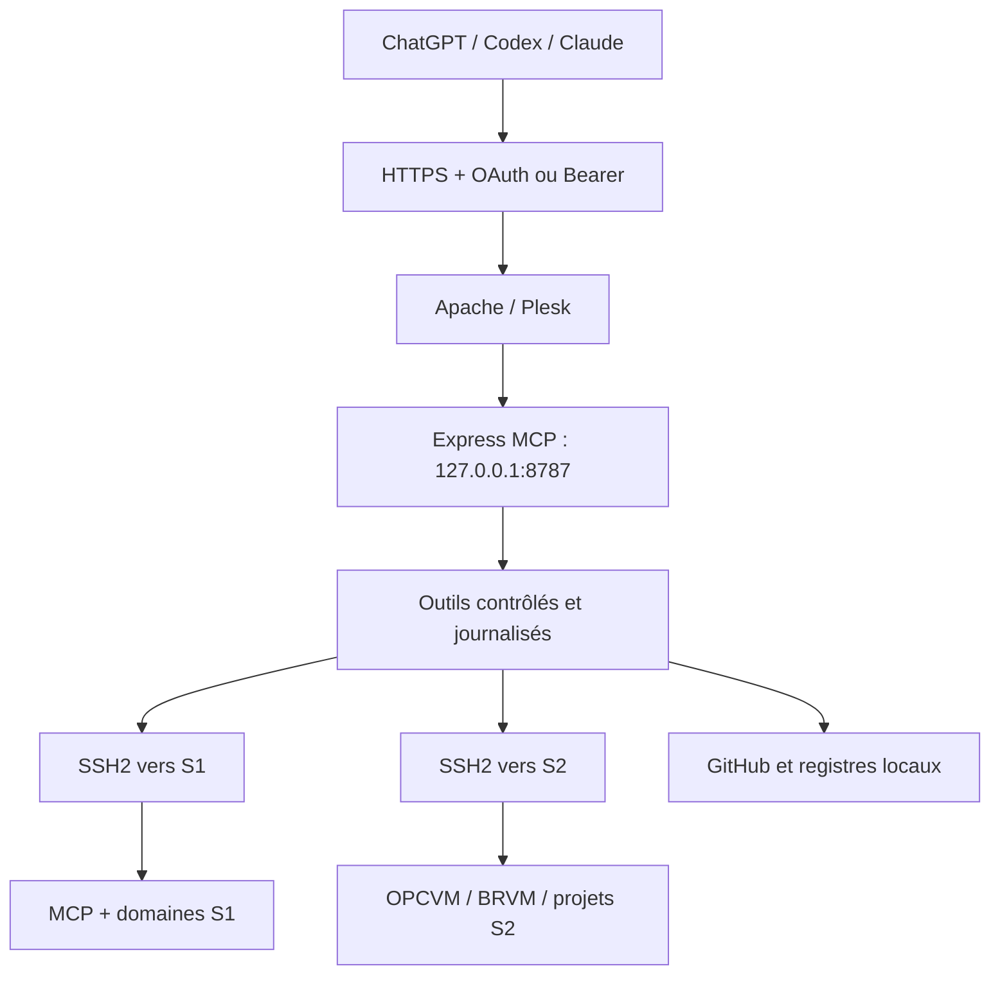

# Inventaire et cartographie du serveur MCP WealthTech

Date d’observation : 2026-07-13.  
Méthode : outils MCP en lecture seule, GitHub connecté et lecture des fichiers autorisés.  
Aucune suppression, écriture serveur, compilation, relance, fusion ou mise en production n’a été exécutée.

## 1. Résumé exécutif

| Élément | État vérifié |
|---|---|
| Projet | WealthTech MCP SSH Bridge |
| Dépôt actif | `Patricked-code/MCP` |
| Cible future déclarée | `chainsolutions-wealthtech/MCP` |
| Branche production | `main` |
| Commit GitHub main | `f92f621fa495d5728df5fb5befcc3265ff3a1302` |
| Commit directement observé sur S1 | `f92f621` |
| Dossier S1 | `/opt/apps/wealthtech-mcp-ssh-bridge` |
| État Git S1 | propre, aligné avec l’origin local connu, diff suivi vide |
| Conteneur | `wealthtech_mcp_ssh_bridge` |
| État conteneur observé | actif depuis environ 44 heures |
| Port interne exposé | `127.0.0.1:8787 -> 8787/tcp` |
| Domaine | `https://mcp.wealthtechinnovations.com` |
| Endpoint MCP | `https://mcp.wealthtechinnovations.com/mcp` |
| Réponse racine | 302 vers `/dashboard` |
| Ping MCP | OK |
| Mode | read-only-first avec outils d’écriture bornés |
| PR #11 | draft ouverte, non fusionnée, non déployée |

Le SHA complet embarqué dans l’image Docker active n’a pas été attesté. Le préfixe serveur et le SHA GitHub sont cohérents, mais cette cohérence ne constitue pas à elle seule une preuve cryptographique du contenu de l’image.

## 2. Topologie

## 3. Serveurs gérés

| ID | Rôle | Hôte | Utilisateur technique | Domaines protégés |
|---|---|---|---|---|
| S1 | serveur principal et destination | `212.227.212.33:22` | `root` via clé montée | niakara.com, wealthtechinnovations.com, wealthtechinnovation.com, berebytours.com et sous-domaines critiques déclarés |
| S2 | source, migration et nettoyage sélectif | `217.160.249.254:22` | `root` via clé montée | chainsolutions.fr, BRVM, BVMAC, FundAfrica/OPCVM, stablecoin et APIs déclarées |

Les clés privées sont montées dans le conteneur et ne sont pas lisibles via les outils MCP exposés.

## 4. Runtime et conteneur

- Node.js 20 Alpine ;
- TypeScript ;
- Express ;
- SDK Model Context Protocol ;
- SSH2 ;
- Zod ;
- Pino ;
- redémarrage Docker : `unless-stopped`.

Volumes déclarés :

| Montage | Mode | Rôle |
|---|---|---|
| `./keys:/app/keys` | lecture seule | clés SSH |
| `./data:/app/data` | lecture/écriture | registres GitHub et MCP |
| `./secrets:/app/secrets` | lecture/écriture conteneur | secrets durables hors Git |
| `./logs:/app/logs` | lecture/écriture | journaux |

## 5. Authentification et routes

### Authentification

- Bearer administrateur historique ;
- OAuth minimal Authorization Code + PKCE S256 ;
- access tokens temporaires signés ;
- scopes annoncés : `mcp:read` et `mcp:write` ;
- le middleware MCP vérifie au minimum `mcp:read` ;
- l’exposition effective des outils d’écriture dépend aussi de `ENABLE_WRITE_TOOLS` et des validations `allow_write`.

### Routes observées dans le code

- `/health` ;
- `/login`, `/logout` ;
- `/dashboard` ;
- `/git`, `/git/status`, `/git/connect` ;
- `/github`, `/github/status`, `/github/:account`, `/github/connect` ;
- `/.well-known/oauth-protected-resource` ;
- `/.well-known/oauth-authorization-server` ;
- `/oauth/authorize` ;
- `/oauth/token` ;
- `/mcp`.

## 6. Catalogue actuel des 34 outils

### Diagnostic lecture seule

- `ping`
- `get_project_context`
- `check_disk_s1`, `check_disk_s2`
- `pm2_status_s1`, `pm2_status_s2`
- `docker_status_s1`, `docker_status_s2`
- `list_domains_s1`, `list_domains_s2`
- `list_large_files_s1`, `list_large_files_s2`
- `list_backups_s1`, `list_backups_s2`
- `curl_domain`

### Auto-gestion du MCP

- `mcp_bridge`
- `mcp_git_status_s1`
- `mcp_git_diff_s1`
- `list_mcp_code_files_s1`
- `read_mcp_code_file_s1`
- `search_mcp_code_s1`
- `scan_mcp_secrets_s1`
- `mcp_container_logs_s1`

### Écriture ou validation contrôlée du MCP

- `patch_mcp_code_file_s1`
- `mcp_typecheck_s1`
- `mcp_build_s1`
- `restart_mcp_bridge_s1`

### Projets S2 et données

- `get_write_tools_context`
- `git_status_project_s2`
- `git_pull_project_s2`
- `deploy_project_s2`
- `deploy_brvm_s2`
- `exec_repo_script_s2`
- `run_sql_readonly_s2`

Il n’existe pas de shell root libre exposé. Les commandes sont prédéfinies ou construites avec des paramètres validés.

## 7. Projets S2 enregistrés

| Projet | Chemin | Fonction |
|---|---|---|
| `api_opcv` | `/var/www/vhosts/chainsolutions.fr/africafunds.chainsolutions.fr/api` | API OPCVM/FundAfrica |
| `front_end_opcvm` | `/var/www/vhosts/chainsolutions.fr/africafunds.chainsolutions.fr/frontend` | frontend OPCVM |
| `brvmchainsolution` | `/opt/apps/brvmchain/BRVMCHAINSOLUTION` | BRVM Chain Solution |

Les statuts historiques de ces projets ne doivent pas être assimilés à une vérification du 13 juillet sans nouvel appel S2.

## 8. État système S1

### Stockage

- partition racine : 77 Go ;
- utilisés : 54 Go ;
- disponibles : 20 Go ;
- occupation : 74 % ;
- la couche Docker overlay reflète la même occupation.

Les volumes loop Snap affichés à 100 % sont des images montées en lecture seule et ne signifient pas que la partition racine est pleine.

### Processus

- Docker actif : `wealthtech_mcp_ssh_bridge` ;
- PM2 : `api-niakara` en ligne, version 0.3.1, uptime observé d’environ 2 mois.

### Fichiers volumineux et sauvegardes

Le relevé limité aux 25 plus gros fichiers montre :

- plusieurs sauvegardes Plesk WealthTech d’environ 3,1 à 4,0 Go ;
- un journal d’accès du sous-domaine liquidity d’environ 842 Mo, visible sous deux chemins Plesk ;
- des sauvegardes Niakara et WealthTech Innovation de l’ordre de 140 à 277 Mo ;
- d’anciens caches, archives ZIP, packs Git et médias volumineux.

La recherche de sauvegardes a atteint la limite de 200 résultats. Elle constitue un inventaire borné, pas une preuve d’exhaustivité. Aucune suppression n’a été faite.

## 9. Domaines et vhosts S1

Le serveur Plesk contient notamment :

- `niakara.com` et `api.niakara.com` ;
- `wealthtechinnovations.com` et de nombreux sous-domaines historiques ou actifs ;
- `wealthtechinnovation.com` ;
- `berebytours.com` ;
- `mcp.wealthtechinnovations.com` ;
- `mcp.wealthtechinnovation.com`.

L’inventaire de répertoires Plesk montre également des applications historiques : stablecoin, blockchain, tokenfactory, liquidity, PNCI, SADIAAF, e-vote, fan-token et autres sous-domaines. Leur présence sur disque ne prouve pas leur disponibilité publique ni leur statut métier actuel.

## 10. Code et documentation

Inventaire autorisé : 227 fichiers.

| Ensemble | Quantité |
|---|---:|
| Markdown | 188 |
| TypeScript | 19 |
| JSON | 18 |
| YAML | 1 |
| Dockerfile | 1 |

Principaux modules TypeScript :

- serveur HTTP et transport MCP ;
- authentification Bearer et OAuth ;
- configuration S1/S2 ;
- client SSH et garde-fous ;
- outils lecture seule ;
- auto-gestion MCP ;
- écritures bornées ;
- gestion durable des comptes ;
- inventaire GitHub.

## 11. GitHub

- dépôt public : `Patricked-code/MCP` ;
- droits du connecteur observés : admin, maintain, push, pull et triage ;
- branche par défaut : `main` ;
- 14 branches visibles lors de l’inventaire ;
- 8 PR étaient déjà ouvertes au début de l’inventaire : #1, #4, #5, #7, #8, #9, #10 et #11 ;
- la présente PR documentaire #12 s’ajoute à cet état une fois le hub publié ;
- PR #6 fusionnée ;
- PR #11 est la prochaine revue technique prioritaire ;
- aucune PR ouverte ne doit être fusionnée automatiquement.

Branches manifestement expérimentales à traiter uniquement après décision séparée : `test-branch` et `test-branch-created-by-mistake-cleanup-needed`. Cet inventaire n’autorise pas leur suppression.

## 12. Sécurité et risques connus

1. Sur `main`, la garde read-only confond encore certaines occurrences de la sous-chaîne `cp` avec la commande shell `cp`.
2. Cela bloque le scanner de secrets et la recherche de code dans certains cas légitimes.
3. La correction est dans la PR #11, non fusionnée et non déployée.
4. Le code utilise une denylist complémentaire ; la sécurité principale repose aussi sur l’absence de shell libre, les commandes fixes, les paramètres validés et les écritures bornées.
5. Le scope OAuth `mcp:write` est annoncé, mais l’autorisation d’écriture réelle dépend d’autres gates ; il faudra conserver ce découplage clairement documenté.
6. Les codes OAuth sont stockés en mémoire ; un redémarrage invalide les codes non échangés.
7. La provenance exacte de l’image Docker active n’est pas attestée.
8. Les fichiers ignorés du dépôt serveur n’ont pas été exhaustivement audités.
9. La documentation historique OAuth du 1er juillet est partiellement obsolète.
10. Le volume de sauvegardes et de logs justifie un audit de rétention séparé avant tout nettoyage.

## 13. Limites de cette cartographie

Cette cartographie est complète dans le périmètre lisible exposé par le MCP et GitHub au 13 juillet 2026. Elle n’est pas un scan forensic intégral du système :

- secrets et clés volontairement exclus ;
- inventaires bornés par `head` ou limites de résultats ;
- aucun accès libre à tous les fichiers du système ;
- aucun contenu de base de données lu pour cette mission ;
- S2 non réaudité en profondeur ;
- aucun hash d’image Docker ou SBOM produit ;
- aucun test de restauration des sauvegardes ;
- aucun scan réseau exhaustif ;
- aucun transcript privé ChatGPT/Claude accessible sans export.
